# 100 Days of C Programming and DSA

**Name:** Aman Barnwal  
**SAP ID:** 590028933  
**Batch:** 78  

---

## Introduction

This repository contains the work completed as part of the **100 Days of Code** initiative with a focus on **C Programming** and **Data Structures & Algorithms (DSA)**.  
The objective of this practice is to build strong programming fundamentals, improve logical reasoning, and apply algorithmic concepts through consistent hands-on coding.

Each section below represents the problems solved on a particular day, along with source code references and output screenshots.

---

## Day 01

### Problem 1: Two Sum (LeetCode)

**Description**  
Given an integer array and a target value, identify two distinct indices such that the sum of the elements at those indices equals the target.  
Exactly one valid solution exists for each input.

**Concepts Used**
- Arrays  
- Nested loops  
- Index-based traversal  

**Output Screenshot**

---

### Problem 2: Insert Element at Given Position in Array

**Description**  
A C program to insert an element `x` at a specified **1-based position** in an array of `n` integers.  
All elements following the position are shifted one index to the right.

**Concepts Used**
- Arrays  
- Index manipulation  
- Element shifting  

**Source Code**  
[Day01/insert_element_at_position.c](Day01/insert_element_at_position.c)

**Output Screenshot**

---

## Day 02

### Problem 1: Delete Element at Given Position in Array

**Description**  
This program deletes an element from a given **1-based index** in an array.  
Remaining elements are shifted left to maintain the array structure.

**Concepts Used**
- Arrays  
- Index-based traversal  
- Element shifting  

**Source Code**  
[Day02/delete_element.c](Day02/delete_element.c)

**Output Screenshot**

---

### Problem 2: Best Time to Buy and Sell Stock (LeetCode)

**Description**  
An array representing stock prices on consecutive days is provided.  
The objective is to choose one day to buy and a later day to sell to maximize profit.  
If no profit is possible, the output is `0`.

**Concepts Used**
- Greedy approach  
- Single-pass traversal  

**Time Complexity**  
O(n)

**Output Screenshot**

---

## Day 03

### Problem: Linear Search and Missing Number

**Description**  
This day focuses on basic searching techniques using arrays.  
The tasks include performing linear search to locate a given element and identifying a missing number from a sequence.

**Concepts Used**
- Arrays  
- Linear traversal  
- Conditional statements  

**Source Code**  
[Day03/linear_search.c](Day03/linear_search.c)

**Output Screenshot**

**Platform Submission Screenshot**

---

## Day 04

### Problem 1: Reverse an Array Using Two-Pointer Technique

**Description**  
Given an array of integers, the task is to reverse the array **in-place** using the two-pointer approach.  
Elements from both ends are swapped until the entire array is reversed.

**Concepts Used**
- Two-pointer technique  
- In-place array modification  

**Source Code**  
[Day04/reverse_array.c](Day04/reverse_array.c)

**Output Screenshot**

---

### Problem 2: Remove Element from Array (LeetCode)

**Description**  
Given an integer array `nums` and a value `val`, remove all occurrences of `val` **in-place**.  
The function returns the number of elements not equal to `val`.  
The order of elements may change.

**Concepts Used**
- Arrays  
- Conditional filtering  

**Output Screenshot**

---

## Day 05

### Problem 1: Merge Two Sorted Logs

**Description**  
Two sorted arrays representing arrival times from two different servers are provided.  
The task is to merge both arrays into a single sorted list while preserving chronological order.

**Concepts Used**
- Arrays  
- Two-pointer traversal  
- Merging logic  

**Source Code**  
[Day05/merge_logs.c](Day05/merge_logs.c)

**Output Screenshot**

---

### Problem 2: Merge Two Sorted Arrays (LeetCode)

**Description**  
Two sorted arrays `nums1` and `nums2` are given along with integers `m` and `n`.  
The goal is to merge `nums2` into `nums1` so that the final array remains sorted in non-decreasing order.  
The merged result is stored directly in `nums1`.

**Concepts Used**
- Arrays  
- Two-pointer technique  
- In-place merging  

**Output Screenshot**

---

## Day 06

### Problem 1: Remove Duplicates from Sorted Array

**Description**  
Since the array is already sorted, we traverse it once and compare each element with the previous unique element.  
Only the first occurrence of each value is kept, and duplicates are skipped to produce a list of unique elements.

**Concepts Used**
- Arrays  
- Two-pointer technique  
- In-place modification  

**Source Code**  
[Day06/remove_duplicates.c](Day06/remove_duplicates.c)

**Output Screenshot**

---

### Problem 2: Move Zeroes (LeetCode)

**Description**  
All non-zero elements are shifted to the front of the array while maintaining their relative order.  
Zeroes are automatically moved to the end by overwriting positions during traversal.

**Concepts Used**
- Arrays  
- Two-pointer technique  
- In-place updates  

**Output Screenshot**

---

## Day 07

### Problem 1: Fibonacci Number Using Recursion

**Description**  
A recursive function is used to compute the n-th Fibonacci number by directly applying the recurrence relation fib(n) = fib(n−1) + fib(n−2).  
The base cases fib(0) = 0 and fib(1) = 1 are handled explicitly to terminate recursion.

**Concepts Used**
- Recursion  
- Function calls  
- Mathematical recurrence  

**Source Code**  
[Day07/fibonacci_recursive.c](Day07/fibonacci_recursive.c)

**Output Screenshot**

---

### Problem 2: Fibonacci Number (LeetCode – Problem 509)

**Description**  
The Fibonacci value is calculated based on the definition that each number is the sum of the previous two numbers in the sequence.  
This problem reinforces understanding of recursion and sequence-based computation.

**Concepts Used**
- Recursion  
- Mathematical sequence  

**Output Screenshot**

---

## Day 08

### Problem 1: Fibonacci Number Using Recursion

**Description**  
A recursive function is implemented to compute the n-th Fibonacci number by repeatedly calling the function for smaller values of n.  
The base conditions fib(0) = 0 and fib(1) = 1 ensure correct termination of the recursion.

**Concepts Used**
- Recursion  
- Function calls  
- Mathematical recurrence  

**Source Code**  
[Day08/DSA_Power.c](Day08/DSA_Power.c)

**Output Screenshot**

---

### Problem 2: Fibonacci Number Calculation (LeetCode)

**Description**  
This problem computes the Fibonacci value using the standard definition where each term is the sum of the two preceding terms.  
It reinforces understanding of recursive sequence generation.

**Concepts Used**
- Recursion  
- Mathematical sequences  

**Output Screenshot**

---

## Day 09

### Problem 1: Reverse a String (Mirror Transformation)

**Description**  
The given string is reversed by rearranging its characters so that the first character moves to the last position and so on.  
This transformation produces the mirror image of the original string.

**Concepts Used**
- Strings  
- Index-based traversal  
- Character swapping  

**Source Code**  
[Day09/reverse_string.c](Day09/reverse_string.c)

**Output Screenshot**

---

### Problem 2: Reverse String In-Place (LeetCode)

**Description**  
The input character array is reversed directly by swapping characters from both ends using a two-pointer approach.  
The operation is performed in-place with constant extra memory.

**Concepts Used**
- Two-pointer technique  
- In-place modification  

**Output Screenshot**

---

## Day 10

### Problem 1: Check Whether a String is Palindrome

**Description**  
The string is checked for palindrome property by comparing characters from the beginning and end using two pointers.  
If all corresponding characters match, the string is identified as a palindrome.

**Concepts Used**
- Strings  
- Two-pointer comparison  
- Conditional logic  

**Source Code**  
[Day10/palindrome.c](Day10/palindrome.c)

**Output Screenshot**

---

### Problem 2: Intersection of Two Arrays (LeetCode)

**Description**  
The task is to find common elements between two integer arrays while considering the frequency of each element.  
Each element in the result appears as many times as it occurs in both arrays.

**Concepts Used**
- Arrays  
- Frequency counting  
- Comparison logic  

**Output Screenshot**

---

## Day 11

### Problem 1: Matrix Addition

**Description**  
Two matrices of the same dimensions are read as input, and their corresponding elements are added to form a resultant matrix.  
The result matrix is printed row-wise, where each element represents the sum of elements at the same position in both matrices.

**Concepts Used**
- 2D Arrays  
- Nested loops  
- Matrix traversal  

**Source Code**  
[Day11/matrix_addition.c](Day11/matrix_addition.c)

**Output Screenshot**

---

### Problem 2: Transpose Matrix (LeetCode)

**Description**  
The matrix is transformed by interchanging rows and columns such that element at position (i, j) becomes (j, i).  
A new matrix is constructed to store the transposed values.

**Concepts Used**
- 2D Arrays  
- Matrix indexing  
- Nested iteration  

**Output Screenshot**

---

## Day 12

### Problem 1: Symmetric Matrix Check

**Description**  
The matrix is first verified to ensure it is square.  
It is considered symmetric if every element satisfies the condition matrix[i][j] == matrix[j][i].

**Concepts Used**
- 2D Arrays  
- Nested loops  
- Matrix property validation  

**Source Code**  
[Day12/symmetric_matrix.c](Day12/symmetric_matrix.c)

**Output Screenshot**

---

### Problem 2: Toeplitz Matrix (LeetCode 766)

**Description**  
A matrix is identified as Toeplitz if each diagonal from top-left to bottom-right contains identical values.  
The condition matrix[i][j] == matrix[i-1][j-1] is checked for all valid positions.

**Concepts Used**
- Diagonal traversal  
- 2D arrays  
- Conditional comparison  

**Output Screenshot**

---

## Day 13

### Problem 1: Spiral Matrix Traversal

**Description**  
The matrix is traversed in a clockwise spiral order starting from the outer boundary and gradually moving inward.  
Four boundary variables (top, bottom, left, right) are updated after completing traversal of each layer.

**Concepts Used**
- 2D Arrays  
- Boundary control  
- Spiral traversal logic  
- Nested loops  

**Source Code**  
[Day13/spiral_matrix.c](Day13/spiral_matrix.c)

**Output Screenshot**

---

### Problem 2: Spiral Matrix (LeetCode)

**Description**  
All elements of the matrix are returned in spiral order using systematic boundary traversal.  
The approach ensures each element is visited exactly once.

**Concepts Used**
- Matrix traversal  
- Dynamic boundary adjustment  
- Order-based extraction  

**Output Screenshot**

---

## Day 14

### Problem 1: Identity Matrix Check

**Description**  
A square matrix is examined to determine whether it satisfies the identity matrix property.  
All diagonal elements must be 1, and every non-diagonal element must be 0.

**Concepts Used**
- 2D Arrays  
- Diagonal validation  
- Nested loops  
- Conditional checking  

**Source Code**  
[Day14/identity_matrix.c](Day14/identity_matrix.c)

**Output Screenshot**

---

### Problem 2: Rotate Image (LeetCode 48)

**Description**  
The matrix is rotated 90 degrees clockwise in-place without using extra space.  
The approach involves first transposing the matrix and then reversing each row.

**Concepts Used**
- Matrix transpose  
- In-place modification  
- 2D array manipulation  

**Output Screenshot**

---

## Day 15

### Problem 1: Primary Diagonal Sum

**Description**  
The matrix is traversed to calculate the sum of elements where the row index equals the column index.  
Only elements forming the primary diagonal are included in the final sum.

**Concepts Used**
- 2D Arrays  
- Diagonal traversal  
- Nested loops  

**Source Code**  
[Day15/primary_diagonal_sum.c](Day15/primary_diagonal_sum.c)

**Output Screenshot**

---

### Problem 2: Set Matrix Zeroes (LeetCode 73)

**Description**  
If any element in the matrix is zero, its entire row and column are set to zero.  
The solution is implemented in-place using marker rows and columns to maintain constant extra space.

**Concepts Used**
- In-place matrix modification  
- Row and column marking  
- Nested traversal  

**Output Screenshot**

---

## Day 16

### Problem 1: Frequency of Elements in an Array

**Description**  
The program counts how many times each distinct element appears in the given array.  
Each element is printed in the format element:count.

**Concepts Used**
- Arrays  
- Nested loops  
- Frequency counting  

**Source Code**  
[Day16/frequency_count.c](Day16/frequency_count.c)

**Output Screenshot**

---

### Problem 2: Rotate Array (LeetCode 189)

**Description**  
The array is rotated to the right by k steps using an in-place reversal approach.  
The method reverses the entire array, then reverses segments to achieve the required rotation.

**Concepts Used**
- Array manipulation  
- Reversal technique  
- In-place modification  

**Output Screenshot**

---

## Day 17

### Problem 1: Maximum and Minimum in an Array

**Description**  
The array is traversed once to determine the largest and smallest elements.  
During traversal, the maximum and minimum values are updated dynamically.

**Concepts Used**
- Arrays  
- Linear traversal  
- Conditional comparison  

**Source Code**  
[Day17/max_min_array.c](Day17/max_min_array.c)

**Output Screenshot**

---

### Problem 2: Maximum Subarray (LeetCode 53)

**Description**  
The task is to find a contiguous subarray with the largest possible sum.  
Kadane’s Algorithm is applied to compute the maximum subarray sum in linear time.

**Concepts Used**
- Dynamic programming  
- Kadane’s Algorithm  
- Running sum optimization  

**LeetCode Output Screenshot**

---

## Day 18

### Problem 1: Rotate Array by k Positions

**Description**  
The elements of the array are rotated to the right by k positions using circular indexing.  
Each element is placed at its new index computed using modular arithmetic.

**Concepts Used**
- Arrays  
- Modular arithmetic  
- Index manipulation  

**Source Code**  
[Day18/rotate_array_k.c](Day18/rotate_array_k.c)

**Output Screenshot**

---

### Problem 2: Product of Array Except Self (LeetCode 238)

**Description**  
For every index in the array, the product of all other elements is calculated without using division.  
Prefix and suffix multiplication are used to achieve linear time complexity with constant extra space.

**Concepts Used**
- Prefix products  
- Suffix products  
- In-place computation  

**LeetCode Output Screenshot**

---

## Day 19

### Problem 1: Pair with Sum Closest to Zero

**Description**  
The array is sorted and a two-pointer approach is used to find two elements whose sum is closest to zero.  
The pair with the minimum absolute sum is tracked during traversal.

**Concepts Used**
- Arrays  
- Sorting  
- Two-pointer technique  
- Absolute comparison  

**Source Code**  
[Day19/closest_sum_zero.c](Day19/closest_sum_zero.c)

**Output Screenshot**

---

### Problem 2: Maximum Sum Circular Subarray (LeetCode 918)

**Description**  
The maximum subarray sum is computed considering both normal and circular cases.  
Kadane’s Algorithm is applied to find the maximum and minimum subarrays, and the final answer is determined accordingly.

**Concepts Used**
- Kadane’s Algorithm  
- Circular array handling  
- Prefix and suffix reasoning  
- O(n) optimization  

**LeetCode Output Screenshot**

---

## Day 20

### Problem 1: Count Subarrays with Sum Equal to Zero

**Description**  
The program counts all continuous subarrays whose total sum is zero.  
Each possible starting point is checked to determine whether a zero-sum subarray exists.

**Concepts Used**
- Arrays  
- Prefix sum logic  
- Nested traversal  

**Source Code**  
[Day20/zero_sum_subarrays.c](Day20/zero_sum_subarrays.c)

**Output Screenshot**

---

## Day 21

### Problem 1: Create and Traverse Singly Linked List

**Description**  
A singly linked list is dynamically created using user input and then traversed to print all elements in order.

**Concepts Used**
- Structures  
- Dynamic memory allocation  
- Pointer traversal  

**Source Code**  
[Day21/singly_linked_list.c](Day21/singly_linked_list.c)

**Output Screenshot**

---

### Problem 2: Middle of the Linked List (LeetCode 876)

**Description**  
The middle node of the linked list is found using the fast and slow pointer technique.  
If two middle nodes exist, the second one is returned.

**Concepts Used**
- Fast and slow pointer  
- Linked list traversal  

**LeetCode Output Screenshot**

---

## Day 22

### Problem 1: Count Nodes in Linked List

**Description**  
A linked list is created dynamically, and the total number of nodes present in the list is calculated by traversal.

**Concepts Used**
- Linked list traversal  
- Node counting  
- Dynamic memory allocation  

**Source Code**  
[Day22/count_nodes.c](Day22/count_nodes.c)

**Output Screenshot**

---

### Problem 2: Reverse Linked List (LeetCode 206)

**Description**  
The linked list is reversed by modifying the direction of next pointers for each node.

**Concepts Used**
- Pointer manipulation  
- Iterative reversal  

**LeetCode Output Screenshot**

---

## Day 23

### Problem 1: Merge Two Sorted Linked Lists

**Description**  
Two sorted linked lists are merged into a single sorted list by comparing node values and updating pointers accordingly.

**Concepts Used**
- Linked list traversal  
- Pointer comparison  
- Efficient merging  

**Source Code**  
[Day23/merge_sorted_ll.c](Day23/merge_sorted_ll.c)

**Output Screenshot**

---

### Problem 2: Linked List Cycle (LeetCode 141)

**Description**  
The presence of a cycle in a linked list is detected using Floyd’s cycle detection algorithm.

**Concepts Used**
- Fast and slow pointer  
- Cycle detection  

**LeetCode Output Screenshot**

---

## Day 24

### Problem 1: Delete First Occurrence of a Key

**Description**  
The first node containing the specified key is located and removed by updating pointer links.

**Concepts Used**
- Linked list traversal  
- Pointer reassignment  
- Memory deallocation  

**Source Code**  
[Day24/delete_first_occurrence.c](Day24/delete_first_occurrence.c)

**Output Screenshot**

---

### Problem 2: Remove Linked List Elements (LeetCode 203)

**Description**  
All nodes containing a specific value are removed from the linked list using a dummy node approach.

**Concepts Used**
- Dummy node technique  
- Pointer updates  
- Linked list filtering  

**LeetCode Output Screenshot**

---

## Day 25

### Problem 1: Count Occurrences of an Element in Linked List

**Description**  
A linked list is created dynamically using user input.  
The list is traversed from head to end, and each time the node’s value matches the given key, a counter is incremented.  
After traversal, the total number of occurrences is printed.

**Concepts Used**
- Linked list traversal  
- Dynamic memory allocation  
- Conditional counting  

**Source Code**  
[Day25/count_occurrences.c](Day25/count_occurrences.c)

**Output Screenshot**

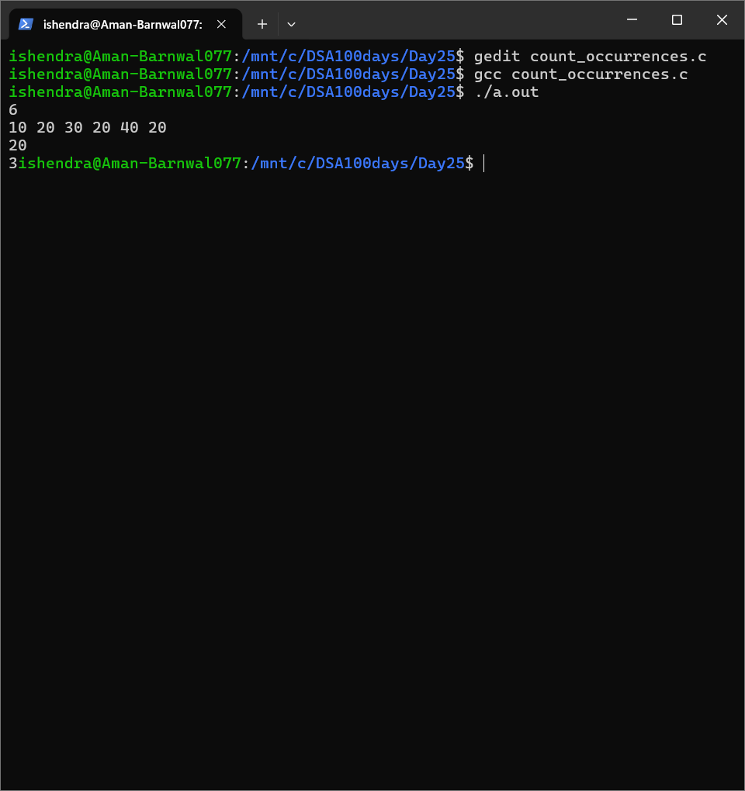

---

### Problem 2: Linked List Cycle II (LeetCode 142)

**Description**  
The node where a cycle begins in a linked list is identified using Floyd’s cycle detection algorithm.  
After detecting a meeting point inside the cycle, one pointer is reset to the head, and both pointers move one step at a time to find the starting node of the cycle.

**Concepts Used**
- Fast and slow pointer  
- Cycle detection  
- Constant space solution  

**LeetCode Output Screenshot**

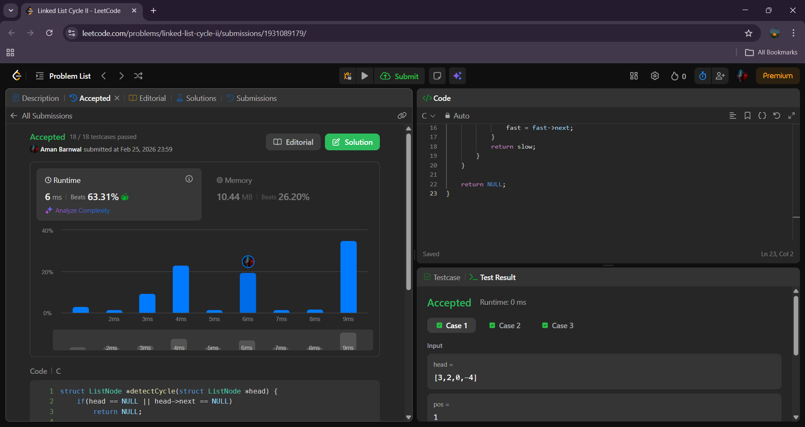

---

## Day 26

### Problem 1: Doubly Linked List Insertion and Traversal

**Description**  
A doubly linked list is created using dynamic memory allocation.  
Each node maintains both `next` and `prev` pointers.  
The list is traversed in forward direction to display elements.

**Concepts Used**
- Doubly linked list  
- Dynamic memory allocation  
- Pointer linking  

**Source Code**  
[Day26/doubly_linked_list.c](Day26/doubly_linked_list.c)

**Output Screenshot**

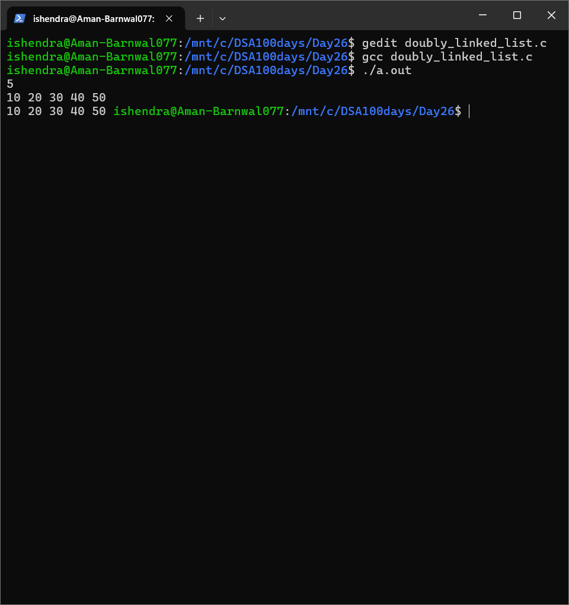

---

## Day 27

### Problem 1: Find Intersection Point of Two Linked Lists

**Description**  
Two singly linked lists are created and their lengths are calculated.  
The longer list pointer is advanced by the difference in lengths, and both lists are traversed together to find the intersection point.

**Concepts Used**
- Linked list traversal  
- Length calculation  
- Pointer alignment  

**Source Code**  
[Day27/intersection_linked_list.c](Day27/intersection_linked_list.c)

**Output Screenshot**

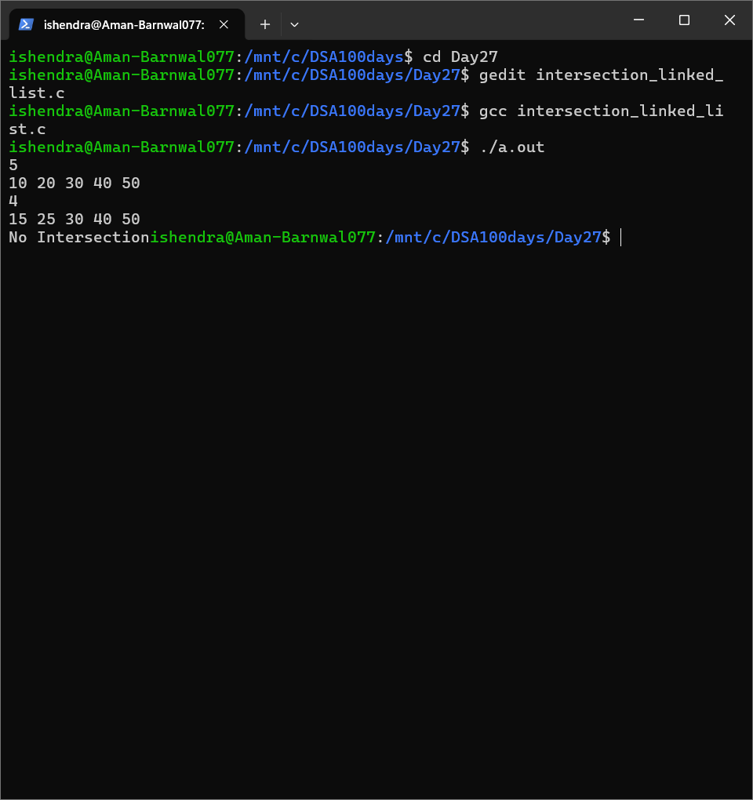

---

## Day 28

### Problem 1: Circular Linked List Creation and Traversal

**Description**  
A circular linked list is created using dynamic memory allocation.  
The last node is connected back to the head to form a circular structure.  
Traversal continues until the pointer reaches the head again to avoid an infinite loop.

**Concepts Used**
- Singly Linked List
- Circular Linked List
- Dynamic Memory Allocation
- Pointer Traversal

**Source Code**  
[Day28/circular_ll.c](Day28/circular_ll.c)

**Output Screenshot**

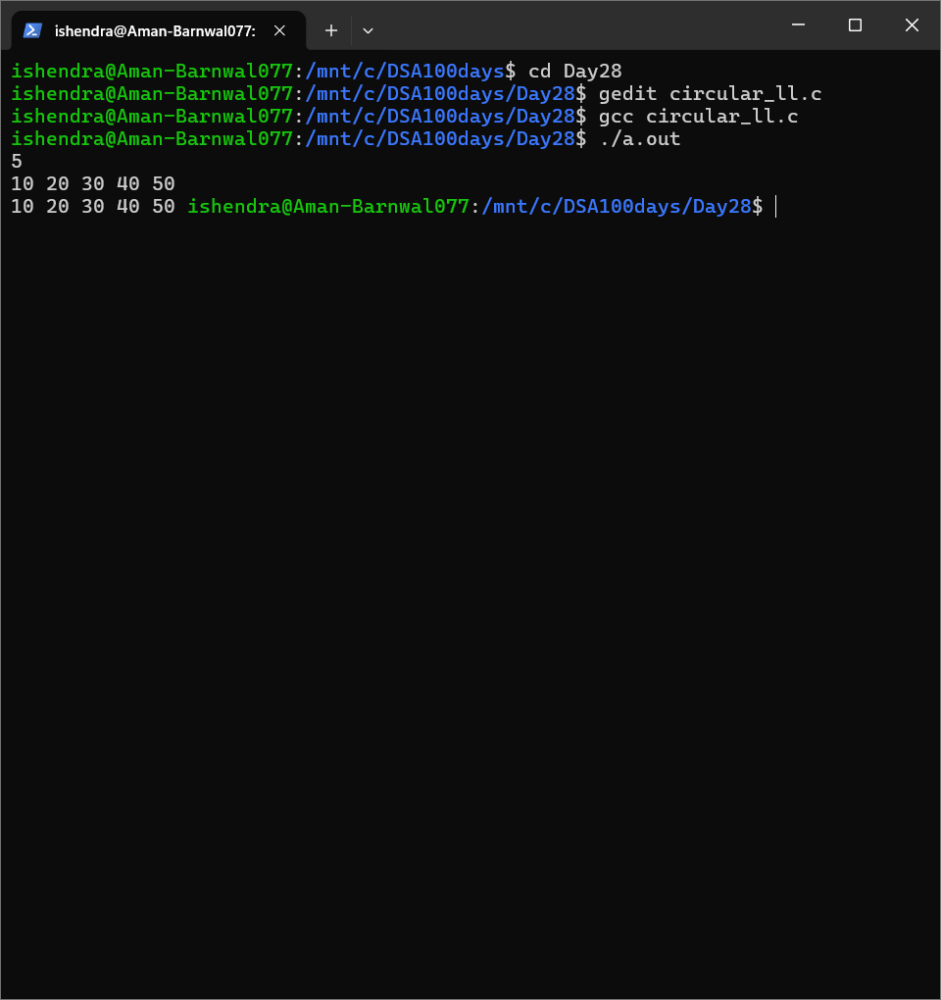

---

### Problem 2: Palindrome Linked List (LeetCode)

**Description**  
This problem determines whether a singly linked list is a palindrome.  
The middle is found using the slow and fast pointer technique, the second half is reversed, and both halves are compared.

**Concepts Used**
- Two Pointer Technique
- Linked List Reversal
- In-place Comparison

**Output Screenshot**

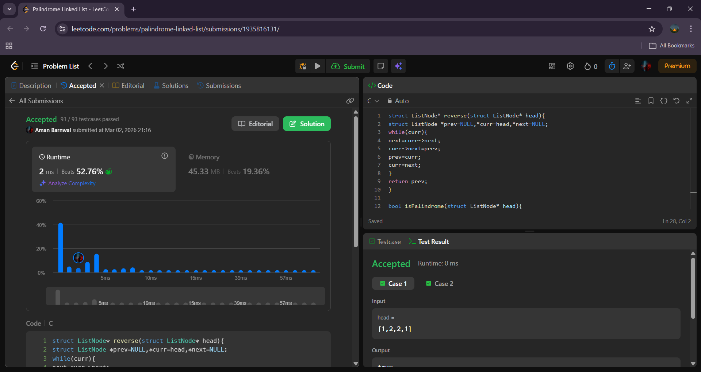

---

## Day 29

### Problem 1: Rotate Linked List Right by k Places

**Description**  
The linked list is rotated to the right by k positions.  
The list is temporarily made circular, and the new head is determined after moving (n − k) steps.

**Concepts Used**
- Linked List Traversal
- Circular Linking
- Pointer Manipulation
- Modulo Optimization

**Source Code**  
[Day29/rotate_ll_k.c](Day29/rotate_ll_k.c)

**Output Screenshot**

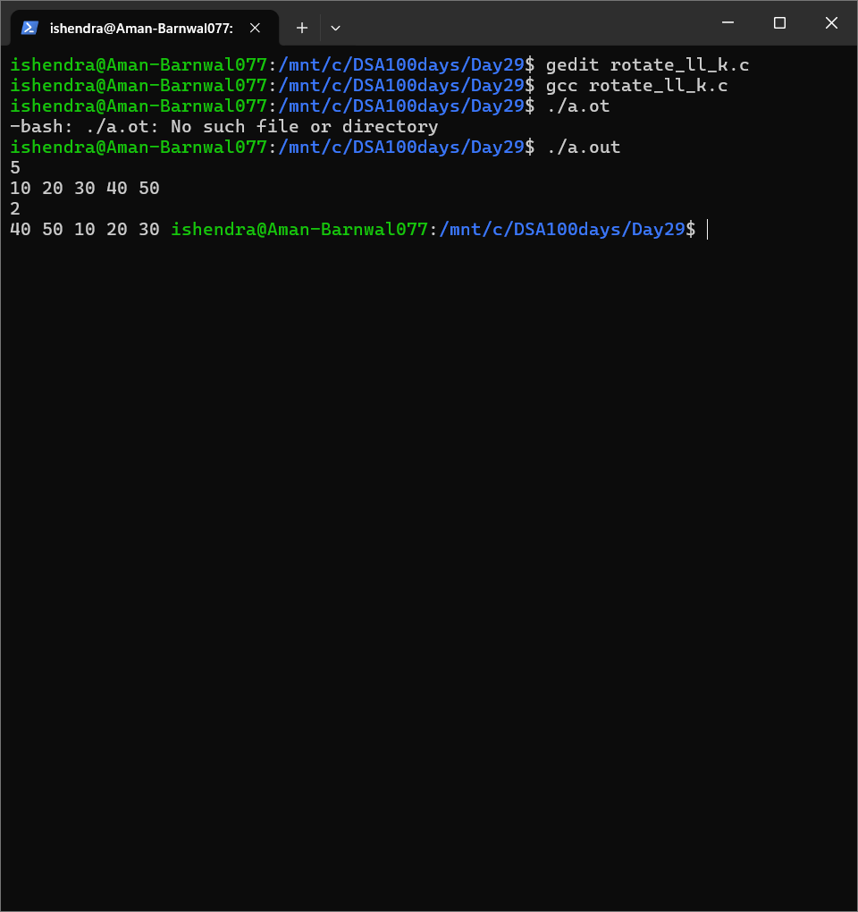

---

### Problem 2: Add Two Numbers (LeetCode)

**Description**  
Two linked lists represent numbers in reverse order.  
Each corresponding digit is added with carry handling to form a new linked list.

**Concepts Used**
- Linked List Traversal
- Carry Handling
- Dynamic Node Creation

**Output Screenshot**

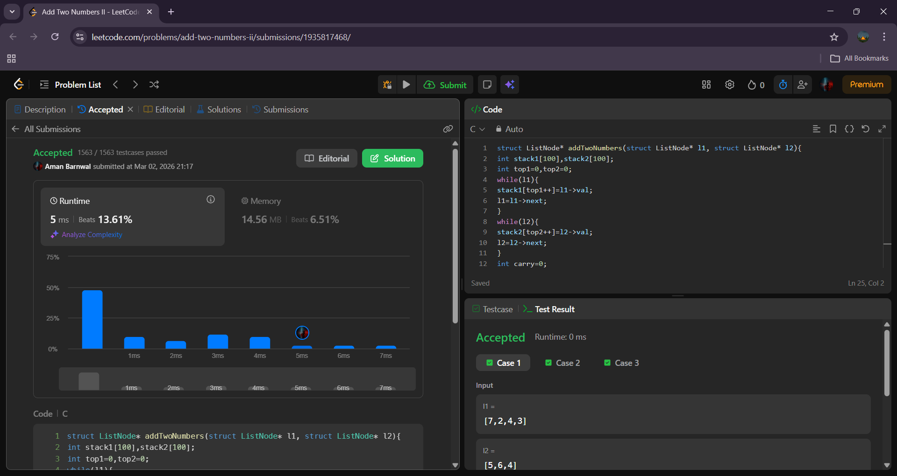

---

## Day 30

### Problem 1: Polynomial Using Linked List

**Description**  
A polynomial is represented using a linked list where each node stores a coefficient and exponent.  
The polynomial is printed in standard mathematical format.

**Concepts Used**
- Linked List Representation
- Structured Data Storage
- Polynomial Formatting Logic

**Source Code**  
[Day30/polynomial_ll.c](Day30/polynomial_ll.c)

**Output Screenshot**

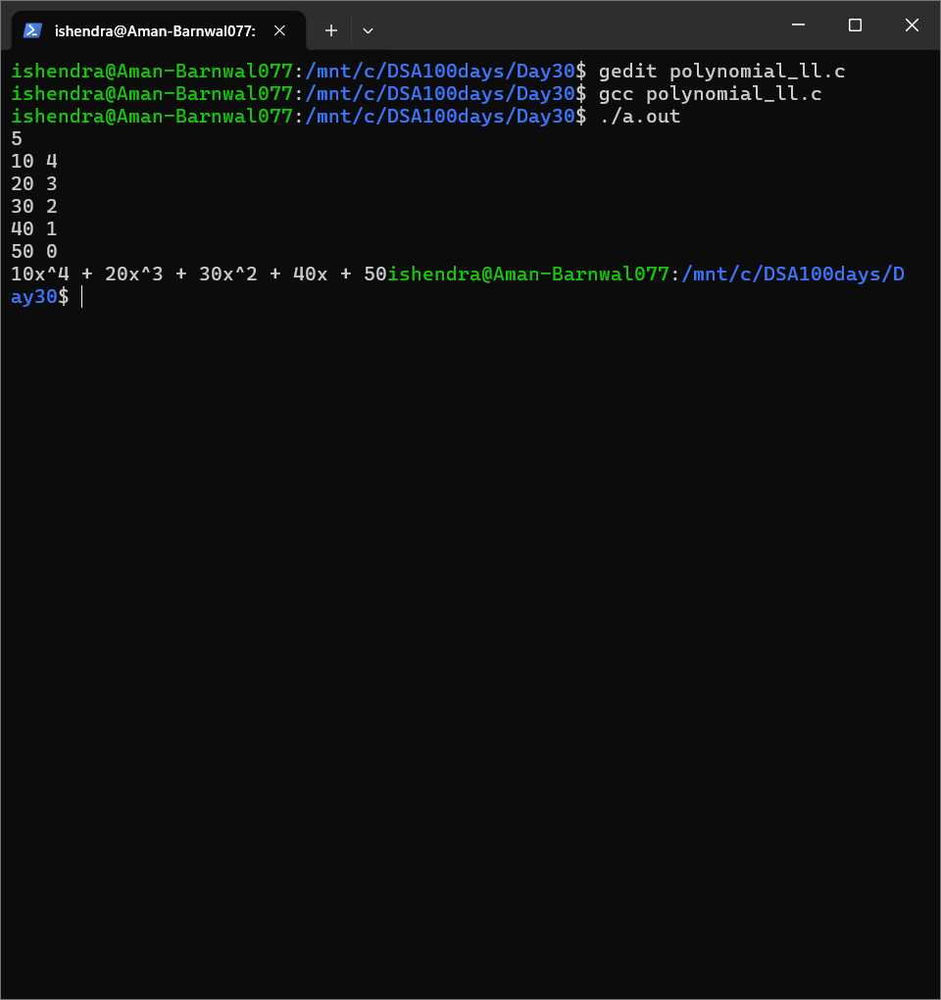

---

### Problem 2: Add Two Numbers II (LeetCode)

**Description**  
Two linked lists represent numbers in forward order.  
Stacks are used to process digits from least significant to most significant without modifying the original lists.

**Concepts Used**
- Stack Simulation
- Linked List Construction
- Carry Propagation

**Output Screenshot**

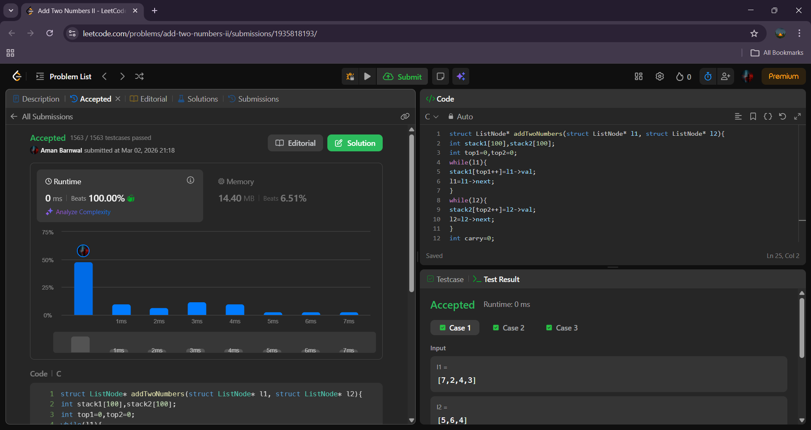

---

## Day 31

### Problem 1: Stack Implementation Using Array

**Description**  
A stack data structure is implemented using an array.  
The program supports three operations: push, pop, and display.  
Push inserts an element at the top of the stack, pop removes the top element, and display prints the stack elements from top to bottom.

**Concepts Used**
- Stack Data Structure
- Array Implementation
- Push and Pop Operations
- LIFO Principle

**Source Code**  
[Day31/stack_array.c](Day31/stack_array.c)

**Output Screenshot**

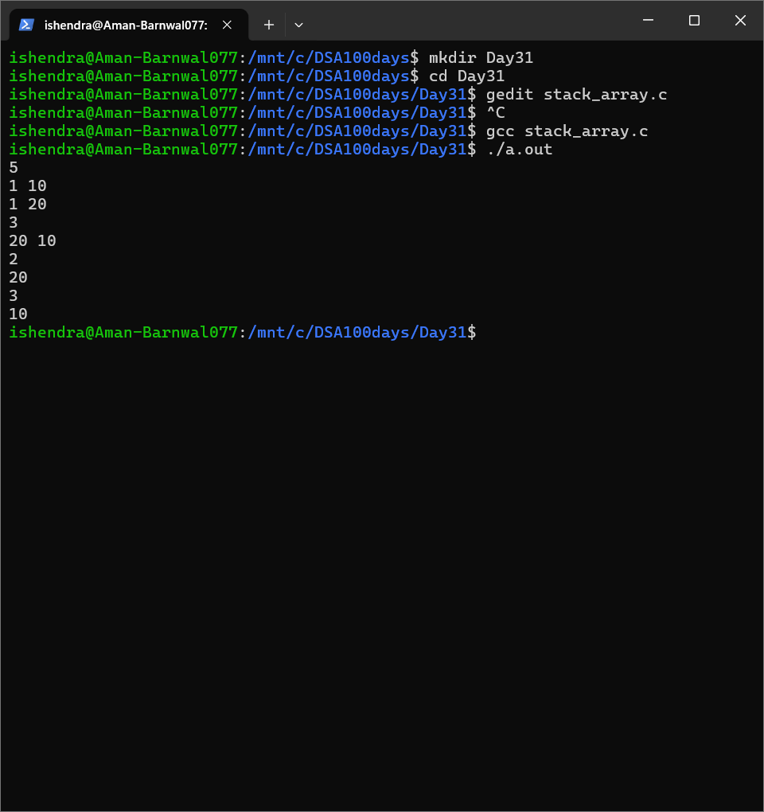

---

### Problem 2: Valid Parentheses (LeetCode)

**Description**  
This problem checks whether a string of brackets is valid.  
A stack is used to ensure that every opening bracket has a matching closing bracket in the correct order.

**Concepts Used**
- Stack
- Character Processing
- Bracket Matching

**Output Screenshot**

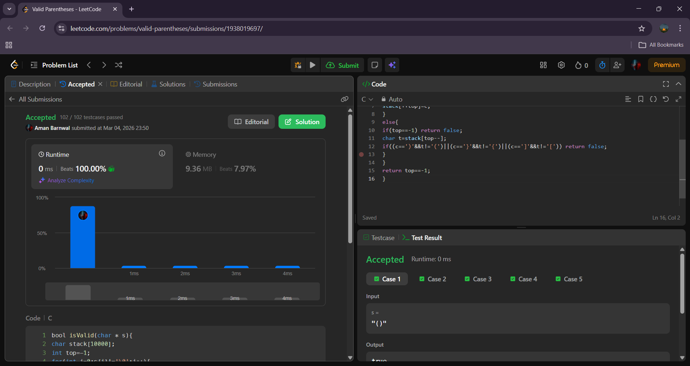

---

## Day 32

### Problem 1: Stack Push and Pop Verification

**Description**  
This program demonstrates stack operations using an array.  
Elements are first pushed onto the stack, and then a specified number of pop operations are performed.  
After performing the pops, the remaining elements in the stack are printed from top to bottom.

**Concepts Used**
- Stack Data Structure
- Push Operation
- Pop Operation
- Array Implementation
- LIFO Principle

**Source Code**  
[Day32/stack_push_pop.c](Day32/stack_push_pop.c)

**Output Screenshot**

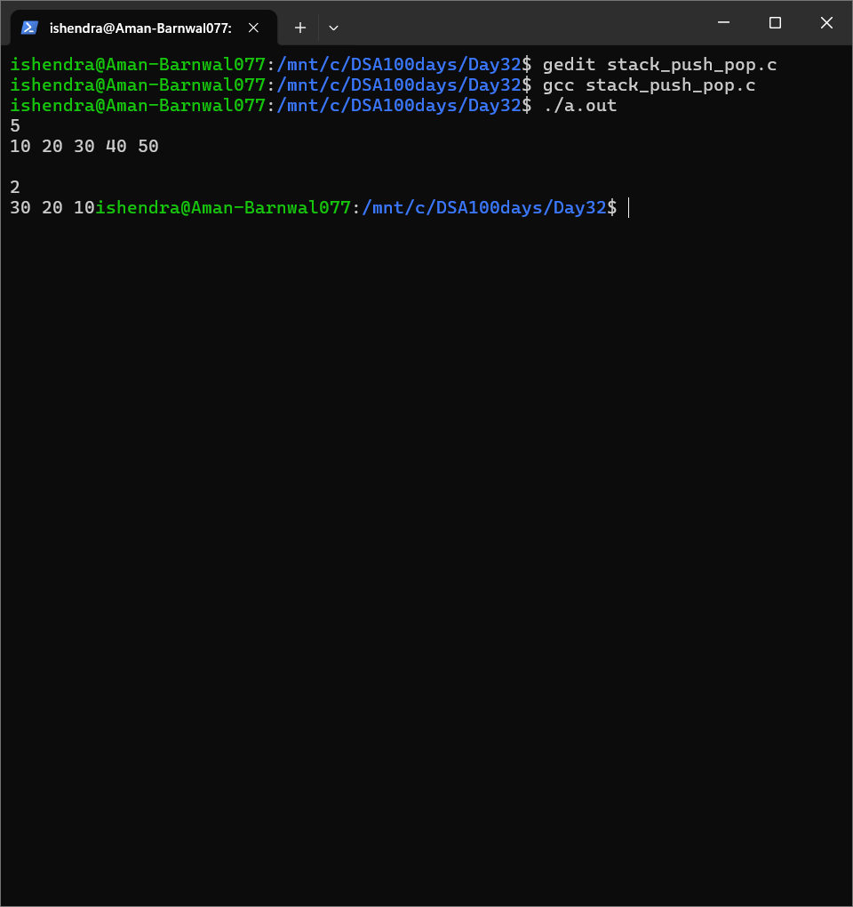

---

### Problem 2: Min Stack (LeetCode)

**Description**  
This problem designs a stack that supports push, pop, top, and retrieving the minimum element in constant time.  
An auxiliary structure is used to track the minimum value at each stage of the stack.

**Concepts Used**
- Stack
- Constant Time Minimum Retrieval
- Auxiliary Stack Technique

**Output Screenshot**

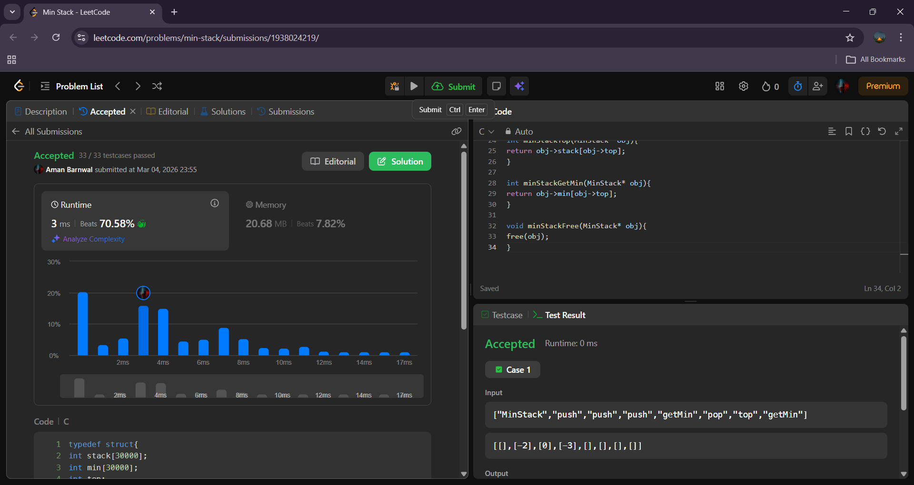

---

## Day 33

### Problem 1: Infix to Postfix Conversion Using Stack

**Description**  
This program converts an infix expression into postfix notation using a stack.  
Operator precedence is maintained while pushing and popping operators from the stack.

**Concepts Used**
- Stack Data Structure
- Expression Conversion
- Operator Precedence
- Character Processing

**Source Code**  
[Day33/infix_to_postfix.c](Day33/infix_to_postfix.c)

**Output Screenshot**

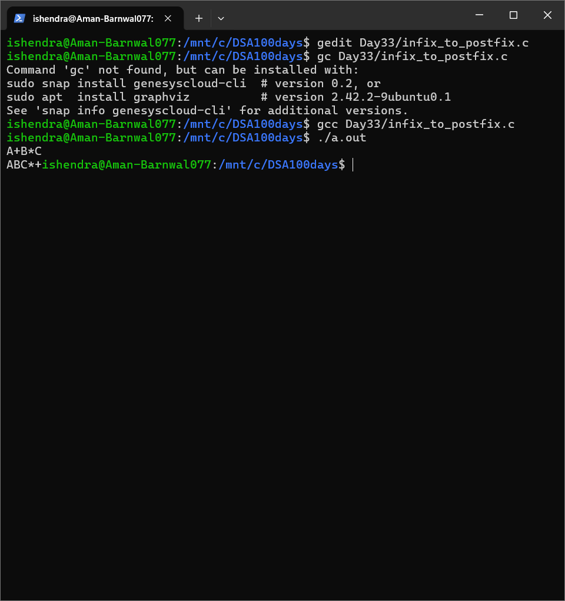

---

### Problem 2: Evaluate Reverse Polish Notation (LeetCode)

**Description**  
This problem evaluates an arithmetic expression written in Reverse Polish Notation.  
Operands are pushed onto a stack and operators apply operations on the top elements.

**Concepts Used**
- Stack
- Expression Evaluation
- Postfix Computation

**Output Screenshot**

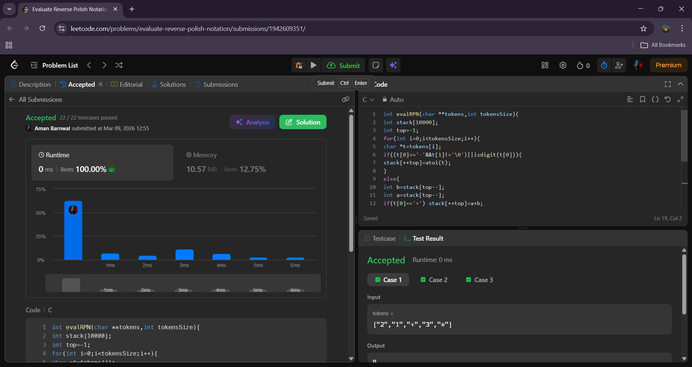

---

## Day 34

### Problem 1: Evaluate Postfix Expression Using Linked List Stack

**Description**  
A postfix expression is evaluated using a stack implemented with a linked list.  
Operands are pushed onto the stack and operators pop operands to compute results.

**Concepts Used**
- Stack using Linked List
- Dynamic Memory Allocation
- Postfix Evaluation

**Source Code**  
[Day34/postfix_eval_ll.c](Day34/postfix_eval_ll.c)

**Output Screenshot**

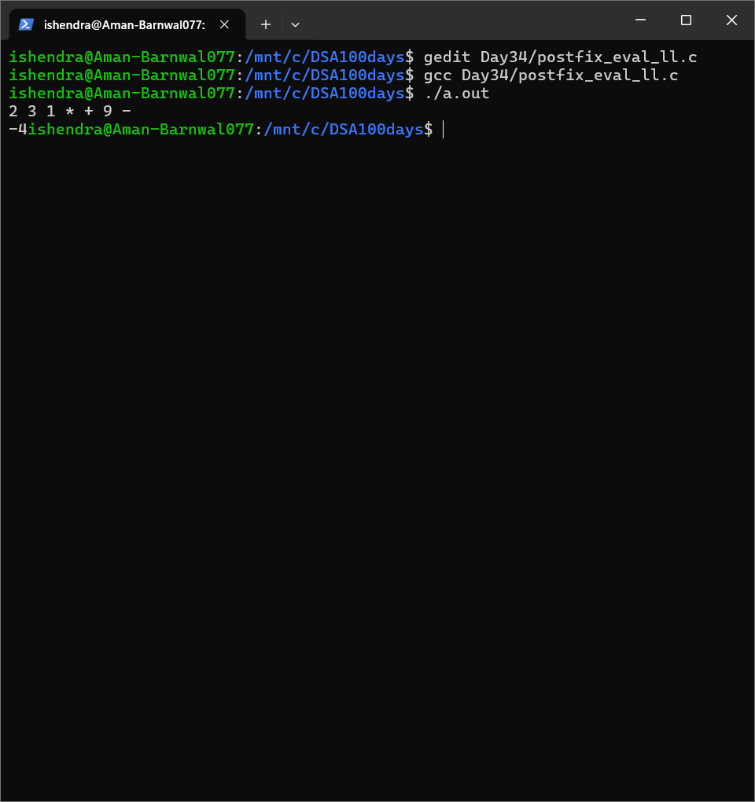

---

### Problem 2: Basic Calculator II (LeetCode)

**Description**  
This problem evaluates a string expression containing addition, subtraction, multiplication, and division.  
A stack is used to maintain correct operator precedence.

**Concepts Used**
- Stack
- Expression Parsing
- Operator Precedence Handling

**Output Screenshot**

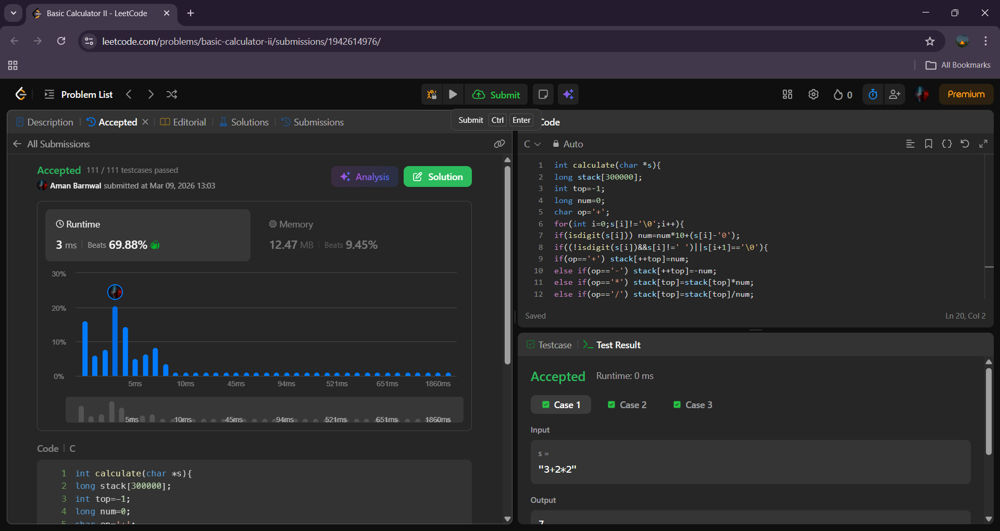

---

## Day 35

### Problem 1: Queue Implementation Using Array

**Description**  
A queue is implemented using an array with front and rear pointers.  
Elements are inserted at the rear and displayed from front to rear.

**Concepts Used**
- Queue Data Structure
- FIFO Principle
- Array Implementation

**Source Code**  
[Day35/queue_array.c](Day35/queue_array.c)

**Output Screenshot**

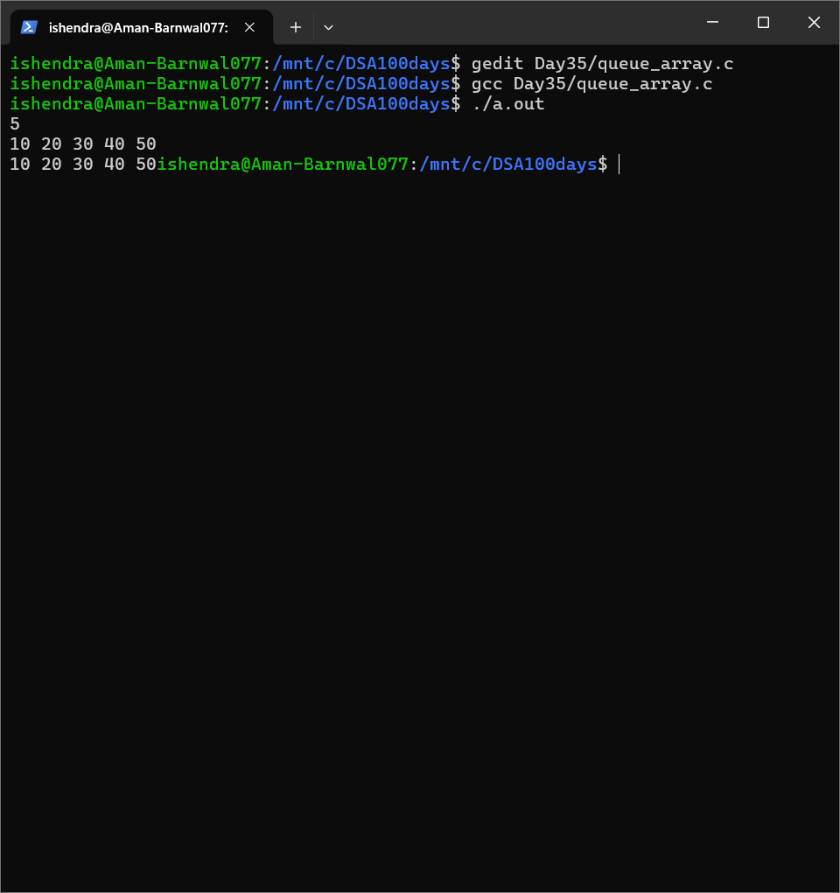

---

### Problem 2: Implement Queue Using Stacks (LeetCode)

**Description**  
A queue is implemented using two stacks.  
One stack handles push operations while the other helps simulate FIFO order during pop and peek operations.

**Concepts Used**
- Stack
- Queue Simulation
- Data Structure Transformation

**Output Screenshot**

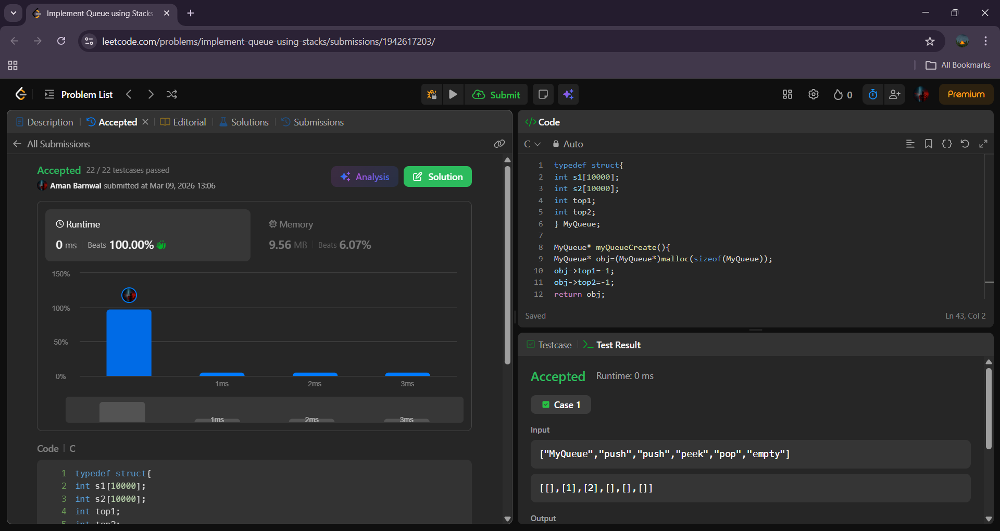

---

## Day 36

### Problem 1: Circular Queue Using Array

**Description**  
A circular queue is implemented using an array.  
The rear pointer wraps around to the beginning when the end of the array is reached.

**Concepts Used**
- Circular Queue
- Front and Rear Pointer Logic
- Modulo Arithmetic

**Source Code**  
[Day36/circular_queue_array.c](Day36/circular_queue_array.c)

**Output Screenshot**

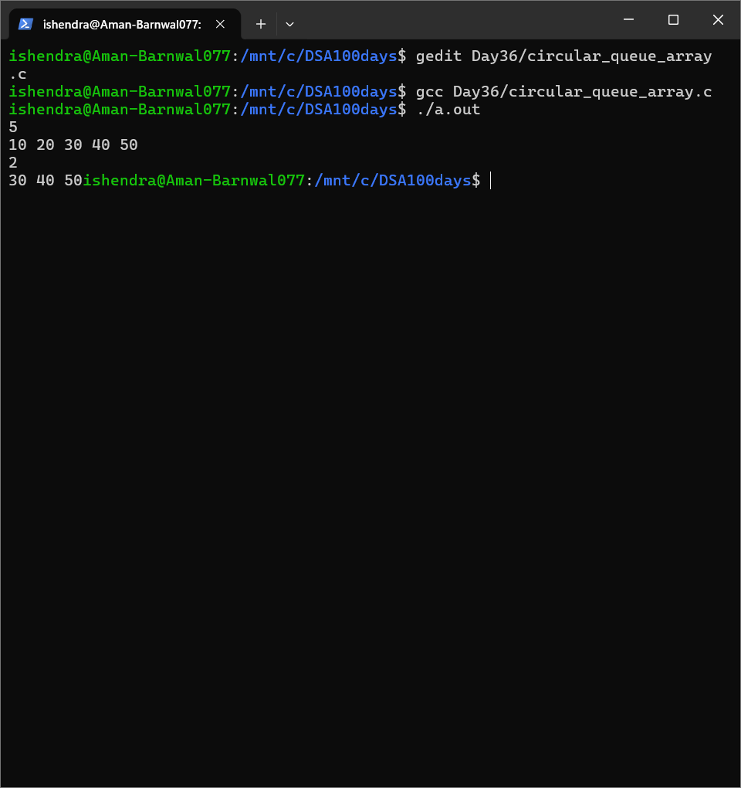

---

### Problem 2: Design Circular Deque (LeetCode)

**Description**  
A circular double-ended queue (deque) supports insertion and deletion from both ends.  
The structure maintains constant-time operations using circular indexing.

**Concepts Used**
- Deque Data Structure
- Circular Buffer
- Array-based Implementation

**Output Screenshot**

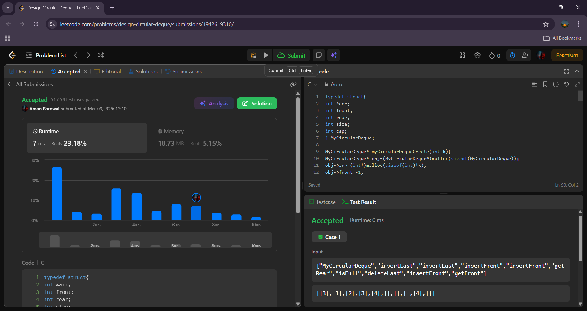

---

## Day 37

### Problem 1: Priority Queue Using Array

**Description**  
A priority queue is implemented using an array.  
Elements with smaller values have higher priority and are removed first.

**Concepts Used**
- Priority Queue
- Array Implementation
- Minimum Element Selection

**Source Code**  
[Day37/priority_queue_array.c](Day37/priority_queue_array.c)

**Output Screenshot**

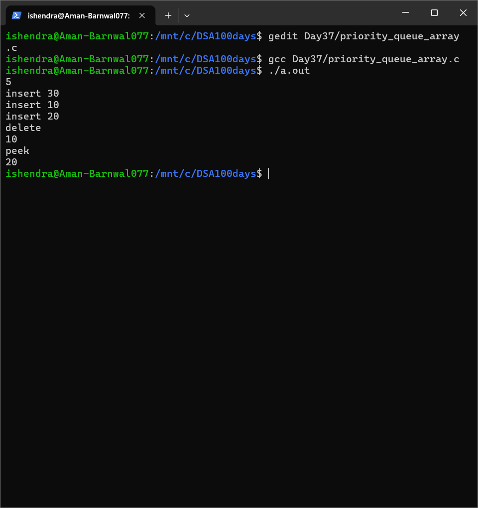

---

### Problem 2: Kth Largest Element in a Stream (LeetCode)

**Description**  
This problem maintains the kth largest element in a continuously updating stream of numbers.  
Each new element updates the sorted order and the kth largest value is returned.

**Concepts Used**
- Heap / Priority Queue Concept
- Stream Processing
- Dynamic Data Handling

**Output Screenshot**

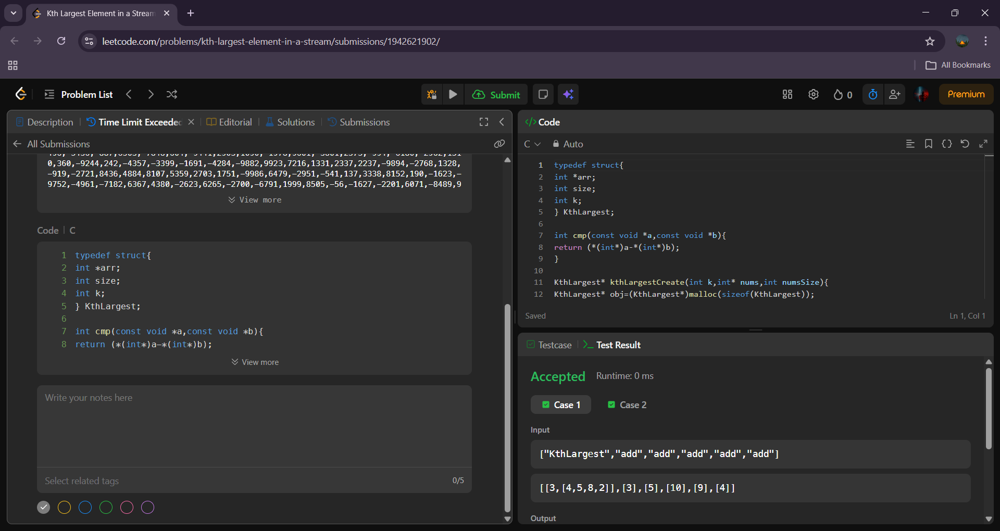

---

## Day 38

### Problem 1: Deque Operations Using Array

**Description**  
A deque (double-ended queue) is implemented using an array.  
It supports insertion and deletion from both front and rear.

**Concepts Used**
- Deque
- Array Implementation
- Front and Rear Operations

**Source Code**  
[Day38/deque_operations.c](Day38/deque_operations.c)

**Output Screenshot**

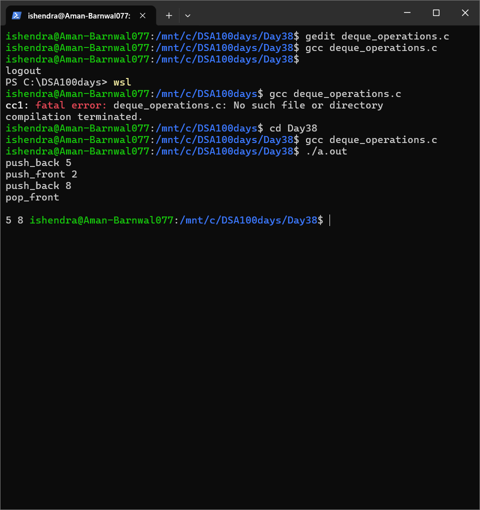

---

### Problem 2: Sliding Window Maximum (LeetCode)

**Description**  
Find the maximum element in every sliding window of size k in an array.  
Efficiently solved using deque to maintain useful elements.

**Concepts Used**
- Sliding Window Technique
- Deque
- Optimization

**Output Screenshot**

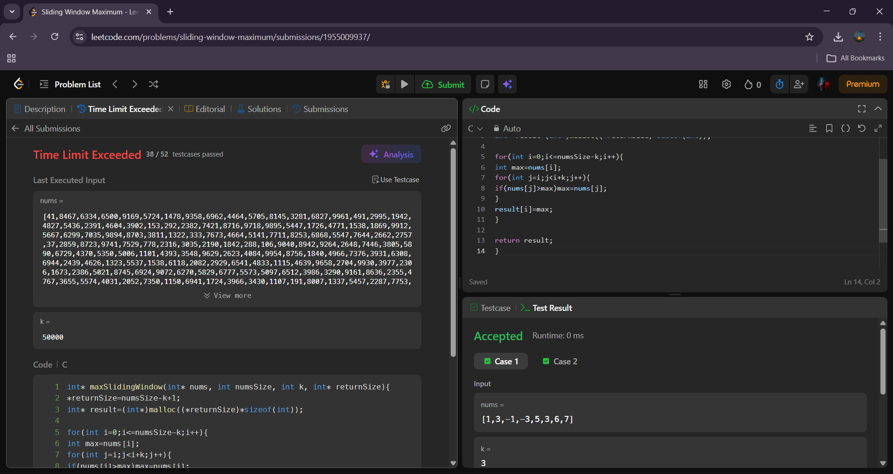

---

## Day 39

### Problem 1: Min Heap Implementation

**Description**  
A min heap is implemented using an array.  
It supports insertion, extraction of minimum element, and peek operation.

**Concepts Used**
- Heap Data Structure
- Priority Queue
- Heapify Up and Down

**Source Code**  
[Day39/min_heap.c](Day39/min_heap.c)

**Output Screenshot**

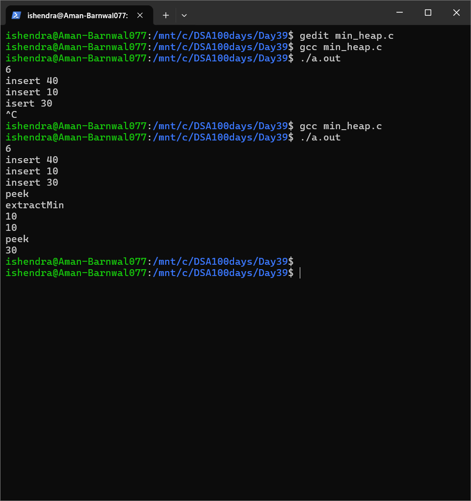

---

### Problem 2: Frequency Based Problem (LeetCode)

**Description**  
This problem involves analyzing frequency of elements and processing them efficiently.  
Typically solved using hashing or heap-based approaches.

**Concepts Used**
- Hashing
- Frequency Counting
- Heap / Priority Queue

**Output Screenshot**

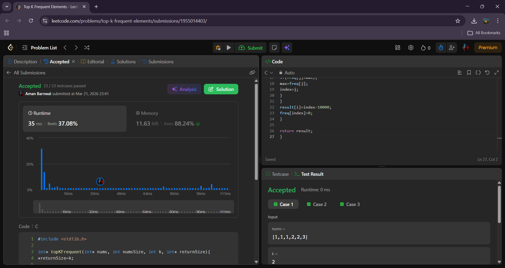

---

## Day 39

### Problem 1: Min Heap Implementation

**Description**  
A min heap is implemented using an array.  
It supports insertion, extraction of minimum element, and peek operation.

**Concepts Used**
- Heap Data Structure
- Priority Queue
- Heapify Up and Down

**Source Code**  
[Day39/min_heap.c](Day39/min_heap.c)

**Output Screenshot**

---

### Problem 2: Frequency Based Problem (LeetCode)

**Description**  
This problem involves analyzing frequency of elements and processing them efficiently.  
Typically solved using hashing or heap-based approaches.

**Concepts Used**
- Hashing
- Frequency Counting
- Heap / Priority Queue

**Output Screenshot**

---

## Day 40

### Problem 1: Heap Sort Implementation

**Description**  
Heap sort is implemented using a max heap.  
The array is first converted into a heap and then sorted by extracting elements.

**Concepts Used**
- Heap Data Structure
- Sorting Algorithms
- Heapify Operation

**Source Code**  
[Day40/heap_sort.c](Day40/heap_sort.c)

**Output Screenshot**

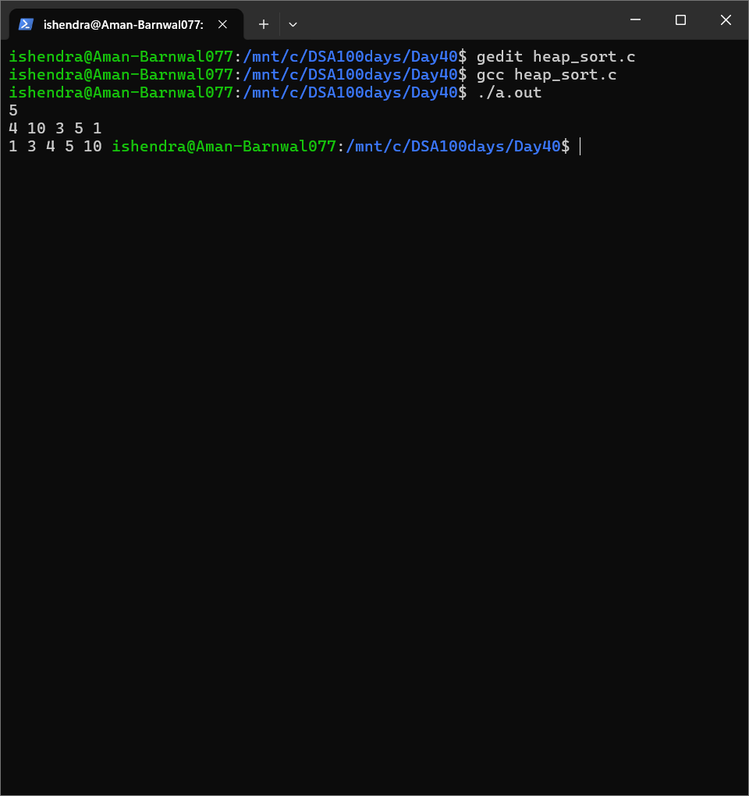

---

### Problem 2: Stack Based Problem (LeetCode)

**Description**  
This problem uses stack operations to process elements efficiently.  
It typically involves pushing and popping elements based on conditions.

**Concepts Used**
- Stack
- LIFO Principle
- Conditional Processing

**Output Screenshot**

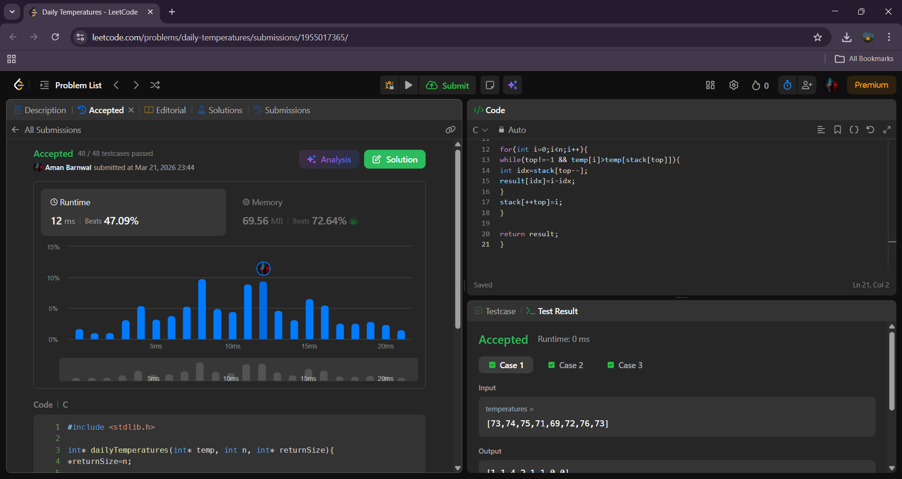

---

## Day 41

### Problem 1: Queue Implementation Using Linked List

**Description**  
A queue is implemented using a linked list.  
It supports enqueue and dequeue operations following FIFO order.

**Concepts Used**
- Queue
- Linked List
- Dynamic Memory Allocation

**Source Code**  
[Day41/queue_linked_list.c](Day41/queue_linked_list.c)

**Output Screenshot**

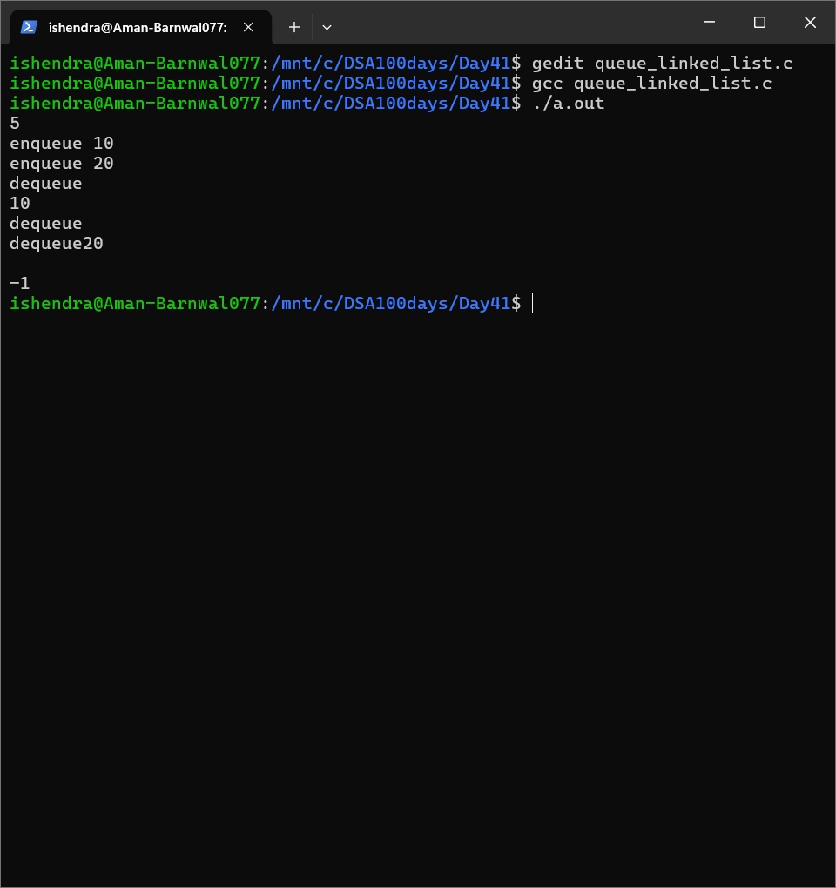

---

### Problem 2: Scheduling Based Problem (LeetCode)

**Description**  
This problem involves scheduling tasks efficiently based on given conditions.  
It is typically solved using queue or greedy approaches.

**Concepts Used**
- Scheduling
- Queue / Greedy Approach
- Optimization

**Output Screenshot**

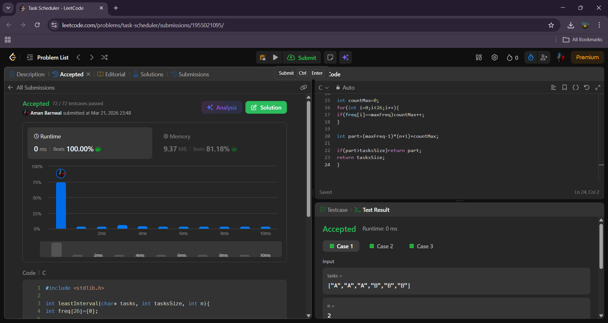

---

## Day 42

### Problem 1: Reverse Queue Using Stack

**Description**  
A queue is reversed using a stack.  
Elements are dequeued from the queue and pushed onto the stack, then printed in reverse order.

**Concepts Used**
- Queue
- Stack
- LIFO and FIFO Concepts

**Source Code**  
[Day42/reverse_queue.c](Day42/reverse_queue.c)

**Output Screenshot**

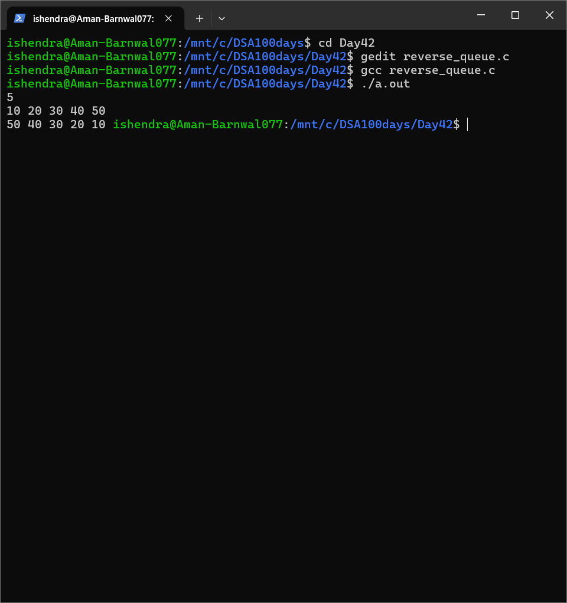

---

### Problem 2: Median Based Problem (LeetCode)

**Description**  
This problem involves finding the median efficiently from a data stream or dataset.  
It is typically solved using heaps or balanced data structures.

**Concepts Used**
- Heap
- Median Calculation
- Dynamic Data Handling

**Output Screenshot**

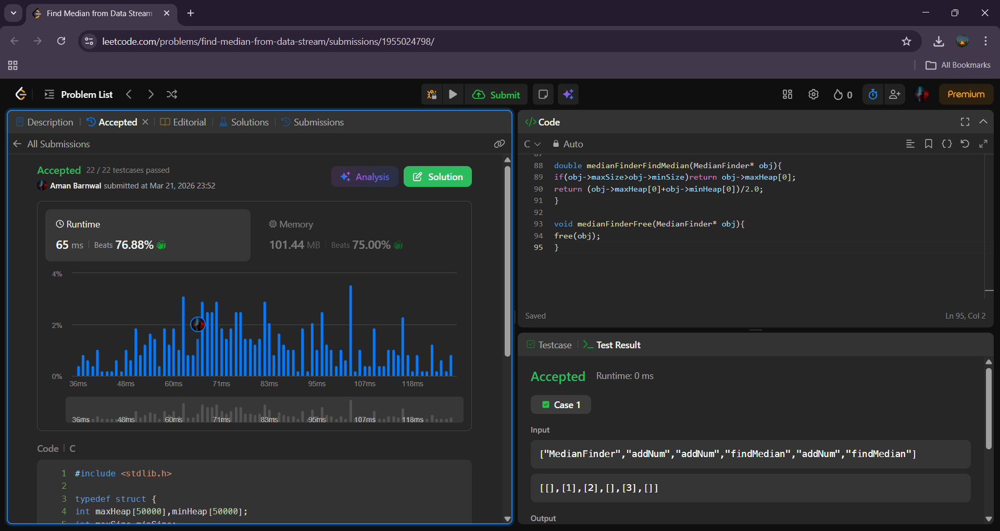

---

## Day 43

### Problem 1: Build Binary Tree and Inorder Traversal

**Description**  
A binary tree is constructed from an array representation.  
Inorder traversal of the tree is then performed and printed.

**Concepts Used**
- Binary Tree
- Tree Construction from Array
- Inorder Traversal

**Source Code**  
[Day43/build_tree_inorder.c](Day43/build_tree_inorder.c)

**Output Screenshot**

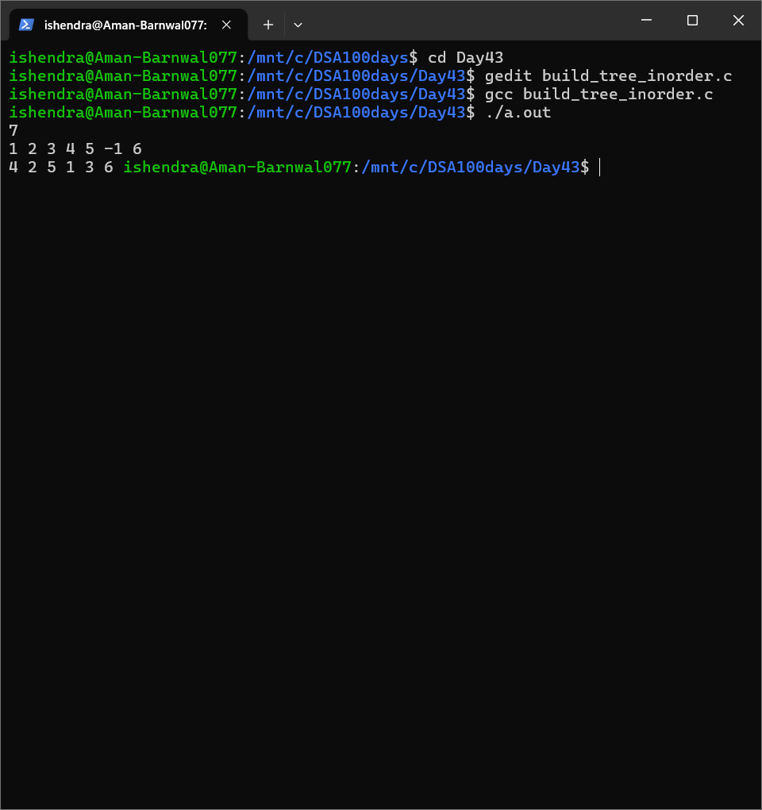

---

### Problem 2: Binary Tree Problem (LeetCode)

**Description**  
This problem involves operations on a binary tree structure.  
It focuses on traversal or processing of tree nodes efficiently.

**Concepts Used**
- Binary Tree
- Tree Traversal
- Recursion

**Output Screenshot**

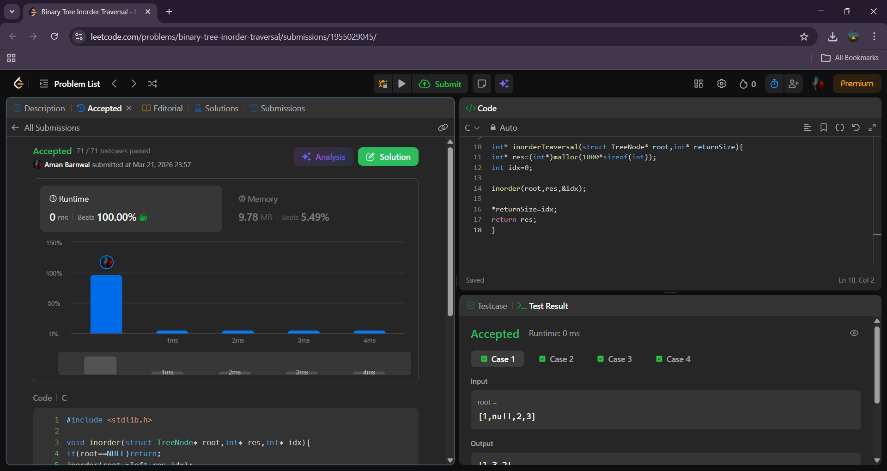

---

## Day 44

### Problem 1: Binary Tree Traversals

**Description**  
A binary tree is constructed from an array and traversed in different orders.  
Inorder, preorder, and postorder traversals are performed.

**Concepts Used**
- Binary Tree
- Inorder Traversal
- Preorder and Postorder Traversal

**Source Code**  
[Day44/tree_traversals.c](Day44/tree_traversals.c)

**Output Screenshot**

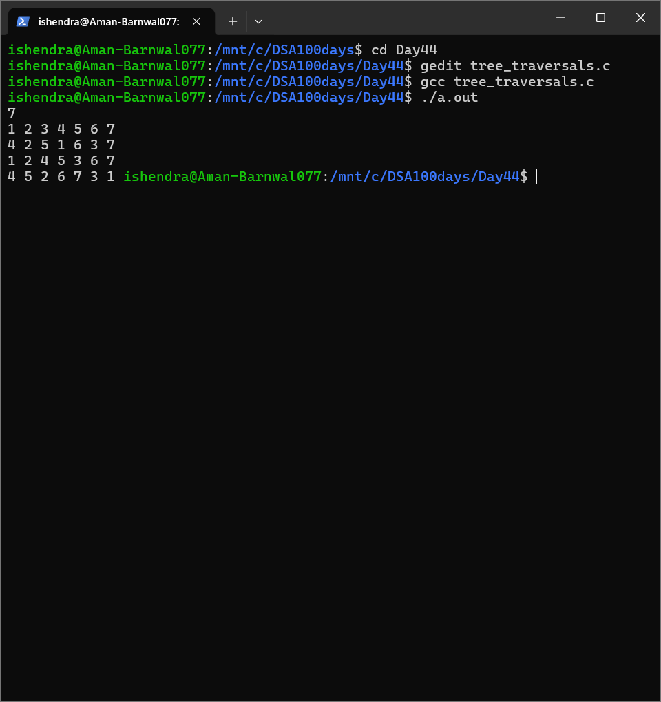

---

### Problem 2: Binary Tree Problem (LeetCode)

**Description**  
This problem focuses on processing binary tree data using traversal techniques.  
Different traversal methods are applied to solve tree-based problems.

**Concepts Used**
- Binary Tree
- Tree Traversal
- Recursion

**Output Screenshot**

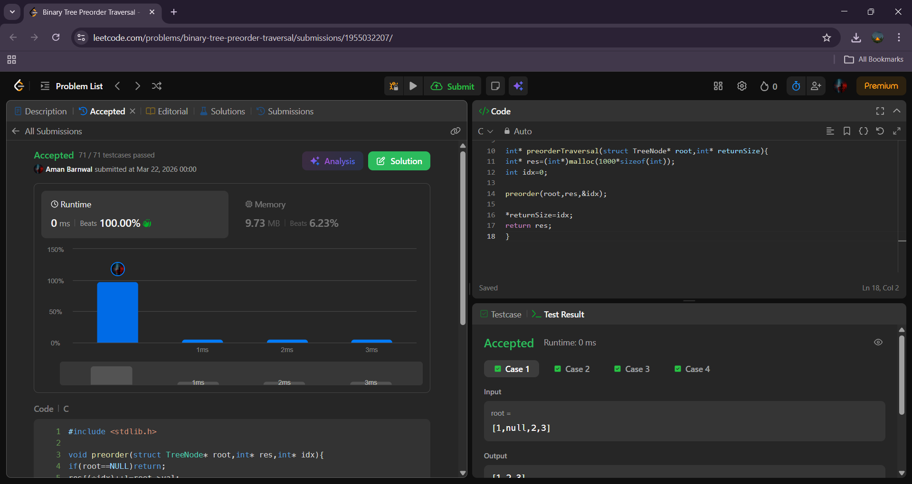

---

## Day 45

### Problem 1: Height of Binary Tree

**Description**  
The height of a binary tree is calculated using recursion.  
The maximum depth from root to leaf node is determined.

**Concepts Used**
- Binary Tree
- Recursion
- Tree Height Calculation

**Source Code**  
[Day45/tree_height.c](Day45/tree_height.c)

**Output Screenshot**

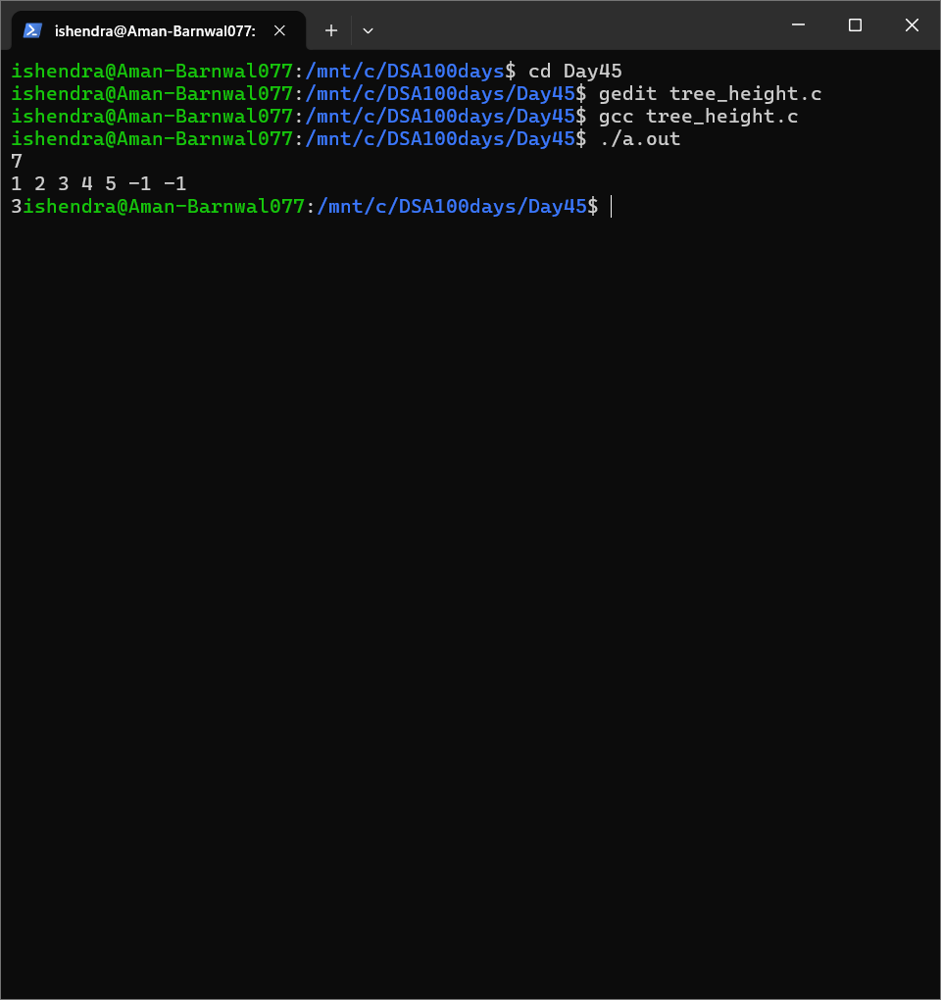

---

### Problem 2: Binary Tree Problem (LeetCode)

**Description**  
This problem involves analyzing properties of a binary tree structure.  
It typically focuses on traversal or depth-based calculations.

**Concepts Used**
- Binary Tree
- Recursion
- Tree Processing

**Output Screenshot**

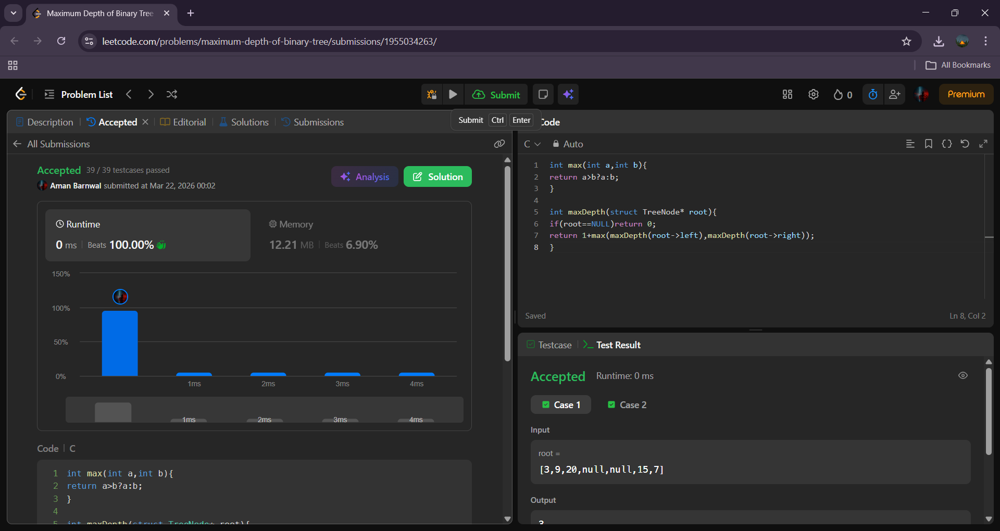

---

## Day 46

### Problem 1: Level Order Traversal

**Description**  
A binary tree is constructed from array input.  
Level order traversal is performed using a queue.

**Concepts Used**
- Binary Tree
- Queue (BFS Traversal)
- Array to Tree Conversion

**Source Code**  
[Day46/level_order_traversal.c](Day46/level_order_traversal.c)

**Output Screenshot**

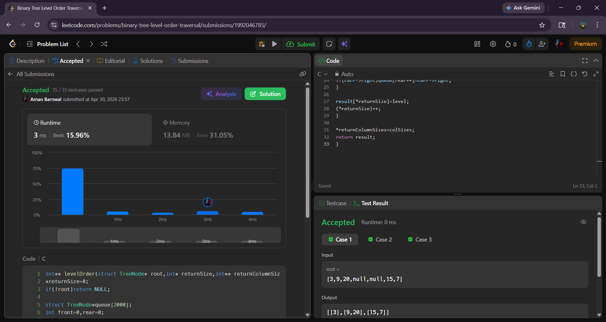

---

### Problem 2: Binary Tree Level Order Traversal (LeetCode)

**Description**  
Given a binary tree, return its level order traversal.  
Nodes are processed level by level from left to right.

**Concepts Used**
- Binary Tree
- Breadth First Search (BFS)
- Queue

**Output Screenshot**

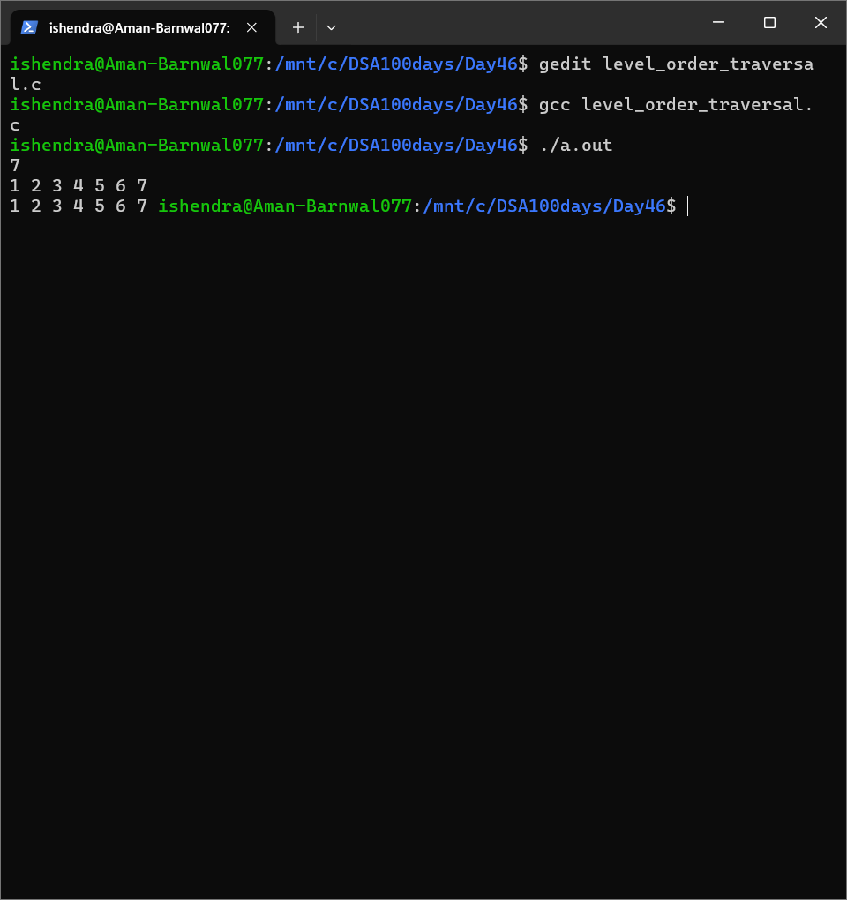

---

## Day 47

### Problem 1: Height of Binary Tree

**Description**  
The height of a binary tree is calculated using recursion.  
It determines the maximum depth from root to the farthest leaf node.

**Concepts Used**
- Binary Tree
- Recursion
- Depth Calculation

**Source Code**  
[Day47/tree_height.c](Day47/tree_height.c)

**Output Screenshot**

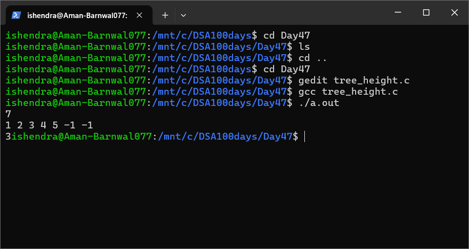

---

### Problem 2: Maximum Depth of Binary Tree (LeetCode)

**Description**  
Given a binary tree, return its maximum depth.  
The depth is the number of nodes along the longest path from root to leaf.

**Concepts Used**
- Binary Tree
- Recursion
- Tree Traversal

**Output Screenshot**

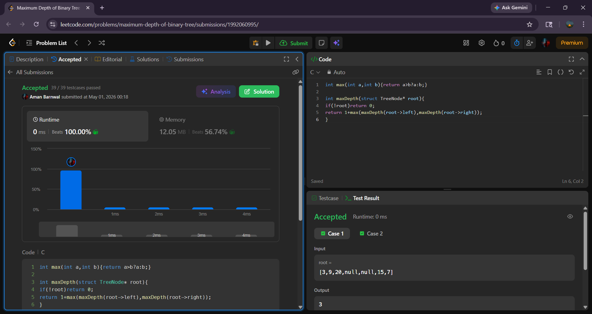

---

## Day 48

### Problem 1: Count Leaf Nodes

**Description**  
Counts the number of leaf nodes in a binary tree.  
A leaf node is defined as a node with no children.

**Concepts Used**
- Binary Tree
- Recursion
- Tree Traversal

**Source Code**  
[Day48/count_leaf_nodes.c](Day48/count_leaf_nodes.c)

**Output Screenshot**

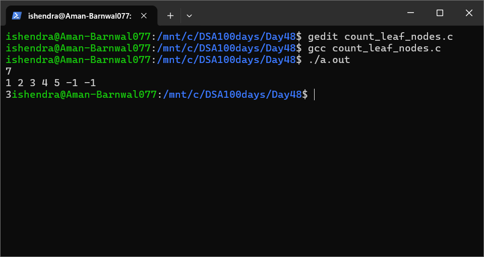

---

### Problem 2: Count Leaf Nodes (LeetCode)

**Description**  
Given a binary tree, return the number of leaf nodes.  
Leaf nodes are nodes that do not have left or right children.

**Concepts Used**
- Binary Tree
- Recursion
- Traversal

**Output Screenshot**

---

## Day 49

### Problem 1: BST Insert

**Description**  
Elements are inserted into a Binary Search Tree following BST rules.  
Inorder traversal is used to verify correct placement.

**Concepts Used**
- Binary Search Tree
- Recursion
- Tree Traversal

**Source Code**  
[Day49/bst_insert.c](Day49/bst_insert.c)

**Output Screenshot**

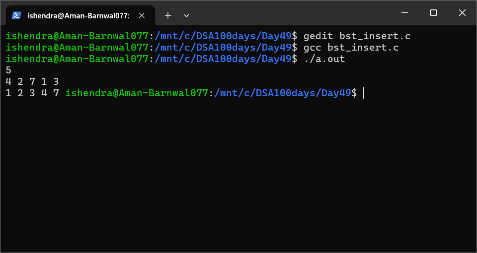

---

### Problem 2: Insert into a Binary Search Tree (LeetCode)

**Description**  
Given the root of a BST and a value, insert the value into the tree.  
The BST property is maintained after insertion.

**Concepts Used**
- Binary Search Tree
- Recursion
- Tree Insertion

**Output Screenshot**

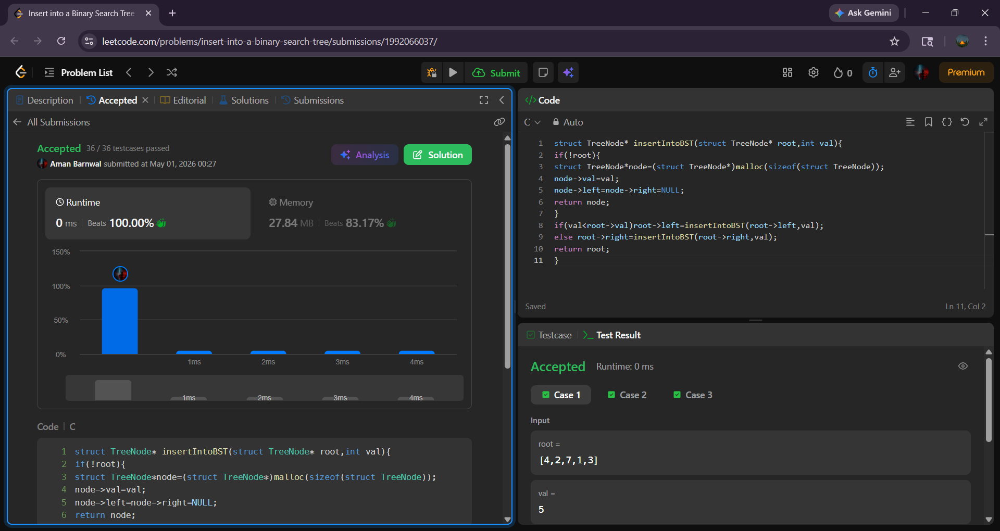

---

## Day 50

### Problem 1: BST Search

**Description**  
Search for a given value in a Binary Search Tree.  
Returns 1 if the value is found, otherwise returns 0.

**Concepts Used**
- Binary Search Tree
- Recursion
- Search Operation

**Source Code**  
[Day50/bst_search.c](Day50/bst_search.c)

**Output Screenshot**

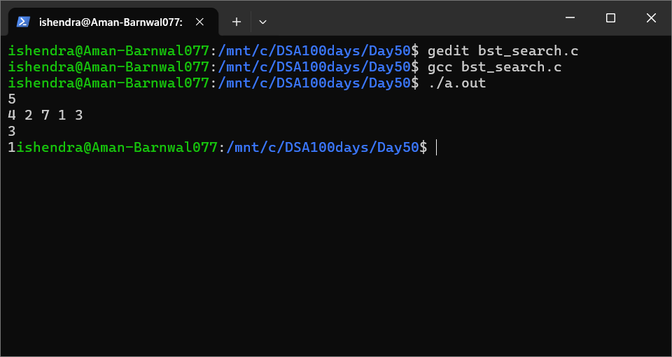

---

### Problem 2: Search in a Binary Search Tree (LeetCode)

**Description**  
Given the root of a BST and a value, return the node containing the value.  
If the value does not exist, return NULL.

**Concepts Used**
- Binary Search Tree
- Recursion
- Tree Traversal

**Output Screenshot**

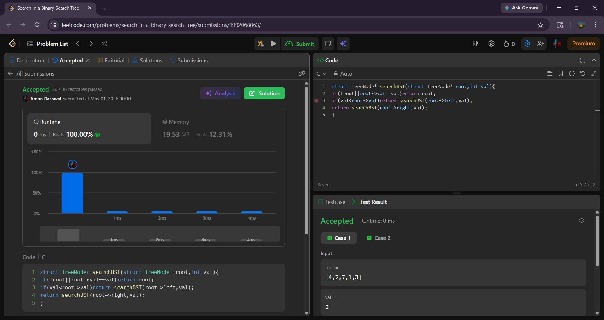

---

## Day 51

### Problem 1: Lowest Common Ancestor in BST

**Description**  
Finds the lowest common ancestor of two nodes in a binary search tree.  
The LCA is the lowest node that has both nodes as descendants.

**Concepts Used**
- Binary Search Tree
- Recursion
- Tree Traversal

**Source Code**  
[Day51/bst_lca.c](Day51/bst_lca.c)

**Output Screenshot**

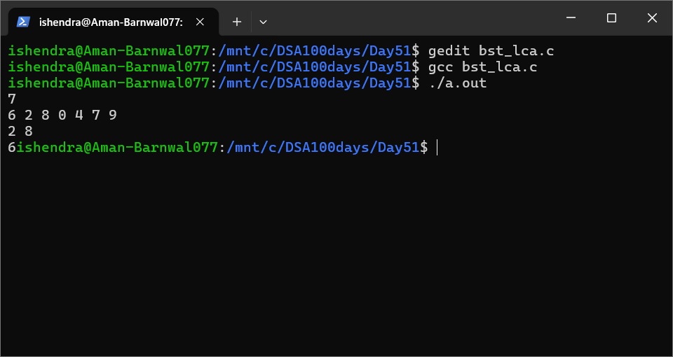

---

### Problem 2: Lowest Common Ancestor of a BST (LeetCode)

**Description**  
Given a BST and two nodes, return their lowest common ancestor.  
The BST property is used to efficiently determine the ancestor.

**Concepts Used**
- Binary Search Tree
- Recursion
- Tree Traversal

**Output Screenshot**

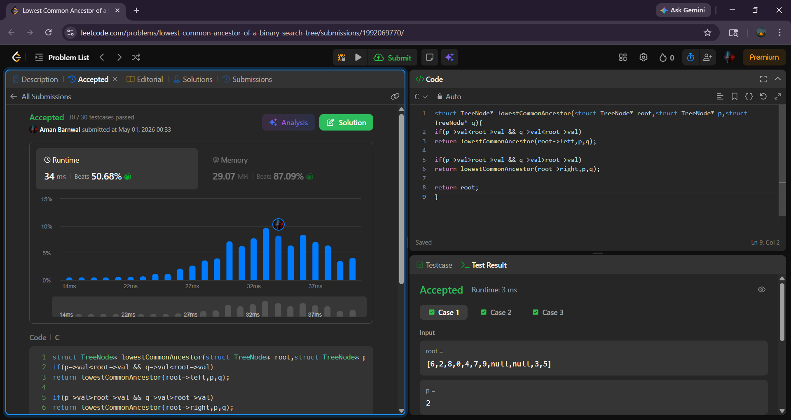

## Day 52

### Problem 1: Lowest Common Ancestor in Binary Tree

**Description**  
Finds the lowest common ancestor of two nodes in a binary tree.  
The LCA is the lowest node that has both nodes as descendants.

**Concepts Used**
- Binary Tree
- Recursion
- Tree Traversal

**Source Code**  
[Day52/binary_tree_lca.c](Day52/binary_tree_lca.c)

**Output Screenshot**

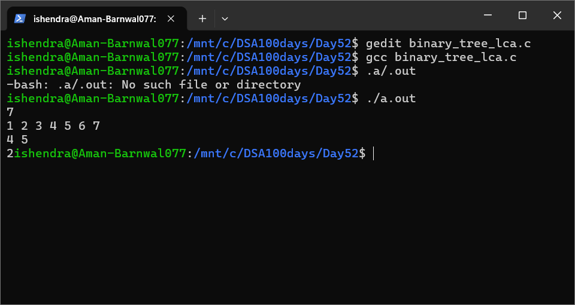

---

### Problem 2: Lowest Common Ancestor of a Binary Tree (LeetCode)

**Description**  
Given a binary tree and two nodes, return their lowest common ancestor.  
The solution works without using BST properties.

**Concepts Used**
- Binary Tree
- Recursion
- Tree Traversal

**Output Screenshot**

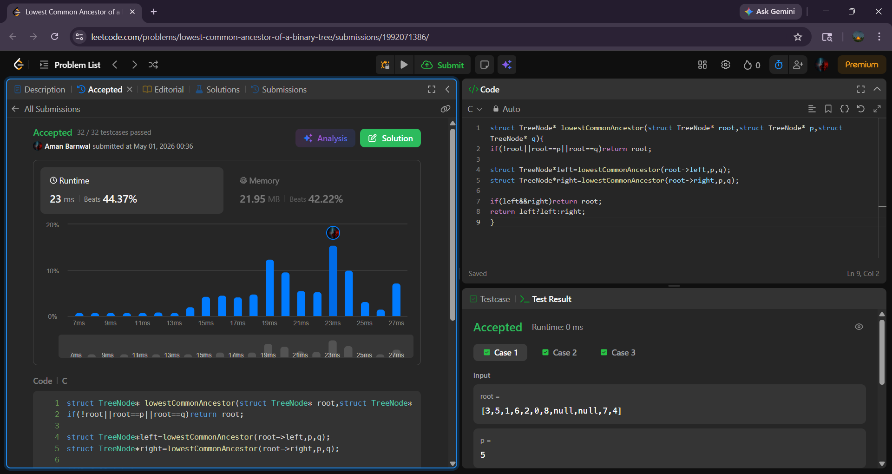

---

## Day 53

### Problem 1: Vertical Order Traversal of Binary Tree

**Description**  
Prints the vertical order traversal of a binary tree.  
Nodes are grouped based on their horizontal distance from the root.

**Concepts Used**
- Binary Tree
- Breadth First Search (BFS)
- Horizontal Distance Mapping

**Source Code**  
[Day53/vertical_order.c](Day53/vertical_order.c)

**Output Screenshot**

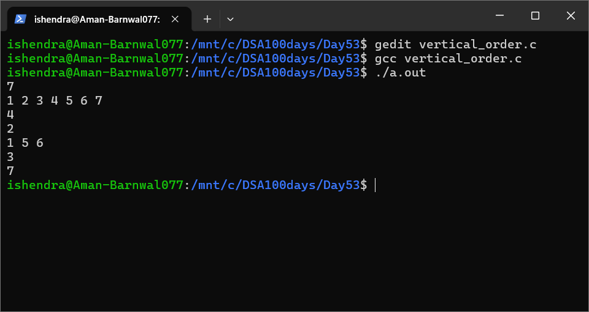

---

### Problem 2: Binary Tree Level Order Traversal (LeetCode)

**Description**  
Given a binary tree, return its level order traversal.  
Nodes are processed level by level from left to right.

**Concepts Used**
- Binary Tree
- BFS Traversal
- Queue

**Output Screenshot**

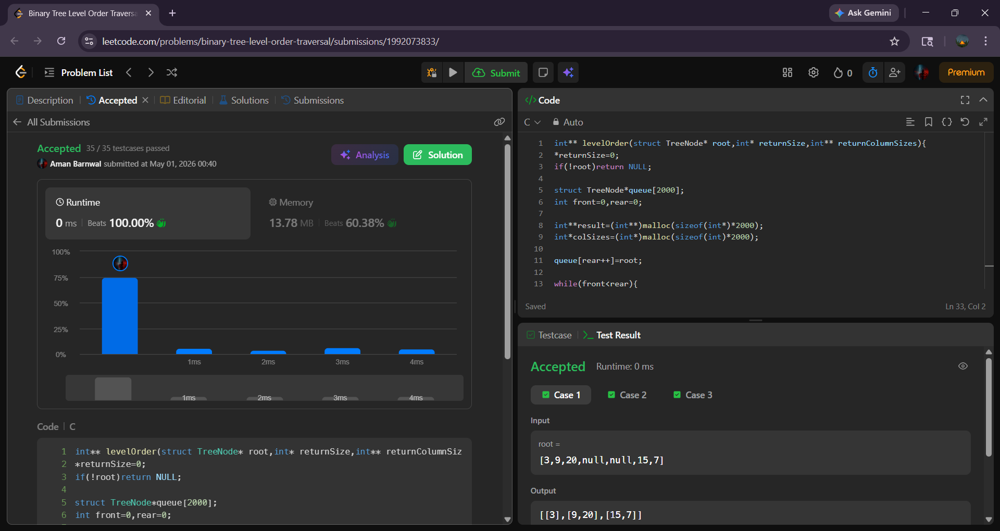

---

## Day 54

### Problem 1: Zigzag Level Order Traversal of Binary Tree

**Description**  
Performs zigzag (spiral) traversal of a binary tree.  
Levels are printed alternately from left-to-right and right-to-left.

**Concepts Used**
- Binary Tree
- Breadth First Search (BFS)
- Level Order Traversal

**Source Code**  
[Day54/zigzag_traversal.c](Day54/zigzag_traversal.c)

**Output Screenshot**

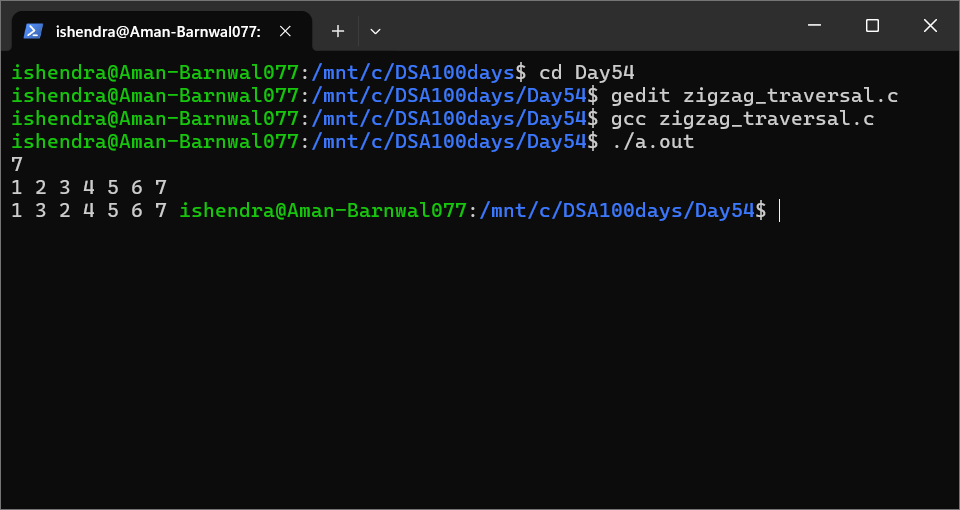

---

### Problem 2: Binary Tree Zigzag Level Order Traversal (LeetCode)

**Description**  
Given a binary tree, return its zigzag level order traversal.  
Each level alternates between left-to-right and right-to-left order.

**Concepts Used**
- Binary Tree
- BFS Traversal
- Queue

**Output Screenshot**

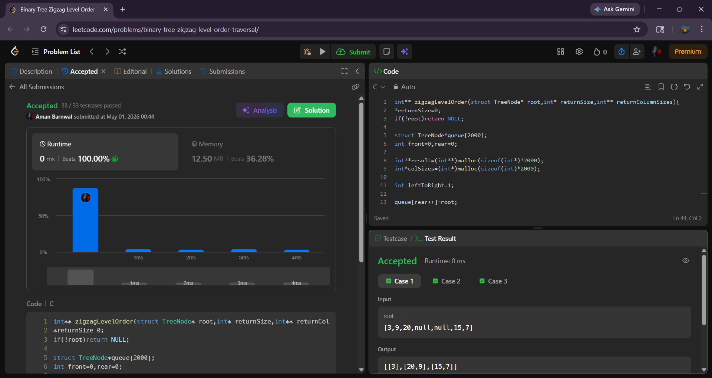

---

## Day 55

### Problem 1: Right View of Binary Tree

**Description**  
Prints the nodes visible when the binary tree is viewed from the right side.  
At each level, the rightmost node is selected.

**Concepts Used**
- Binary Tree
- Breadth First Search (BFS)
- Level Order Traversal

**Source Code**  
[Day55/right_view.c](Day55/right_view.c)

**Output Screenshot**

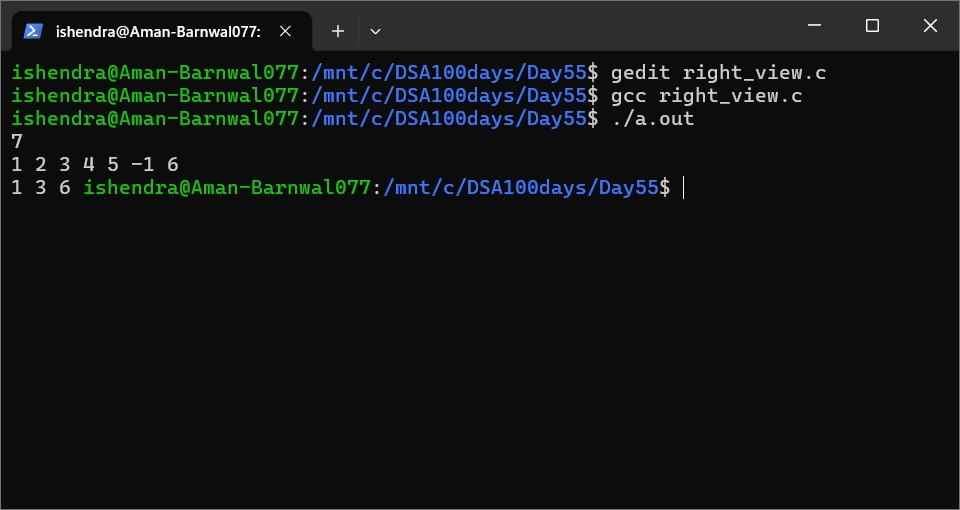

---

### Problem 2: Binary Tree Right Side View (LeetCode)

**Description**  
Given a binary tree, return the values of nodes visible from the right side.  
The result contains the last node of each level.

**Concepts Used**
- Binary Tree
- BFS Traversal
- Queue

**Output Screenshot**

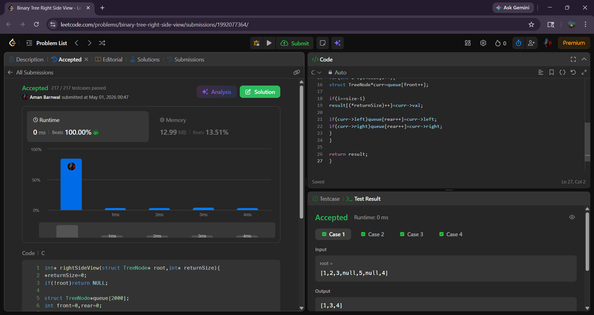

---

## Day 56

### Problem 1: Check Symmetric Binary Tree

**Description**  
Checks whether a binary tree is symmetric around its center.  
The left subtree is compared with the mirror of the right subtree.

**Concepts Used**
- Binary Tree
- Recursion
- Tree Traversal

**Source Code**  
[Day56/symmetric_tree.c](Day56/symmetric_tree.c)

**Output Screenshot**

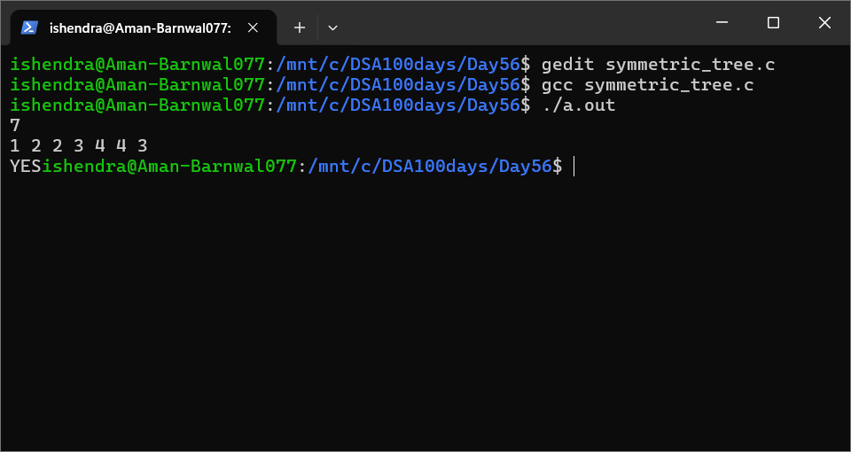

---

### Problem 2: Symmetric Tree (LeetCode)

**Description**  
Given a binary tree, determine whether it is symmetric around its center.  
Both recursive and iterative approaches can be used to verify symmetry.

**Concepts Used**
- Binary Tree
- Recursion
- BFS (Queue)

**Output Screenshot**

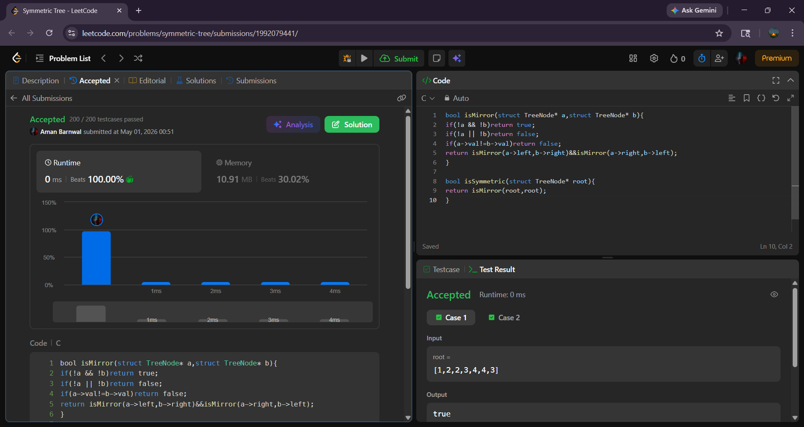

---

## Day 57

### Problem 1: Mirror Binary Tree

**Description**  
Converts a binary tree into its mirror image by swapping left and right children at every node.  
Inorder traversal of the mirrored tree is printed.

**Concepts Used**
- Binary Tree
- Recursion
- Tree Traversal

**Source Code**  
[Day57/mirror_tree.c](Day57/mirror_tree.c)

**Output Screenshot**

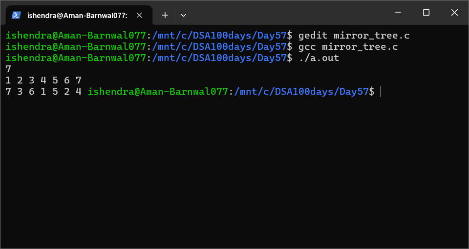

---

### Problem 2: Flatten Binary Tree to Linked List (LeetCode)

**Description**  
Transforms a binary tree into a linked list in-place following preorder traversal.  
Each node’s right pointer points to the next node, and left pointer becomes NULL.

**Concepts Used**
- Binary Tree
- Preorder Traversal
- In-place Transformation

**Output Screenshot**

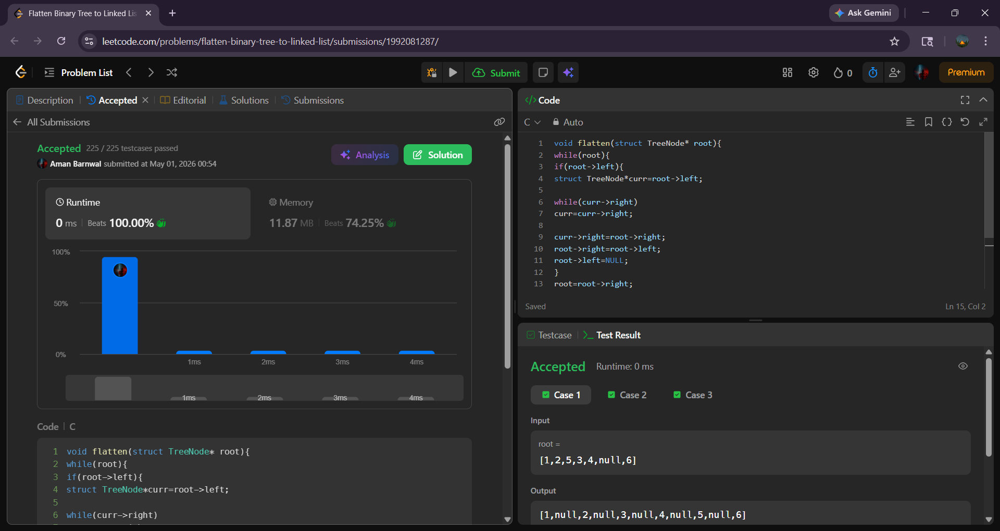

---

## Day 58

### Problem 1: Construct Binary Tree from Preorder and Inorder

**Description**  
Constructs a binary tree using given preorder and inorder traversals.  
The constructed tree is then printed using postorder traversal.

**Concepts Used**
- Binary Tree
- Recursion
- Tree Construction

**Source Code**  
[Day58/build_tree_pre_in.c](Day58/build_tree_pre_in.c)

**Output Screenshot**

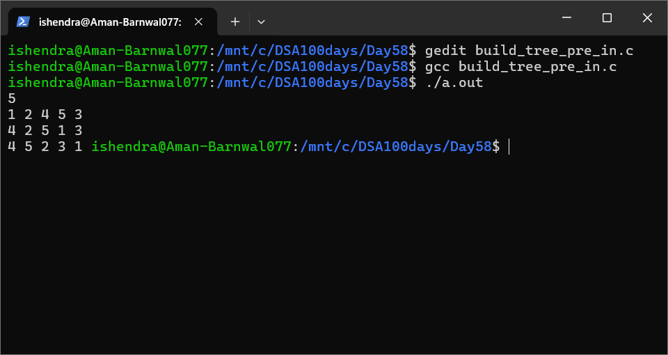

---

### Problem 2: Construct Binary Tree from Preorder and Inorder Traversal (LeetCode)

**Description**  
Given preorder and inorder traversal arrays, construct and return the binary tree.  
Preorder identifies the root, and inorder divides the tree into left and right subtrees.

**Concepts Used**
- Binary Tree
- Recursion
- Tree Construction

**Output Screenshot**

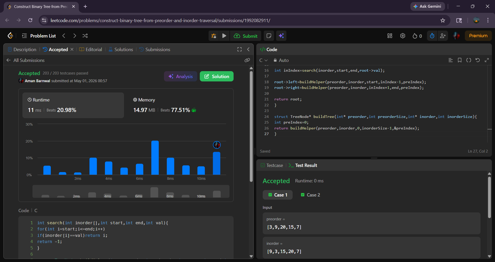

---

## Day 59

### Problem 1: Construct Binary Tree from Inorder and Postorder

**Description**  
Constructs a binary tree using given inorder and postorder traversals.  
The constructed tree is then printed using preorder traversal.

**Concepts Used**
- Binary Tree
- Recursion
- Tree Construction

**Source Code**  
[Day59/build_tree_in_post.c](Day59/build_tree_in_post.c)

**Output Screenshot**

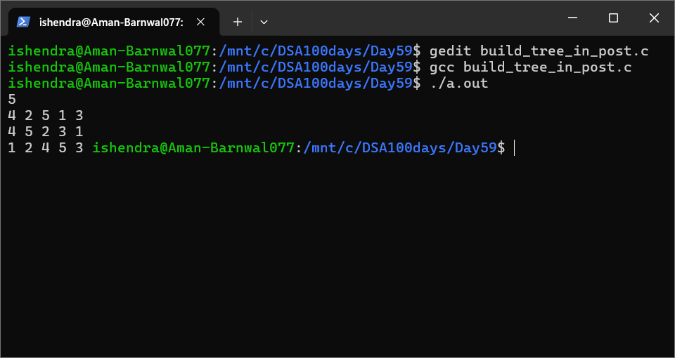

---

### Problem 2: Construct Binary Tree from Inorder and Postorder Traversal (LeetCode)

**Description**  
Given inorder and postorder traversal arrays, construct and return the binary tree.  
Postorder identifies the root, and inorder divides the tree into left and right subtrees.

**Concepts Used**
- Binary Tree
- Recursion
- Tree Construction

**Output Screenshot**

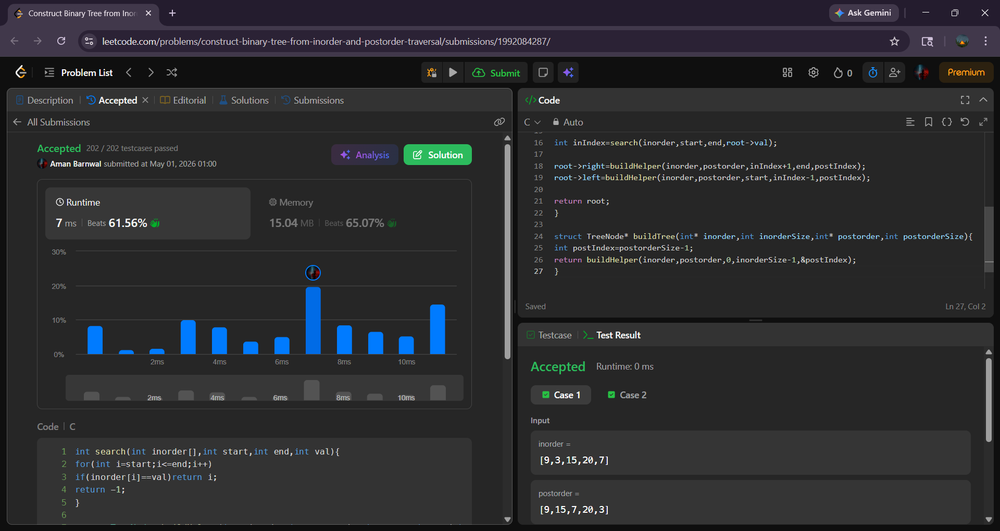

---

## Day 60

### Problem 1: Check Min-Heap Property in Binary Tree

**Description**  
Checks whether a given binary tree satisfies the Min-Heap property.  
Each parent node must be smaller than its children.

**Concepts Used**
- Binary Tree
- Array Representation
- Heap Property

**Source Code**  
[Day60/min_heap_check.c](Day60/min_heap_check.c)

**Output Screenshot**

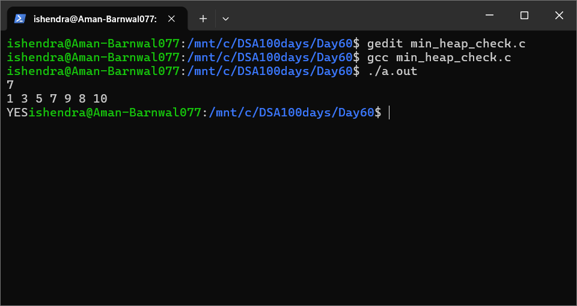

---

### Problem 2: Binary Tree Cameras (LeetCode)

**Description**  
Given a binary tree, determine the minimum number of cameras required to monitor all nodes.  
Each camera covers its parent, itself, and its immediate children.

**Concepts Used**
- Binary Tree
- DFS Traversal
- Greedy Approach

**Output Screenshot**

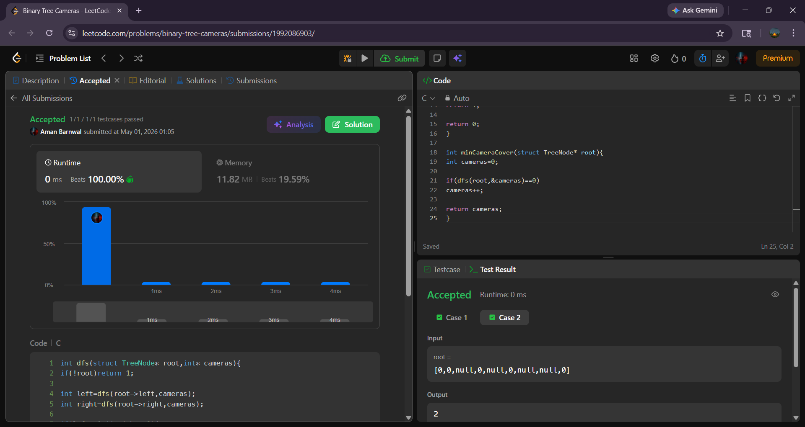

---

## Day 61

### Problem 1: Adjacency Matrix Representation of Graph

**Description**  
Constructs a graph using adjacency matrix representation.  
Edges are stored in a 2D matrix indicating connections between vertices.

**Concepts Used**
- Graph Representation
- Adjacency Matrix
- Undirected Graph

**Source Code**  
[Day61/adjacency_matrix.c](Day61/adjacency_matrix.c)

**Output Screenshot**

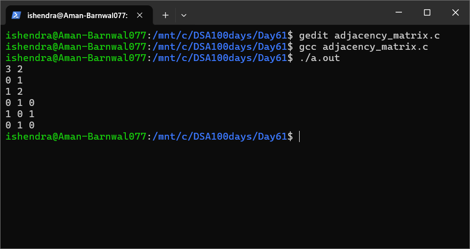

---

### Problem 2: Number of Provinces (LeetCode)

**Description**  
Given a matrix representing connections between cities, determine the number of provinces.  
A province is a group of directly or indirectly connected cities.

**Concepts Used**
- Graph Traversal
- Depth First Search (DFS)
- Connected Components

**Output Screenshot**

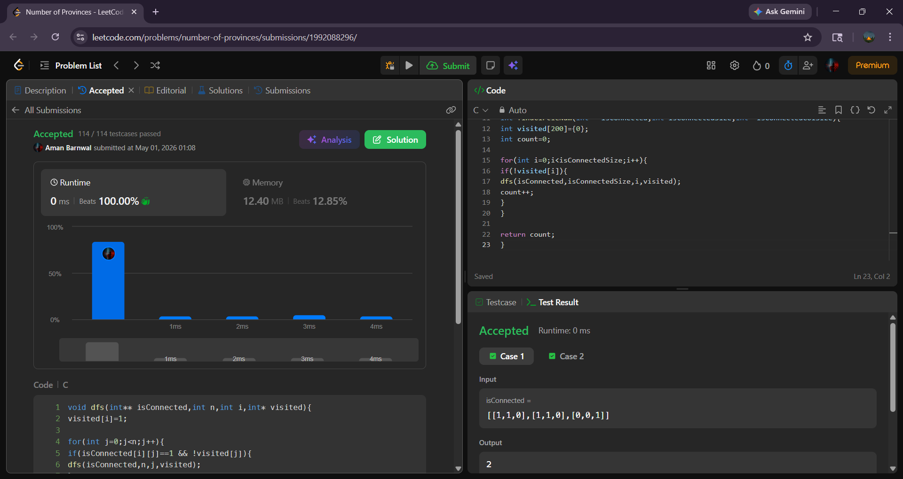

---

## Day 62

### Problem 1: Adjacency List Representation of Graph

**Description**  
Constructs a graph using adjacency list representation.  
Each vertex stores a list of its adjacent vertices using linked lists.

**Concepts Used**
- Graph Representation
- Adjacency List
- Linked List

**Source Code**  
[Day62/adjacency_list.c](Day62/adjacency_list.c)

**Output Screenshot**

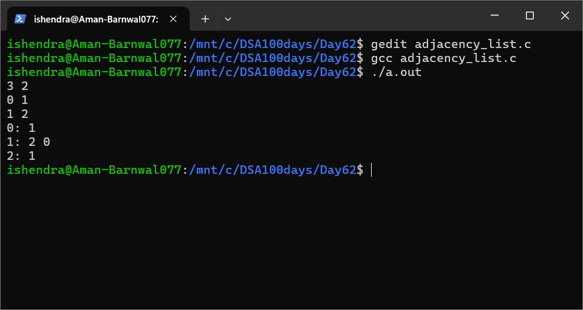

---

### Problem 2: Keys and Rooms (LeetCode)

**Description**  
Determines whether all rooms can be visited starting from room 0.  
Uses graph traversal to check reachability of all nodes.

**Concepts Used**
- Graph Traversal
- Depth First Search (DFS)
- Visited Array

**Output Screenshot**

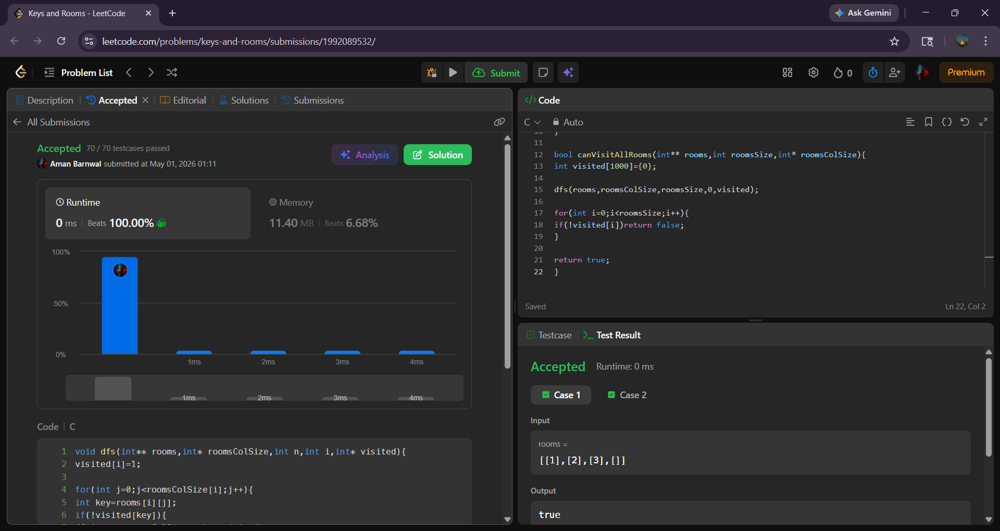

---

## Day 63

### Problem 1: DFS Traversal of Graph

**Description**  
Performs Depth First Search (DFS) traversal of a graph starting from a given source vertex.  
The graph is represented using adjacency lists.

**Concepts Used**
- Graph Traversal
- Depth First Search (DFS)
- Recursion

**Source Code**  
[Day63/dfs_traversal.c](Day63/dfs_traversal.c)

**Output Screenshot**

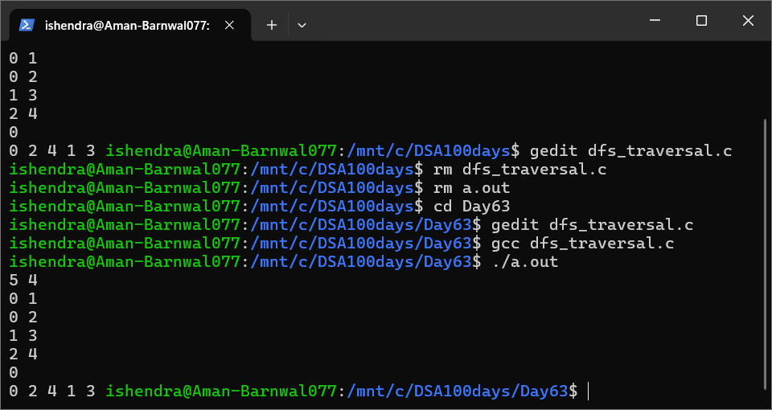

---

### Problem 2: Flood Fill (LeetCode)

**Description**  
Performs flood fill on a 2D grid starting from a given pixel.  
All connected pixels with the same initial color are changed to a new color.

**Concepts Used**
- DFS Traversal
- Matrix/Grid Processing
- Recursion

**Output Screenshot**

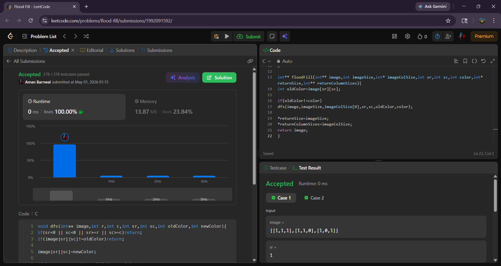

---

## Day 64

### Problem 1: BFS Traversal of Graph

**Description**  
Performs Breadth First Search (BFS) traversal starting from a given source vertex.  
Uses a queue to explore nodes level by level.

**Concepts Used**
- Graph Traversal
- Breadth First Search (BFS)
- Queue

**Source Code**  
[Day64/bfs_traversal.c](Day64/bfs_traversal.c)

**Output Screenshot**

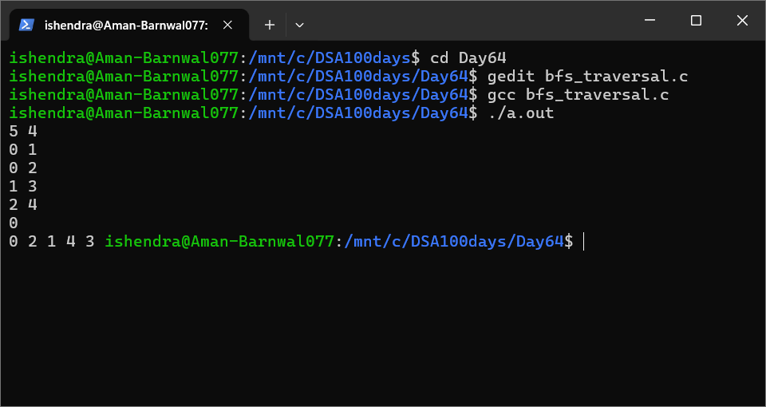

---

### Problem 2: Rotting Oranges (LeetCode)

**Description**  
Determines the minimum time required for all fresh oranges to become rotten.  
Uses BFS to simulate spreading of rot level by level.

**Concepts Used**
- BFS Traversal
- Grid Processing
- Queue

**Output Screenshot**

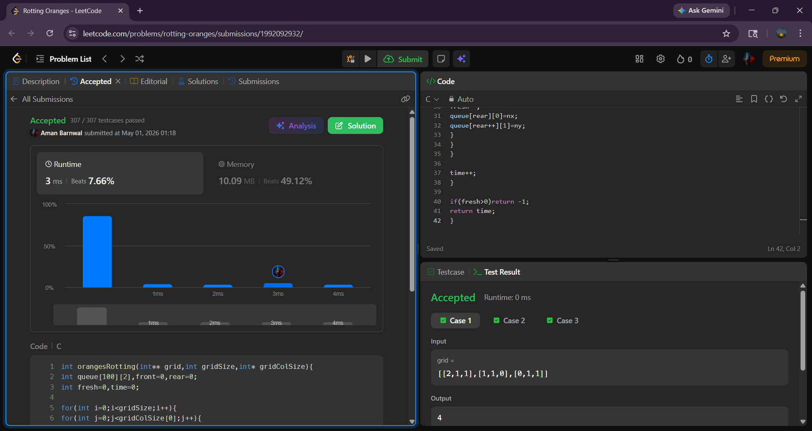

---

## Day 65

### Problem 1: Detect Cycle in Undirected Graph (DFS)

**Description**  
Checks whether an undirected graph contains a cycle using Depth First Search.  
Parent tracking is used to avoid considering the immediate parent as a cycle.

**Concepts Used**
- Graph Traversal
- Depth First Search (DFS)
- Parent Tracking

**Source Code**  
[Day65/detect_cycle_dfs.c](Day65/detect_cycle_dfs.c)

**Output Screenshot**

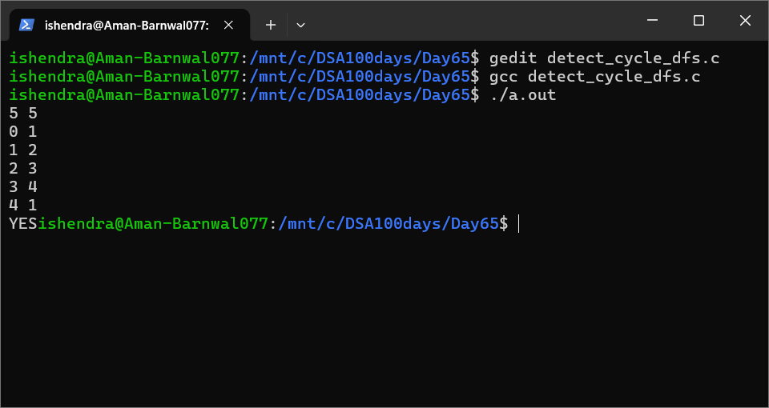

---

### Problem 2: Detect Cycle in Undirected Graph (GFG)

**Description**  
Given a graph represented using edge list, determine whether it contains a cycle.  
The graph may contain multiple disconnected components.

**Concepts Used**
- Graph Traversal
- DFS
- Cycle Detection

**Output Screenshot**

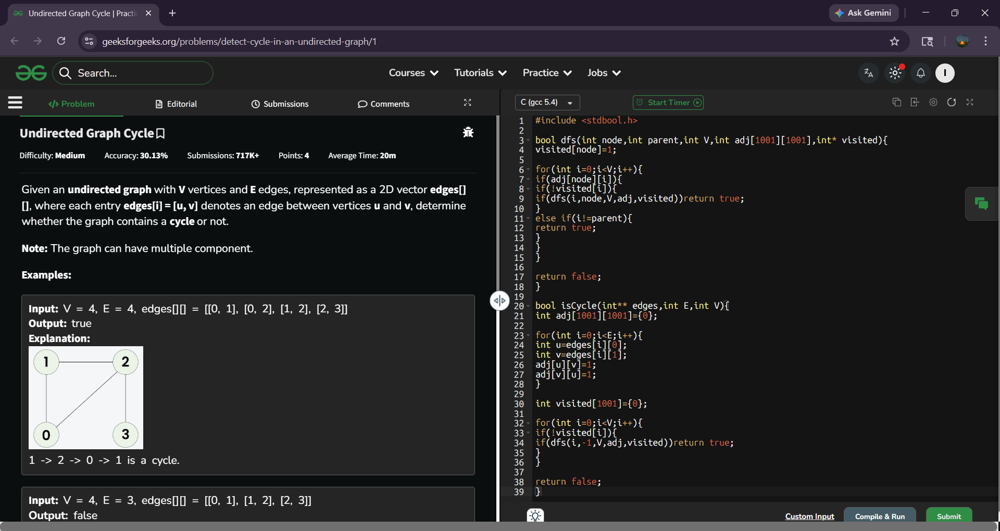

---

## Day 66

### Problem 1: Detect Cycle in Directed Graph (DFS)

**Description**  
Detects whether a directed graph contains a cycle using DFS and recursion stack.  
A cycle exists if a node is revisited while still in the recursion stack.

**Concepts Used**
- Graph Traversal
- Depth First Search (DFS)
- Recursion Stack

**Source Code**  
[Day66/detect_cycle_directed.c](Day66/detect_cycle_directed.c)

**Output Screenshot**

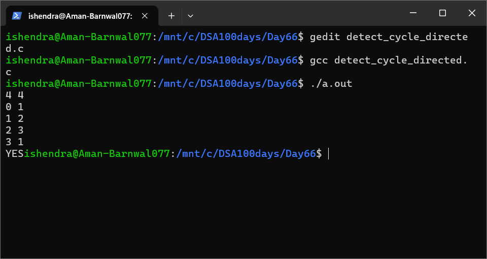

---

### Problem 2: Course Schedule (LeetCode)

**Description**  
Determines whether all courses can be completed given prerequisite constraints.  
The problem reduces to detecting a cycle in a directed graph.

**Concepts Used**
- Graph Representation
- DFS
- Cycle Detection (Directed Graph)

**Output Screenshot**

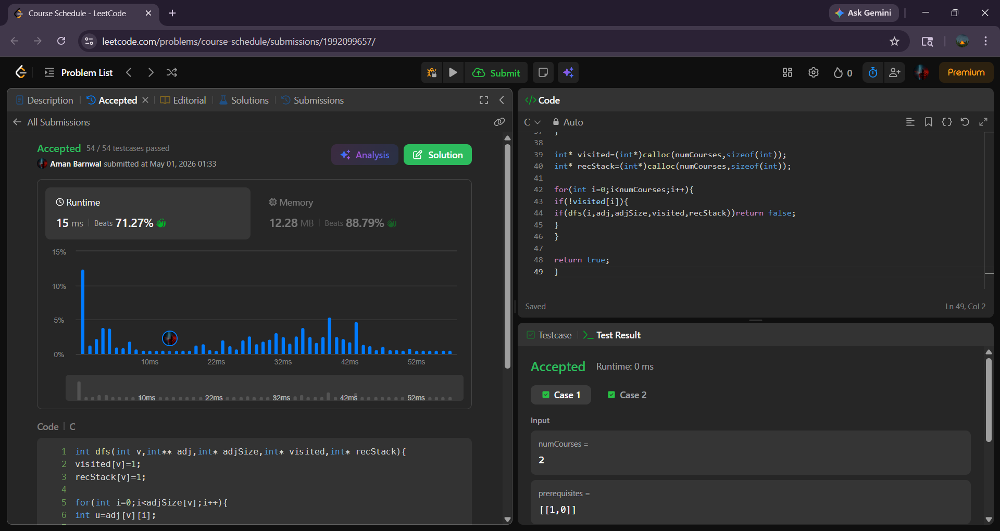

---

## Day 67

### Problem 1: Topological Sort using DFS

**Description**  
Prints the topological ordering of a Directed Acyclic Graph (DAG) using DFS.  
Nodes are pushed to a stack after visiting all their neighbors.

**Concepts Used**
- Graph Traversal
- Depth First Search (DFS)
- Topological Sorting

**Source Code**  
[Day67/topological_sort_dfs.c](Day67/topological_sort_dfs.c)

**Output Screenshot**

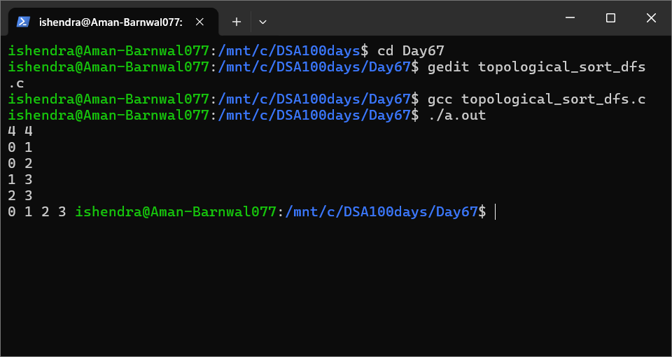

---

### Problem 2: Course Schedule II (LeetCode)

**Description**  
Finds a valid order of courses given prerequisite constraints.  
Uses topological sorting and cycle detection in a directed graph.

**Concepts Used**
- Graph Representation
- DFS
- Topological Sort
- Cycle Detection

**Output Screenshot**

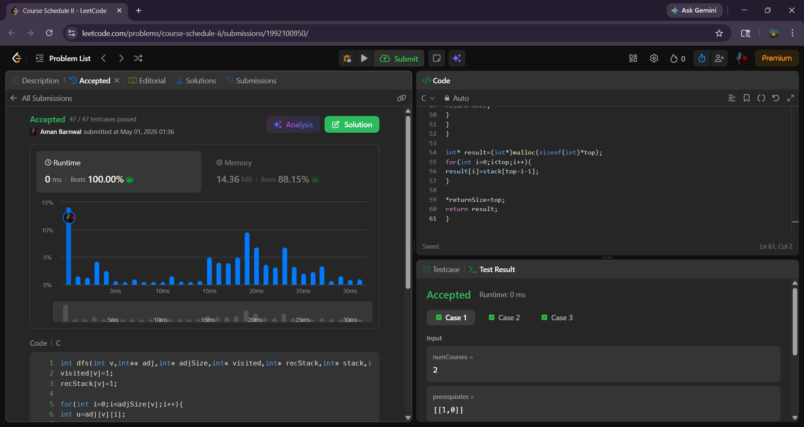

---

## Day 68

### Problem 1: Topological Sort using Kahn’s Algorithm

**Description**  
Implements topological sorting of a Directed Acyclic Graph (DAG) using in-degree array and queue.  
Nodes with zero in-degree are processed first.

**Concepts Used**
- Graph Traversal
- Topological Sorting
- Queue
- In-degree Array

**Source Code**  
[Day68/kahn_topo.c](Day68/kahn_topo.c)

**Output Screenshot**

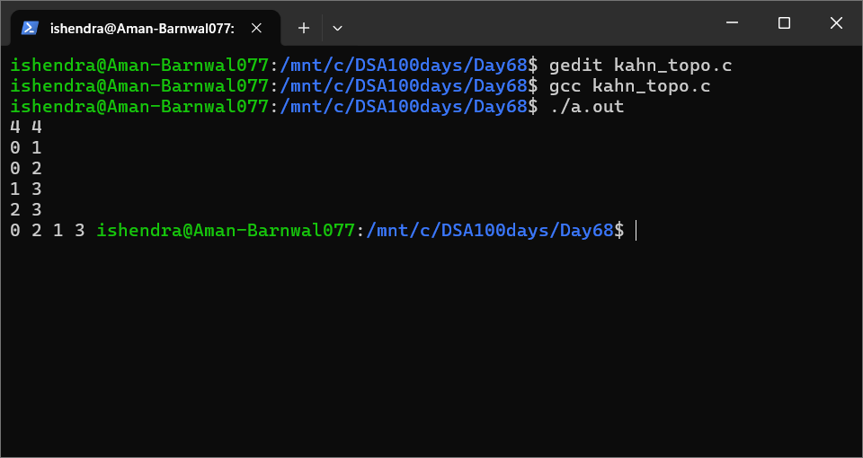

---

### Problem 2: Alien Dictionary (LeetCode)

**Description**  
Determines the order of characters in an alien language using given sorted words.  
Constructs a graph of character precedence and applies topological sorting.

**Concepts Used**
- Graph Representation
- Topological Sort
- BFS (Kahn’s Algorithm)
- Cycle Detection

**Output Screenshot**

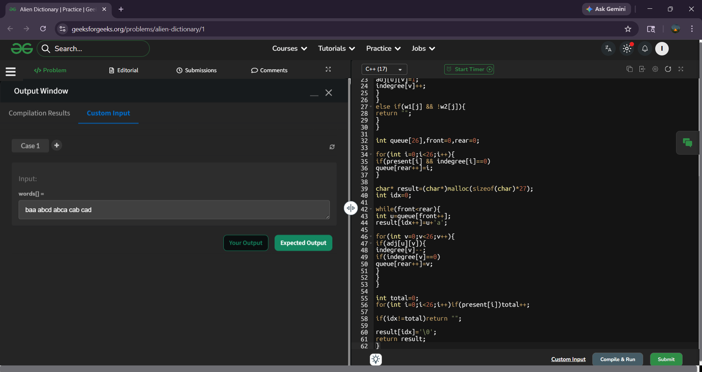

---

## Day 69

### Problem 1: Shortest Path using Dijkstra’s Algorithm

**Description**  
Computes the shortest path from a source node in a weighted graph with non-negative edges.  
Uses Dijkstra’s algorithm to update minimum distances.

**Concepts Used**
- Graph Algorithms
- Dijkstra’s Algorithm
- Greedy Approach

**Source Code**  
[Day69/dijkstra_pq.c](Day69/dijkstra_pq.c)

**Output Screenshot**

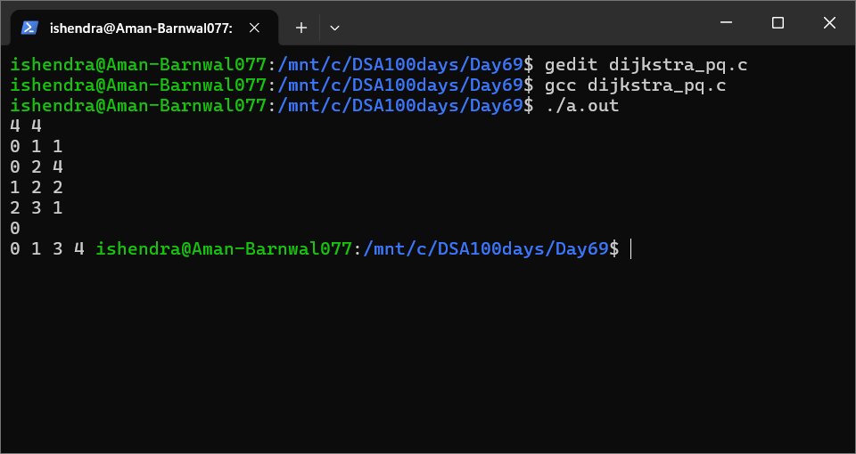

---

### Problem 2: Network Delay Time (LeetCode)

**Description**  
Finds the minimum time required for all nodes to receive a signal sent from a source node.  
Uses shortest path logic similar to Dijkstra’s algorithm.

**Concepts Used**
- Graph Representation
- Dijkstra’s Algorithm
- Shortest Path

**Output Screenshot**

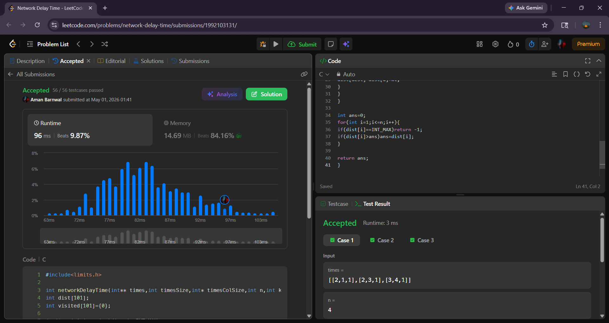

---

## Day 71

### Problem 1: Hash Table using Quadratic Probing

**Description**  
Implements a hash table with quadratic probing for collision resolution.  
Uses formula h(k, i) = (h(k) + i²) % m.

**Concepts Used**
- Hashing
- Collision Resolution
- Quadratic Probing

**Source Code**  
[Day71/quadratic_probing.c](Day71/quadratic_probing.c)

**Output Screenshot**

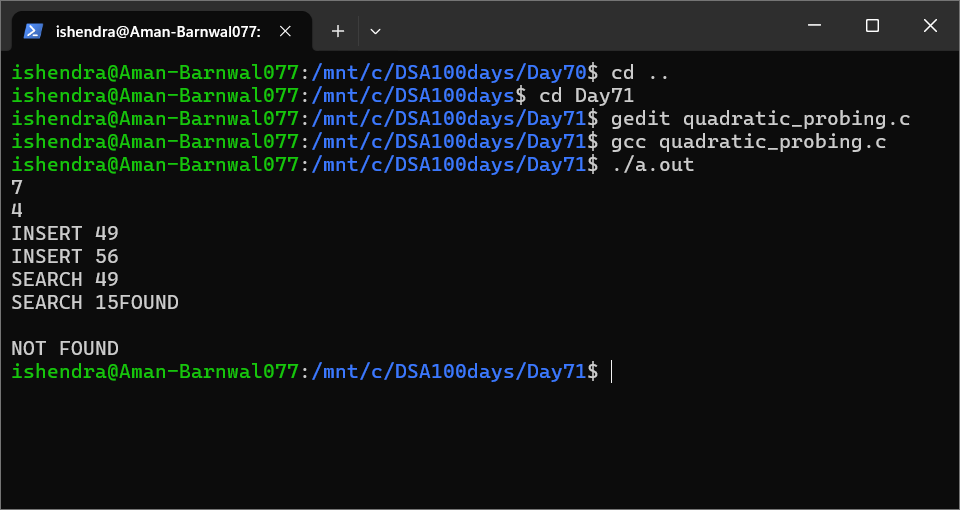

---

### Problem 2: Minimum Cost to Connect Points (LeetCode)

**Description**  
Finds the minimum cost to connect all points using Manhattan distance.  
Uses Prim’s algorithm for Minimum Spanning Tree.

**Concepts Used**
- Graph Algorithms
- Minimum Spanning Tree (MST)
- Prim’s Algorithm

**Output Screenshot**

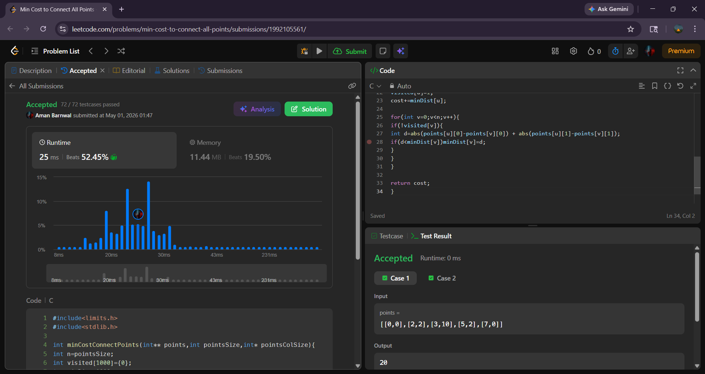

---

## Day 72

### Problem 1: First Repeated Character in String

**Description**  
Finds the first repeated character in a string based on the earliest second occurrence.  
If no character repeats, returns -1.

**Concepts Used**
- Strings
- Frequency Array
- Hashing

**Source Code**  
[Day72/first_repeated_char.c](Day72/first_repeated_char.c)

**Output Screenshot**

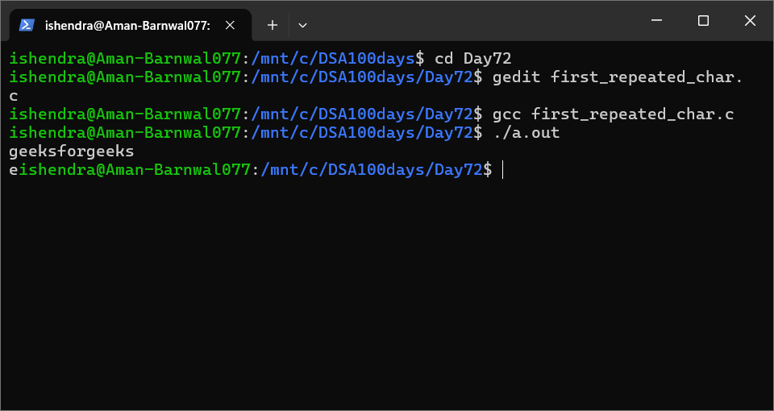

---

### Problem 2: Travelling Salesman Problem (GFG)

**Description**  
Finds the minimum cost to visit all cities exactly once and return to the starting city.  
Uses recursion and backtracking.

**Concepts Used**
- Graph Algorithms
- Backtracking
- Recursion

**Output Screenshot**

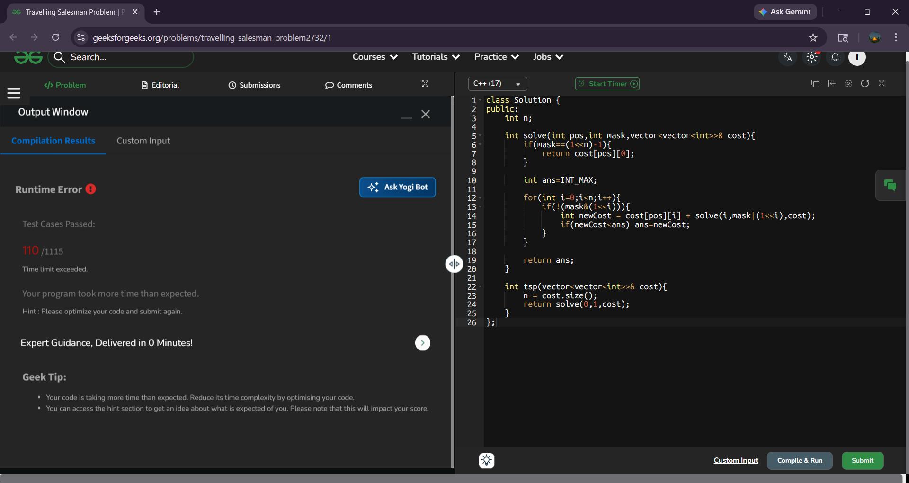

---

## Day 73

### Problem 1: First Non-Repeating Character

**Description**  
Finds the first character in a string that does not repeat.  
If all characters repeat, returns '$'.

**Concepts Used**
- Strings
- Frequency Array
- Hashing

**Source Code**  
[Day73/first_non_repeating_char.c](Day73/first_non_repeating_char.c)

**Output Screenshot**

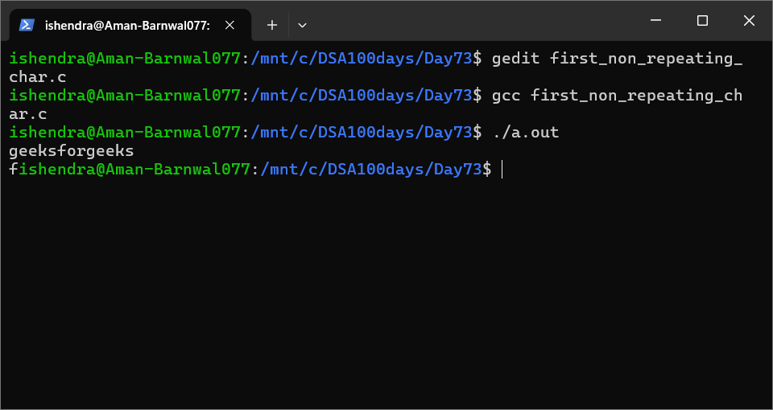

---

### Problem 2: Redundant Connection (LeetCode)

**Description**  
Finds an edge that can be removed to make the graph a tree.  
Uses Union-Find (Disjoint Set) to detect cycles.

**Concepts Used**
- Graph Algorithms
- Union-Find
- Cycle Detection

**Output Screenshot**

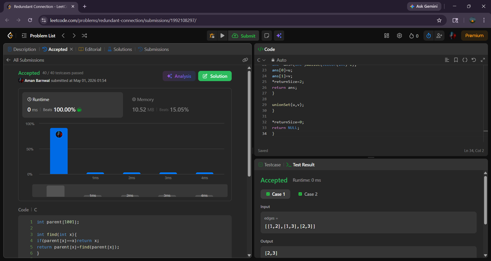

---

## Day 74

### Problem 1: Candidate with Maximum Votes

**Description**  
Determines the candidate who received the highest number of votes.  
In case of a tie, the lexicographically smallest name is chosen.

**Concepts Used**
- Strings
- Frequency Counting
- Comparison Logic

**Source Code**  
[Day74/max_votes.c](Day74/max_votes.c)

**Output Screenshot**

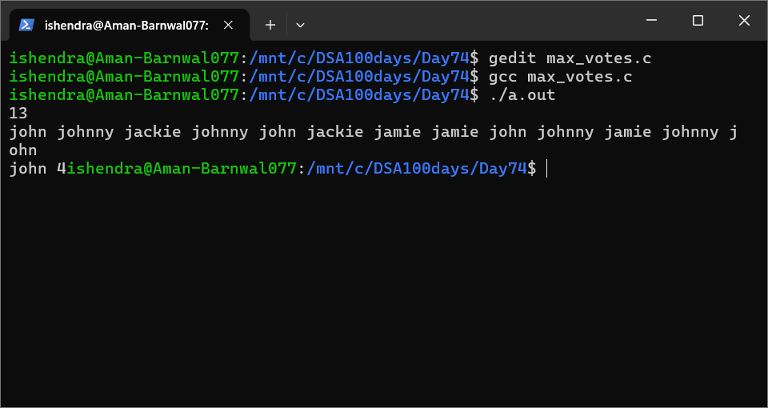

---

### Problem 2: Number of Provinces (LeetCode)

**Description**  
Finds the number of connected components (provinces) in a graph represented by an adjacency matrix.

**Concepts Used**
- Graph Traversal
- Depth First Search (DFS)
- Connected Components

**Output Screenshot**

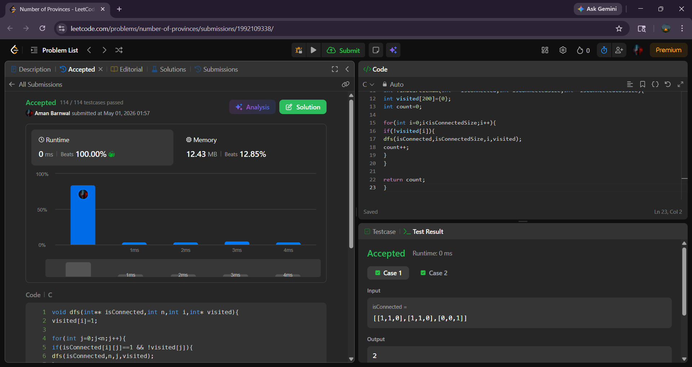

---

## Day 75

### Problem 1: Longest Subarray with Zero Sum

**Description**  
Finds the length of the longest contiguous subarray whose sum is zero.  
Uses prefix sum technique with hashing.

**Concepts Used**
- Arrays
- Prefix Sum
- Hashing

**Source Code**  
[Day75/longest_zero_subarray.c](Day75/longest_zero_subarray.c)

**Output Screenshot**

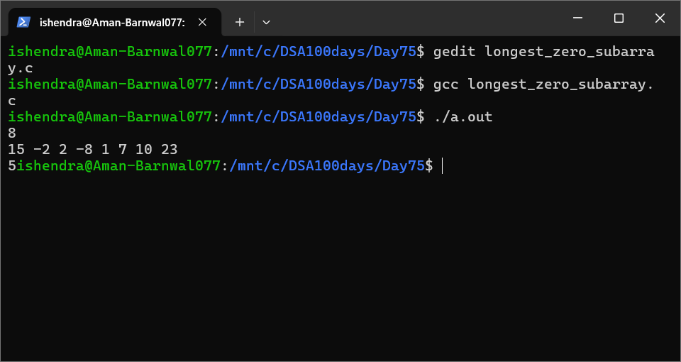

---

### Problem 2: Is Graph Bipartite? (LeetCode)

**Description**  
Checks whether a graph can be divided into two sets such that no adjacent nodes share the same set.

**Concepts Used**
- Graph Traversal
- DFS
- Coloring Technique

**Output Screenshot**

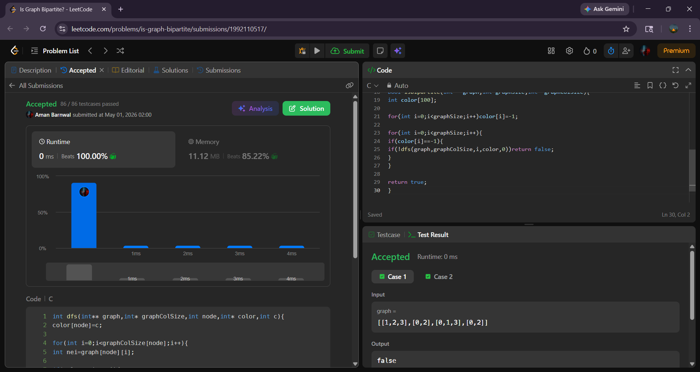

---

## Day 76

### Problem 1: Number of Connected Components

**Description**  
Counts the number of connected components in an undirected graph using DFS traversal.

**Concepts Used**
- Graph Traversal
- Depth First Search (DFS)
- Connected Components

**Source Code**  
[Day76/connected_components.c](Day76/connected_components.c)

**Output Screenshot**

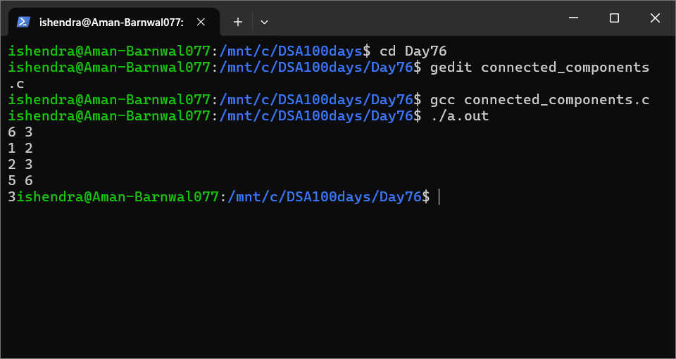

---

### Problem 2: Clone Graph (LeetCode)

**Description**  
Creates a deep copy of a connected undirected graph.  
Each node and its neighbors are duplicated using DFS.

**Concepts Used**
- Graph Traversal
- DFS
- Deep Copy

**Output Screenshot**

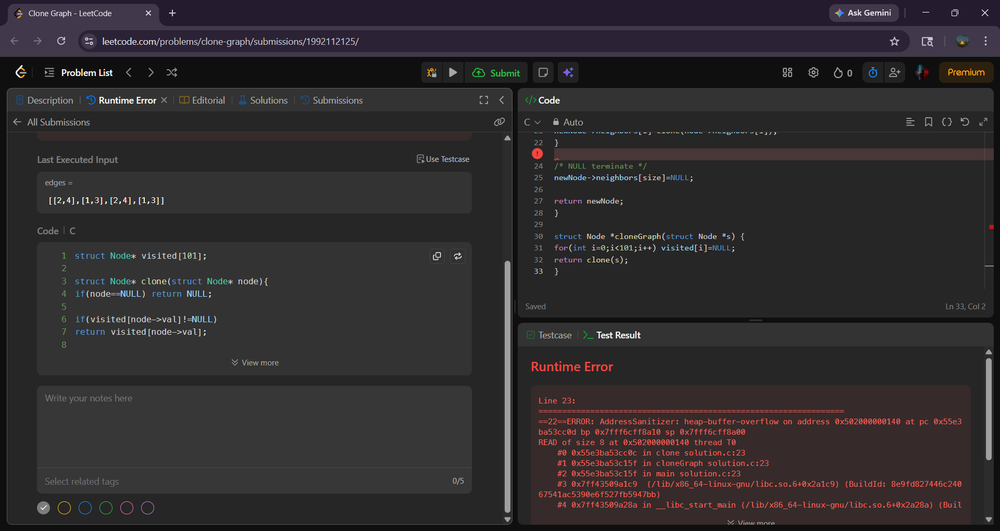

---

## Day 77

### Problem 1: Check Graph Connectivity

**Description**  
Determines whether all nodes in a graph are connected using DFS traversal.

**Concepts Used**
- Graph Traversal
- Depth First Search (DFS)
- Connectivity

**Source Code**  
[Day77/check_connected.c](Day77/check_connected.c)

**Output Screenshot**

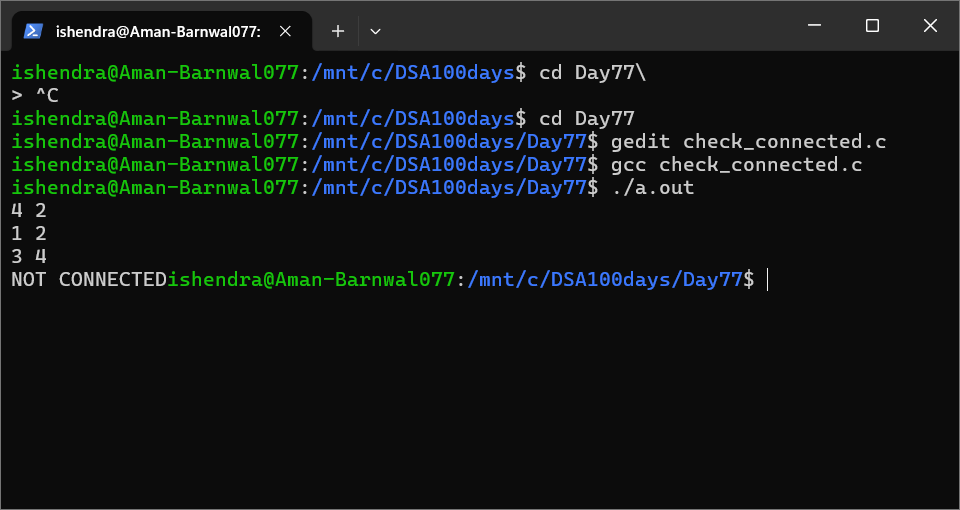

---

### Problem 2: Critical Connections in a Network (LeetCode)

**Description**  
Finds all critical connections (bridges) in a network.  
Uses Tarjan’s Algorithm with discovery and low times.

**Concepts Used**
- Graph Algorithms
- DFS
- Tarjan’s Algorithm
- Bridges Detection

**Output Screenshot**

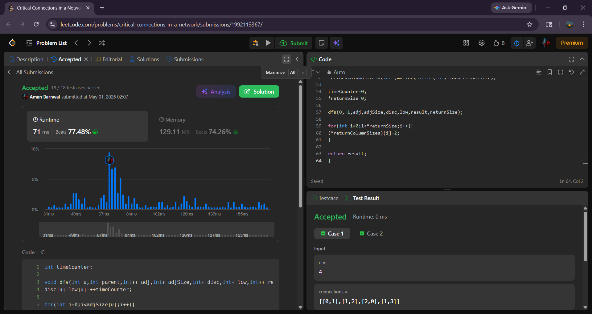

---

## Day 78

### Problem 1: Minimum Spanning Tree using Prim’s Algorithm

**Description**  
Computes the total weight of the Minimum Spanning Tree (MST) for a weighted undirected graph using Prim’s algorithm.

**Concepts Used**
- Graph Algorithms
- Minimum Spanning Tree (MST)
- Prim’s Algorithm

**Source Code**  
[Day78/prim_mst.c](Day78/prim_mst.c)

**Output Screenshot**

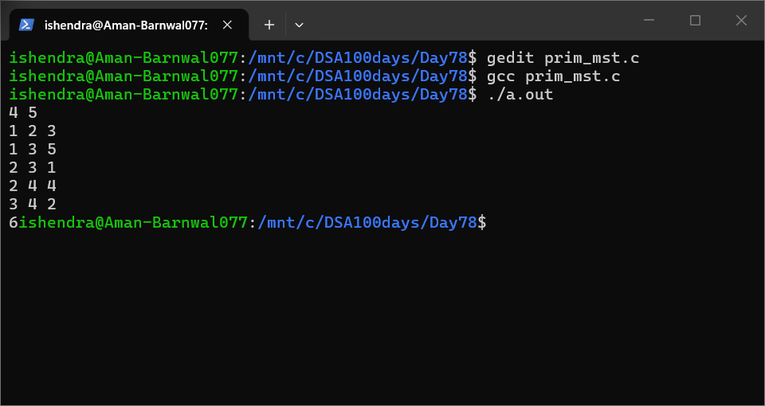

---

### Problem 2: Articulation Points (GFG)

**Description**  
Finds all articulation points (cut vertices) in a graph.  
A vertex is an articulation point if removing it increases the number of connected components.

**Concepts Used**
- Graph Traversal
- DFS
- Tarjan’s Algorithm
- Low & Discovery Time

**Output Screenshot**

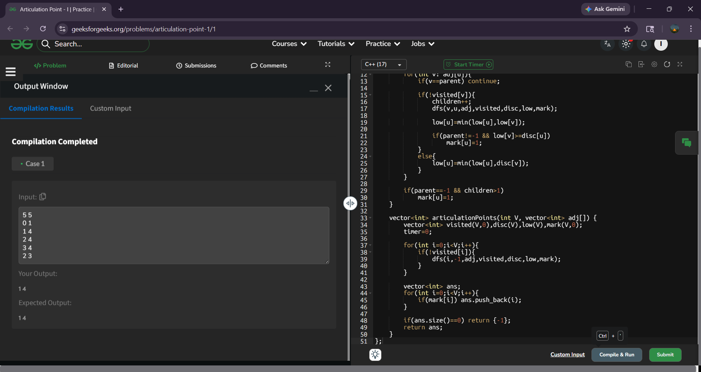

---

## Day 79

### Problem 1: Shortest Path using Dijkstra’s Algorithm

**Description**  
Computes shortest distances from a source vertex in a weighted graph with non-negative weights.

**Concepts Used**
- Graph Algorithms
- Dijkstra’s Algorithm
- Greedy Approach

**Source Code**  
[Day79/dijkstra_priority_queue.c](Day79/dijkstra_priority_queue.c)

**Output Screenshot**

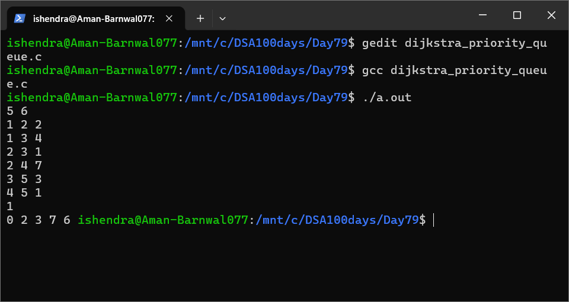

---

### Problem 2: Strongly Connected Components (GFG)

**Description**  
Finds the number of strongly connected components in a directed graph using Kosaraju’s algorithm.

**Concepts Used**
- Graph Traversal
- DFS
- Kosaraju’s Algorithm
- Graph Transpose

**Output Screenshot**

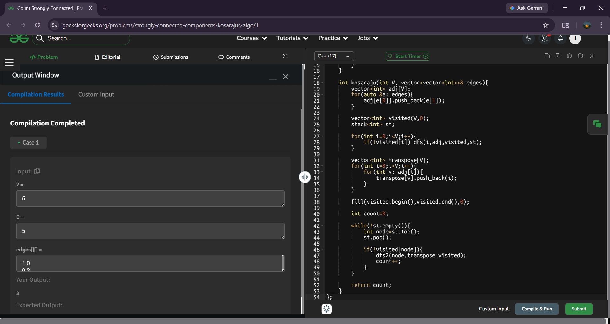

---

## Day 80

### Problem 1: Floyd-Warshall Algorithm

**Description**  
Computes shortest paths between all pairs of vertices in a weighted graph.  
Handles both positive and negative weights (no negative cycles).

**Concepts Used**
- Graph Algorithms
- Dynamic Programming
- Floyd-Warshall Algorithm

**Source Code**  
[Day80/floyd_warshall.c](Day80/floyd_warshall.c)

**Output Screenshot**

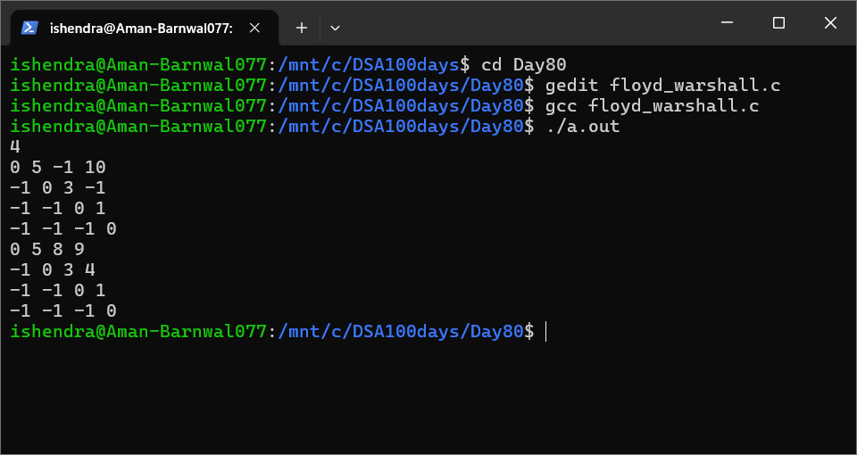

---

### Problem 2: Find the City With the Smallest Number of Neighbors (LeetCode)

**Description**  
Finds the city with the smallest number of reachable neighbors within a distance threshold.  
Uses Floyd-Warshall to compute all-pairs shortest paths.

**Concepts Used**
- Graph Algorithms
- Floyd-Warshall Algorithm
- Shortest Paths

**Output Screenshot**

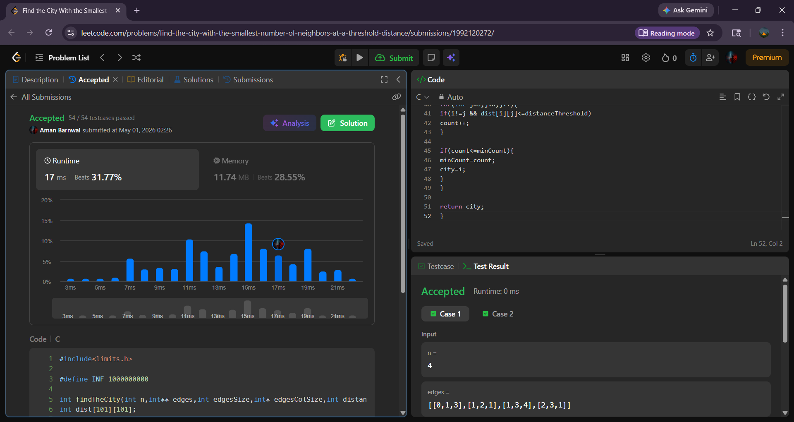

---

## Day 81

### Problem 1: Bubble Sort

**Description**  
Implements Bubble Sort to sort an array in ascending order by repeatedly swapping adjacent elements.

**Concepts Used**
- Sorting Algorithms
- Bubble Sort
- Arrays

**Source Code**  
[Day81/bubble_sort.c](Day81/bubble_sort.c)

**Output Screenshot**

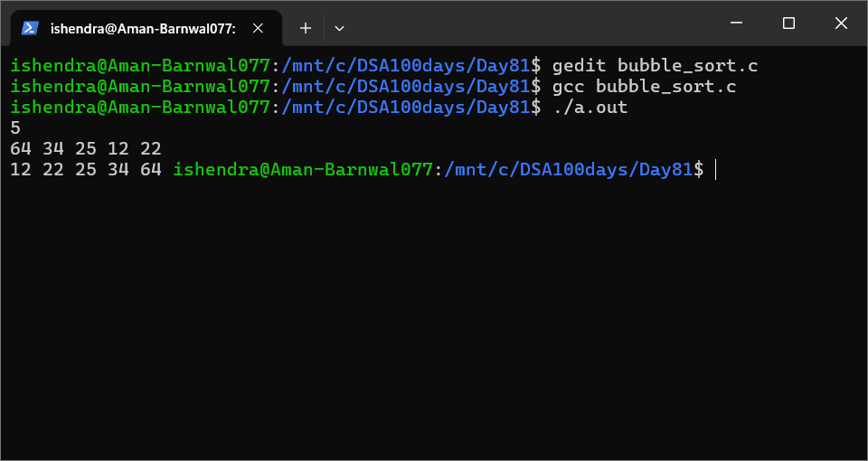

---

### Problem 2: Binary Search (LeetCode)

**Description**  
Searches for a target value in a sorted array using Binary Search with O(log n) complexity.

**Concepts Used**
- Searching Algorithms
- Binary Search
- Divide and Conquer

**Output Screenshot**

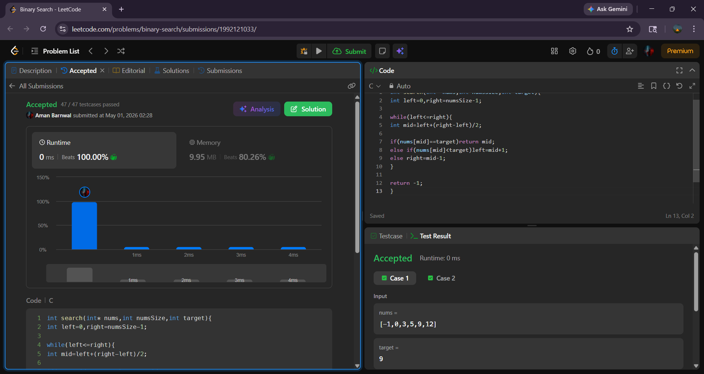

---

## Day 82

### Problem 1: Lower Bound and Upper Bound using Binary Search

**Description**  
Implements lower bound and upper bound operations using binary search on a sorted array.

**Concepts Used**
- Binary Search
- Arrays
- Searching Algorithms

**Source Code**  
[Day82/lower_upper_bound.c](Day82/lower_upper_bound.c)

**Output Screenshot**

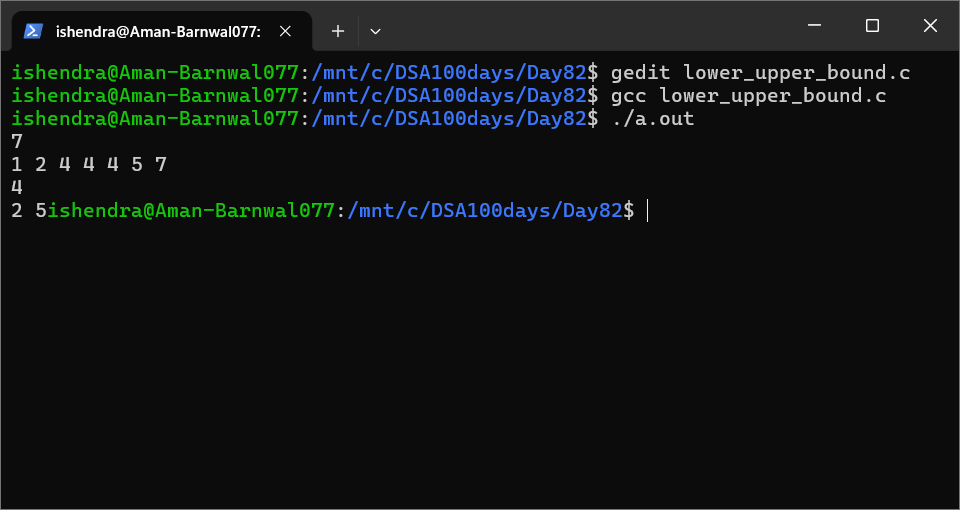

---

### Problem 2: Search Insert Position (LeetCode)

**Description**  
Finds the index where a target value should be inserted in a sorted array.

**Concepts Used**
- Binary Search
- Arrays
- O(log n) Algorithm

**Output Screenshot**

---

## Day 83

### Problem 1: Selection Sort

**Description**  
Implements Selection Sort to sort an array by repeatedly selecting the minimum element and placing it at the correct position.

**Concepts Used**
- Sorting Algorithms
- Selection Sort
- Arrays

**Source Code**  
[Day83/selection_sort.c](Day83/selection_sort.c)

**Output Screenshot**

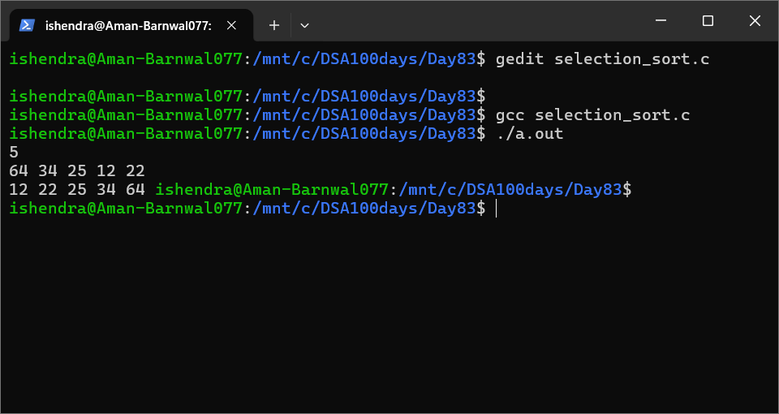

---

### Problem 2: Search in Rotated Sorted Array (LeetCode)

**Description**  
Finds the index of a target in a rotated sorted array using modified binary search.

**Concepts Used**
- Binary Search
- Arrays
- Divide and Conquer

**Output Screenshot**

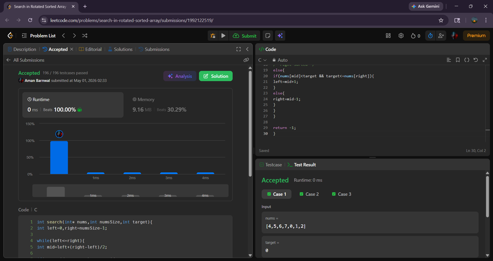

---

## Day 84

### Problem 1: Insertion Sort

**Description**  
Implements Insertion Sort to arrange elements in ascending order.  
Each element is placed in its correct position within the sorted portion of the array.

**Concepts Used**
- Sorting Algorithms
- Insertion Sort
- Arrays

**Source Code**  
[Day84/insertion_sort.c](Day84/insertion_sort.c)

**Output Screenshot**

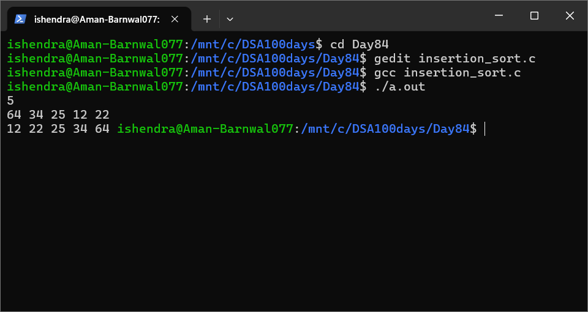

---

### Problem 2: Find Peak Element (LeetCode)

**Description**  
Finds a peak element in an array using binary search in O(log n) time.  
A peak element is strictly greater than its neighbors.

**Concepts Used**
- Binary Search
- Divide and Conquer
- Arrays

**Output Screenshot**

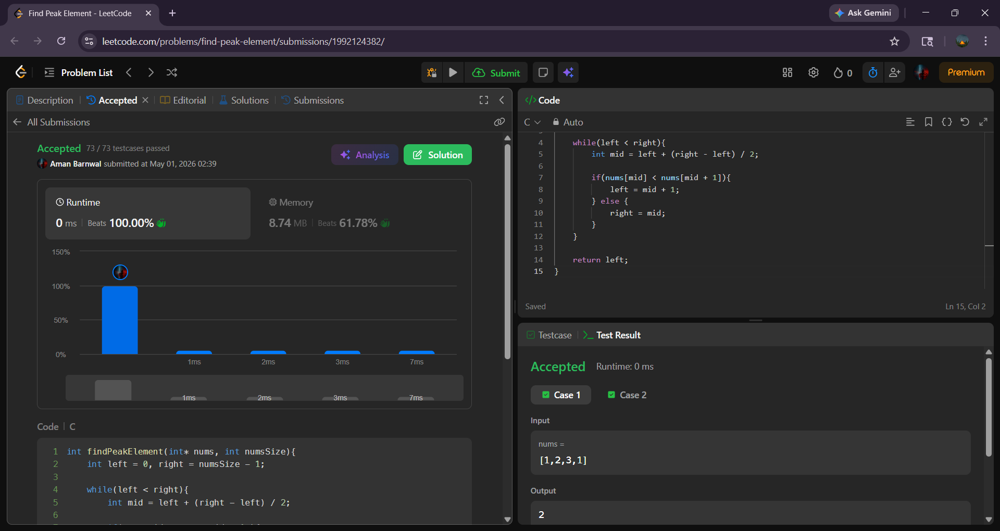

---

## Day 85

### Problem 1: Merge Sort

**Description**  
Implements Merge Sort to sort an array using divide and conquer approach.

**Concepts Used**
- Sorting Algorithms
- Divide and Conquer
- Merge Sort

**Source Code**  
[Day85/merge_sort.c](Day85/merge_sort.c)

**Output Screenshot**

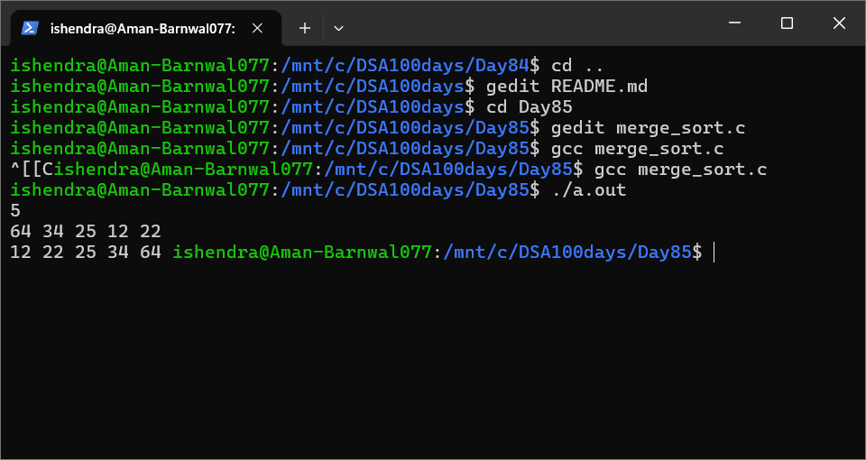

---

### Problem 2: Find Minimum in Rotated Sorted Array (LeetCode)

**Description**  
Finds the minimum element in a rotated sorted array using binary search in O(log n).

**Concepts Used**
- Binary Search
- Arrays
- Divide and Conquer

**Output Screenshot**

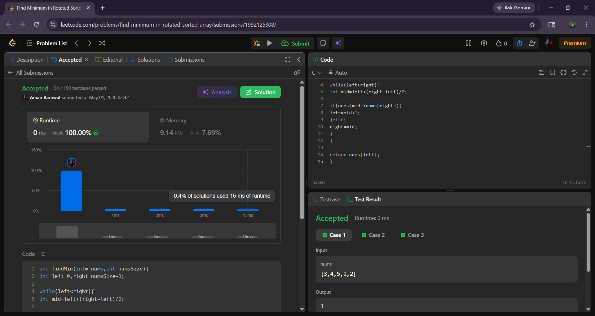

---

## Day 86

### Problem 1: Integer Square Root using Binary Search

**Description**  
Finds the integer square root of a non-negative number using binary search.  
Returns the largest integer whose square is less than or equal to the given number.

**Concepts Used**
- Binary Search
- Mathematical Computation
- Efficient Searching

**Source Code**  
[Day86/integer_sqrt.c](Day86/integer_sqrt.c)

**Output Screenshot**

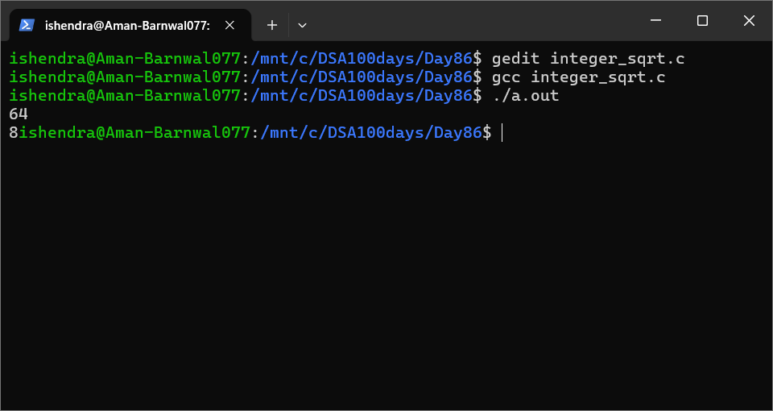

---

### Problem 2: Sqrt(x) (LeetCode)

**Description**  
Computes the square root of a number and returns the result rounded down to the nearest integer using binary search.

**Concepts Used**
- Binary Search
- Math Optimization
- O(log n) Algorithm

**Output Screenshot**

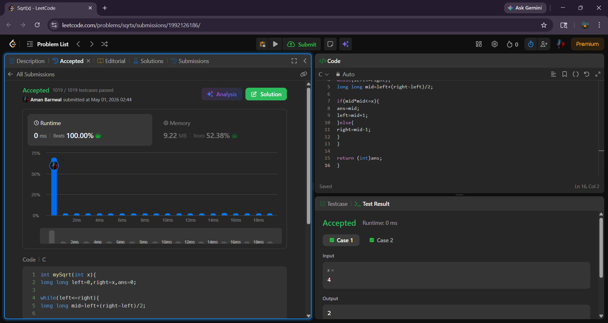

---

## Day 87

### Problem 1: Binary Search (Iterative)

**Description**  
Implements Binary Search using an iterative approach to find an element in a sorted array.

**Concepts Used**
- Binary Search
- Arrays
- Iterative Approach

**Source Code**  
[Day87/binary_search_iterative.c](Day87/binary_search_iterative.c)

**Output Screenshot**

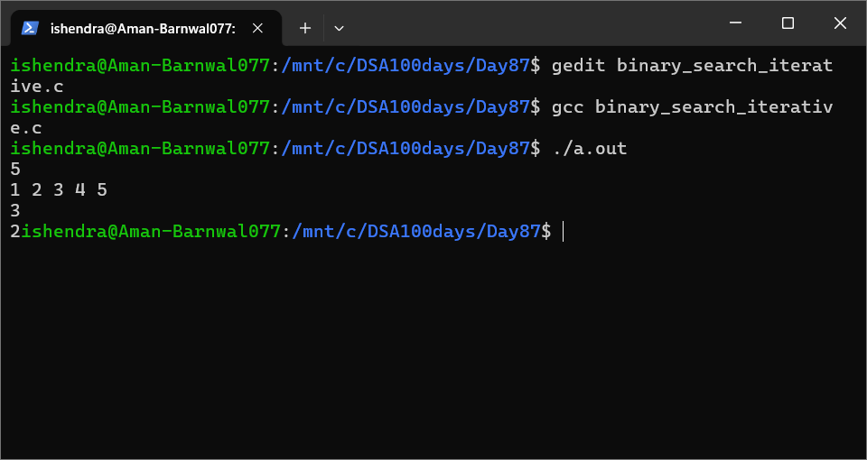

---

### Problem 2: Koko Eating Bananas (LeetCode)

**Description**  
Finds the minimum eating speed required to finish all bananas within given hours using binary search.

**Concepts Used**
- Binary Search on Answer
- Greedy Calculation
- Optimization Technique

**Output Screenshot**

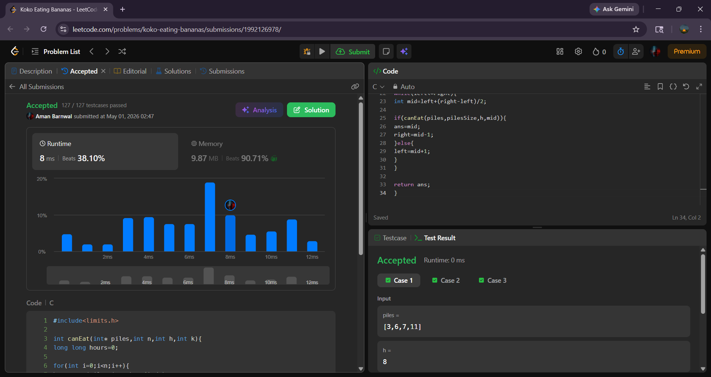

---

## Day 88

### Problem 1: Aggressive Cows

**Description**  
Places k cows in stalls such that the minimum distance between any two cows is maximized.  
Solved using binary search on answer.

**Concepts Used**
- Binary Search on Answer
- Greedy Placement
- Sorting

**Source Code**  
[Day88/aggressive_cows.c](Day88/aggressive_cows.c)

**Output Screenshot**

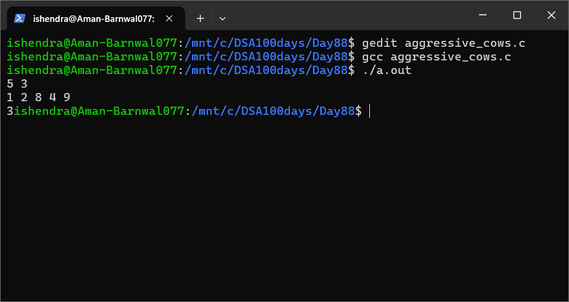

---

### Problem 2: Magnetic Force Between Two Balls (LeetCode)

**Description**  
Finds the maximum minimum distance between balls placed in baskets using binary search.

**Concepts Used**
- Binary Search on Answer
- Greedy Strategy
- Sorting

**Output Screenshot**

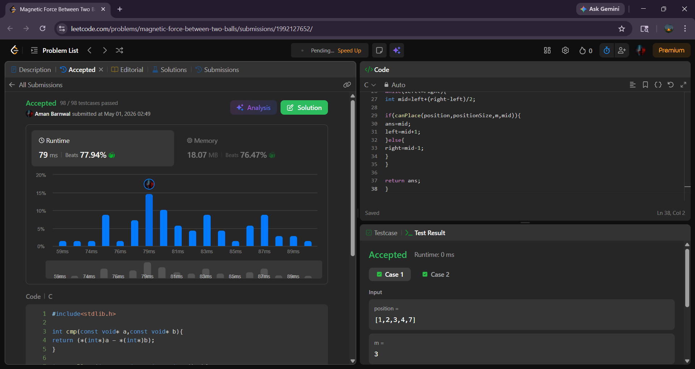

---

## Day 89

### Problem 1: Book Allocation Problem

**Description**  
Allocates books to students such that the maximum number of pages assigned is minimized.  
Books must be assigned in contiguous order.

**Concepts Used**
- Binary Search on Answer
- Greedy Allocation
- Arrays

**Source Code**  
[Day89/book_allocation.c](Day89/book_allocation.c)

**Output Screenshot**

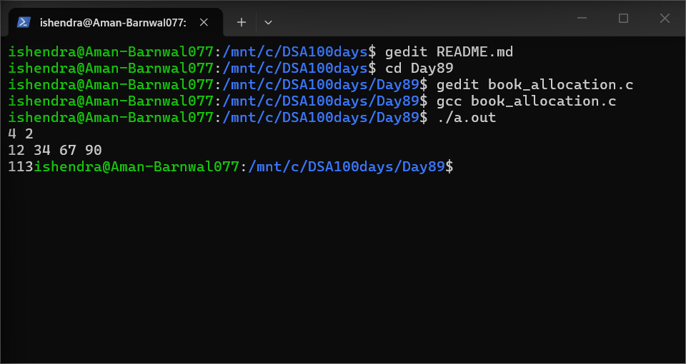

---

### Problem 2: Capacity to Ship Packages Within D Days (LeetCode)

**Description**  
Finds the minimum ship capacity required to transport packages within a given number of days.

**Concepts Used**
- Binary Search on Answer
- Greedy Strategy
- Optimization Problems

**Output Screenshot**

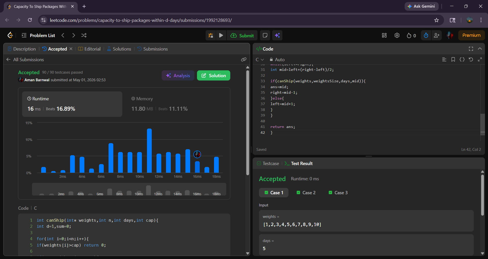

---

## Day 90

### Problem 1: Painter’s Partition Problem

**Description**  
Determines the minimum time required to paint all boards using k painters, where each painter paints contiguous boards.

**Concepts Used**
- Binary Search on Answer
- Greedy Allocation
- Partitioning Problems

**Source Code**  
[Day90/painters_partition.c](Day90/painters_partition.c)

**Output Screenshot**

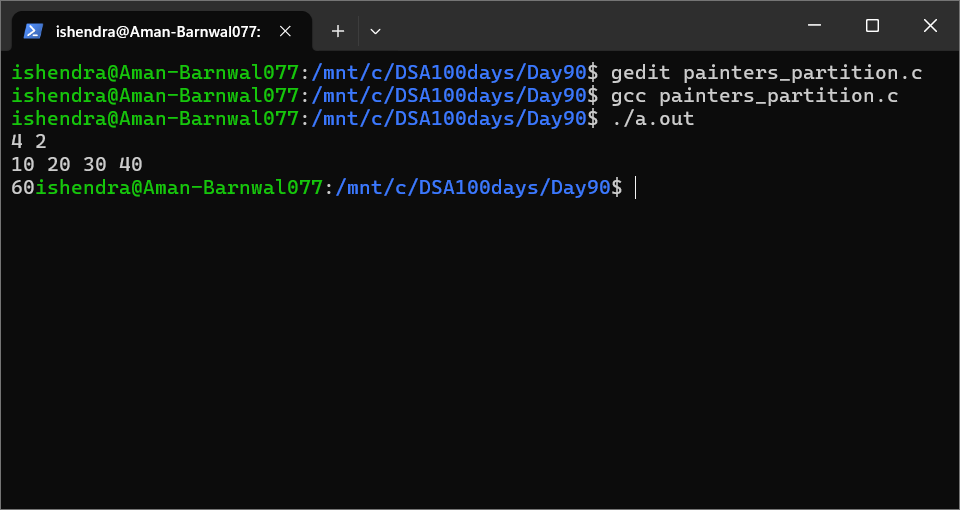

---

### Problem 2: Split Array Largest Sum (LeetCode)

**Description**  
Splits an array into k subarrays such that the maximum subarray sum is minimized.

**Concepts Used**
- Binary Search on Answer
- Greedy Strategy
- Optimization Problems

**Output Screenshot**

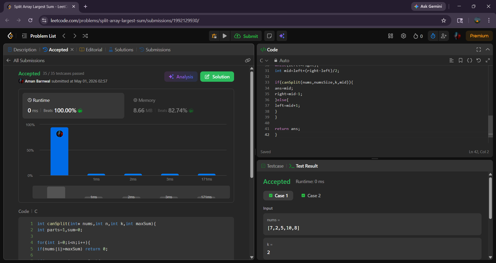

---

## Day 92

### Problem 1: Quick Sort

**Description**  
Implements Quick Sort using the Lomuto partition scheme.  
The array is partitioned around a pivot and recursively sorted.

**Concepts Used**
- Sorting Algorithms
- Divide and Conquer
- Quick Sort
- Partitioning

**Source Code**  
[Day92/quick_sort.c](Day92/quick_sort.c)

**Output Screenshot**

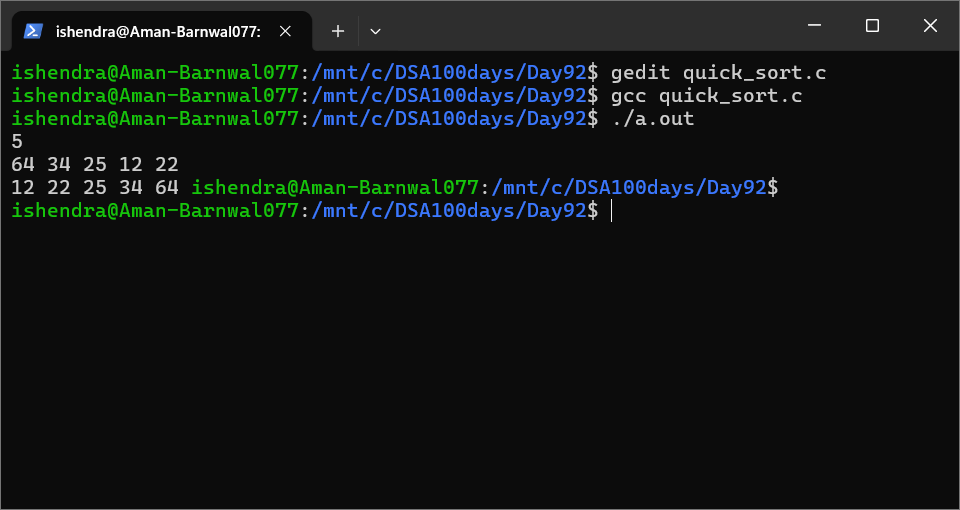

---

### Problem 2: Kth Largest Element in an Array (LeetCode)

**Description**  
Finds the kth largest element without fully sorting the array using QuickSelect.

**Concepts Used**
- QuickSelect Algorithm
- Partitioning
- Divide and Conquer

**Output Screenshot**

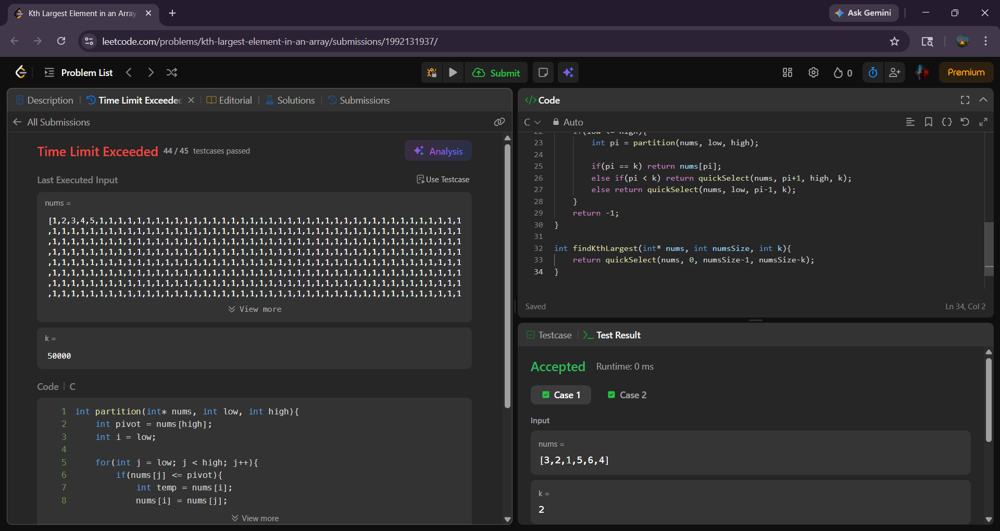

---

## Day 93

### Problem 1: Insertion Sort (Array)

**Description**  
Sorts an array using insertion sort.  
Efficient for small or nearly sorted arrays and maintains stability.

**Concepts Used**
- Sorting Algorithms
- Insertion Sort
- Stable Sorting

**Source Code**  
[Day93/insertion_sort.c](Day93/insertion_sort.c)

**Output Screenshot**

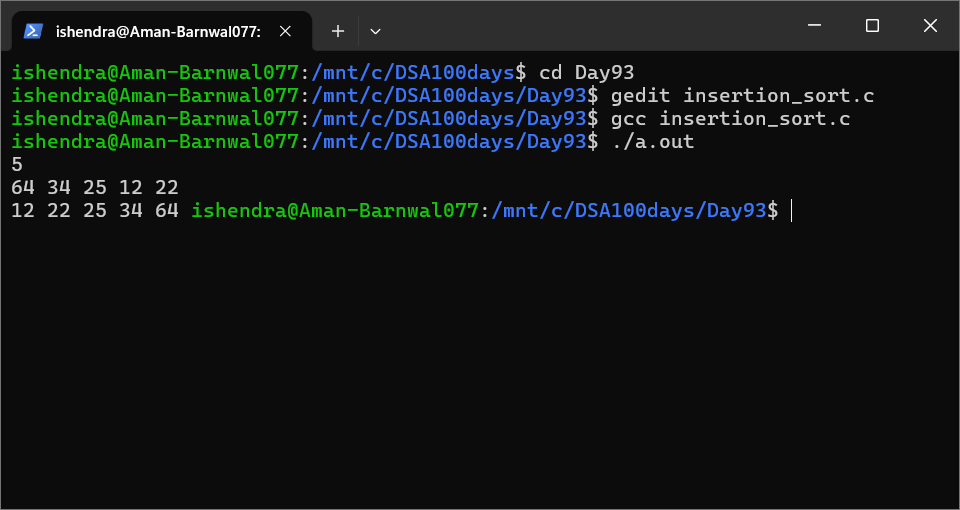

---

### Problem 2: Insertion Sort on Linked List (LeetCode)

**Description**  
Sorts a singly linked list using insertion sort by placing each node in its correct position.

**Concepts Used**
- Linked Lists
- Insertion Sort
- Pointer Manipulation

**Output Screenshot**

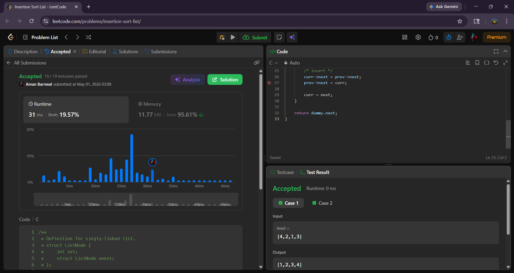

---

## Day 94

### Problem 1: Counting Sort

**Description**  
Sorts an array of non-negative integers using counting sort by building a frequency array and reconstructing the sorted array.

**Concepts Used**
- Counting Sort
- Frequency Array
- Prefix Sum Technique

**Source Code**  
[Day94/counting_sort.c](Day94/counting_sort.c)

**Output Screenshot**

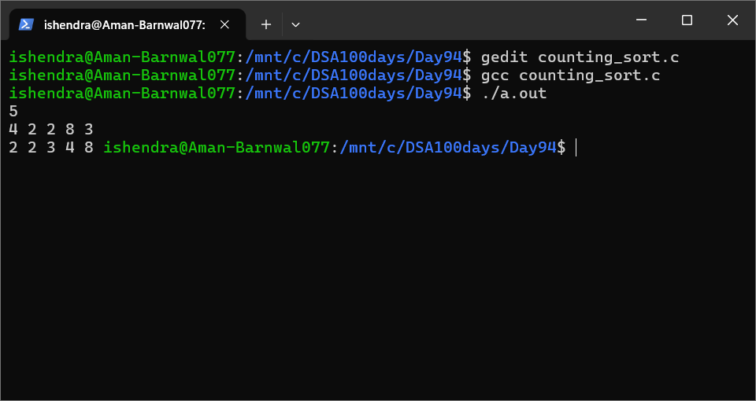

---

### Problem 2: Relative Sort Array (LeetCode)

**Description**  
Sorts one array based on the relative order defined by another array, and places remaining elements in ascending order.

**Concepts Used**
- Counting Sort
- Frequency Mapping
- Custom Sorting Logic

**Output Screenshot**

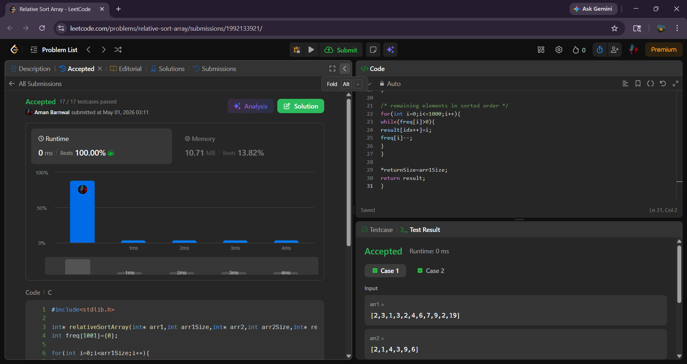

---

## Day 95

### Problem 1: Bucket Sort

**Description**  
Sorts real numbers in the range [0,1) using bucket sort.  
Elements are distributed into buckets, sorted individually, and concatenated.

**Concepts Used**
- Bucket Sort
- Linked List
- Distribution Sorting

**Source Code**  
[Day95/bucket_sort.c](Day95/bucket_sort.c)

**Output Screenshot**

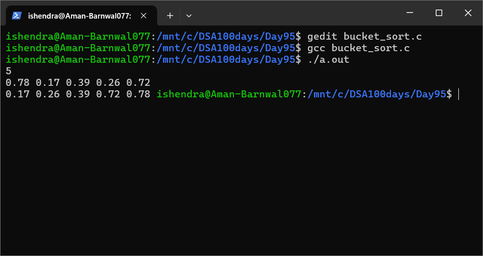

---

### Problem 2: Maximum Gap (LeetCode)

**Description**  
Finds the maximum difference between successive elements in sorted order using a linear-time bucket-based approach.

**Concepts Used**
- Bucket Sort Concept
- Pigeonhole Principle
- Linear Time Optimization

**Output Screenshot**

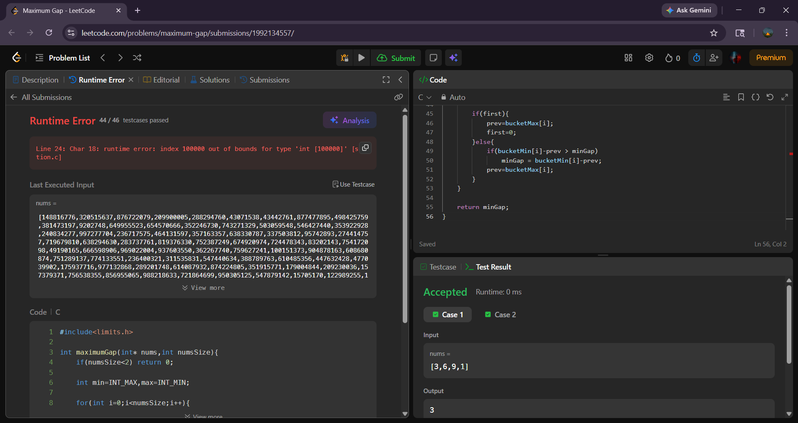

---

## Day 96

### Problem 1: Count Inversions using Merge Sort

**Description**  
Counts the number of inversions in an array where a pair (i, j) is an inversion if i < j and arr[i] > arr[j].

**Concepts Used**
- Divide and Conquer
- Merge Sort Modification
- Counting Technique

**Approach**
- Split the array using merge sort
- While merging, if left element > right element, count inversions
- Add (mid - i + 1) to inversion count

**Time Complexity**
- O(n log n)

**Source Code**  
[Day96/count_inversions.c](Day96/count_inversions.c)

**Output Screenshot**

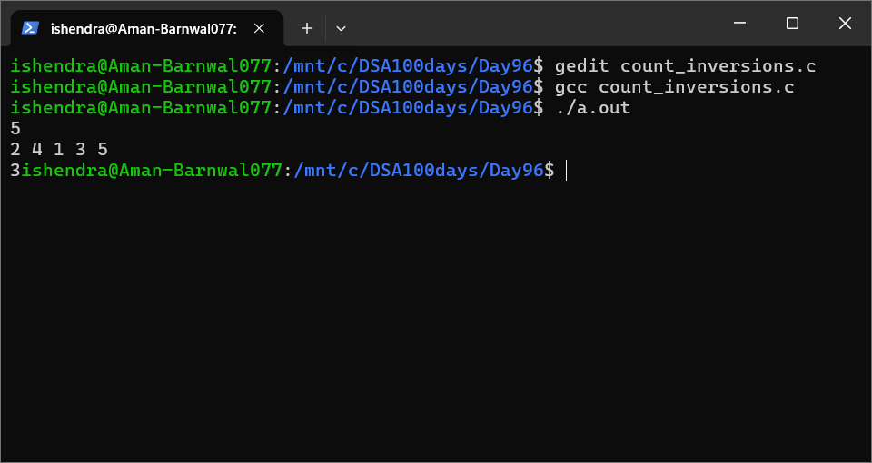

---

### Problem 2: Reverse Pairs (LeetCode)

**Description**  
Counts the number of reverse pairs where nums[i] > 2 × nums[j] and i < j.

**Concepts Used**
- Modified Merge Sort
- Two Pointer Technique
- Overflow Handling (long long)

**Approach**
- Divide array using merge sort
- Before merging, count valid pairs using two pointers
- Use condition: nums[i] > 2 * nums[j]
- Then merge sorted halves

**Time Complexity**
- O(n log n)

**Source Code**  
[Day96/reverse_pairs_leetcode.c](Day96/reverse_pairs_leetcode.c)

**Output Screenshot**

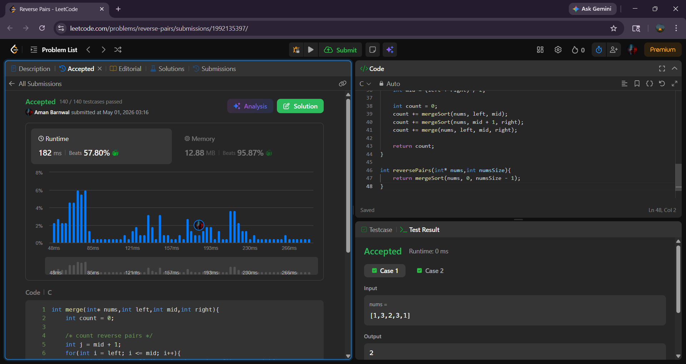

---

## Day 97

### Problem: Minimum Meeting Rooms

**Description**  
Given meeting intervals, determine the minimum number of rooms required so that no meetings overlap.

**Concepts Used**
- Greedy Algorithm
- Sorting
- Min Heap (Priority Queue)

**Approach**
- Sort meetings based on start time
- Use a min-heap to track end times
- If earliest ending meeting finishes before next starts → reuse room
- Else → allocate new room

**Time Complexity**
- O(n log n)

**Source Code**  
[Day97/meeting_rooms.c](Day97/meeting_rooms.c)

**Output Screenshot**

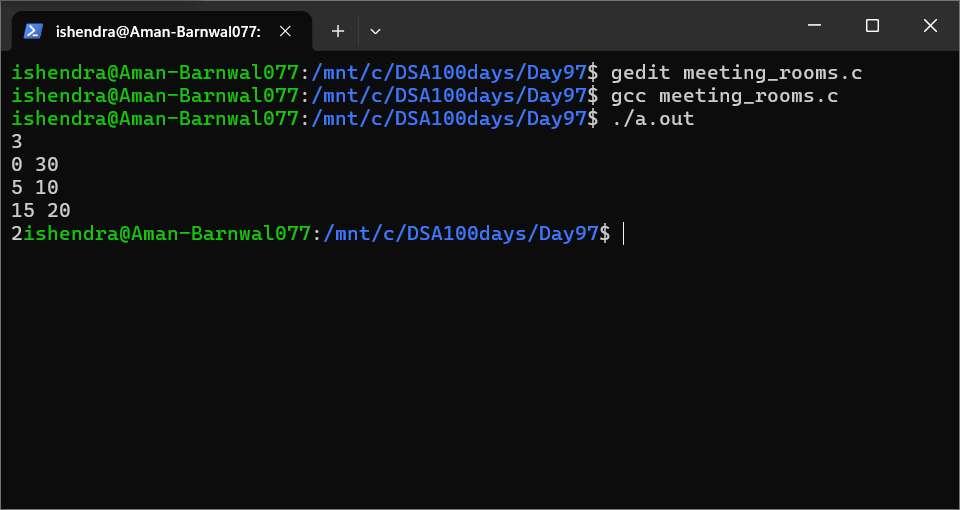

---

## Day 98

### Problem 1: Merge Intervals

**Description**  
Merges all overlapping intervals into non-overlapping intervals covering the same range.

**Concepts Used**
- Sorting
- Greedy Approach
- Interval Merging

**Approach**
- Sort intervals by start time
- Compare with last merged interval
- Merge if overlapping, otherwise add new interval

**Time Complexity**
- O(n log n)

**Source Code**  
[Day98/merge_intervals.c](Day98/merge_intervals.c)

**Output Screenshot**

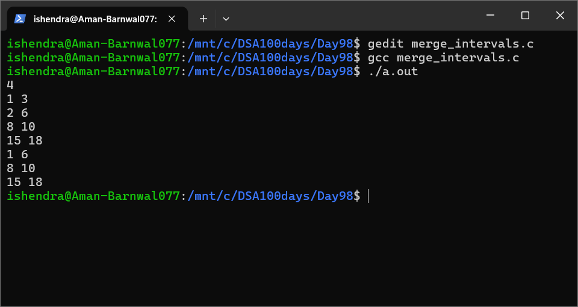

---

### Problem 2: Merge Intervals (LeetCode)

**Description**  
Returns merged non-overlapping intervals from given list.

**Concepts Used**
- Sorting
- Greedy Strategy
- Dynamic Memory Allocation

**Output Screenshot**

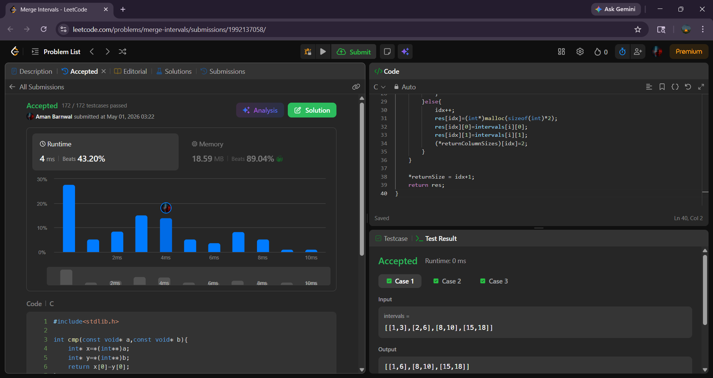

---

## Day 99

### Problem 1: Car Fleet (Terminal)

**Description**  
Given positions and speeds of cars, determine how many fleets will reach the destination.

**Concepts Used**
- Sorting
- Greedy Strategy
- Time Calculation

**Approach**
- Compute time for each car to reach target
- Sort cars by position (descending)
- Traverse and count fleets:
  - If current car takes more time → new fleet
  - Else → merges into previous fleet

**Time Complexity**
- O(n log n)

**Source Code**  
[Day99/car_fleet.c](Day99/car_fleet.c)

**Output Screenshot**

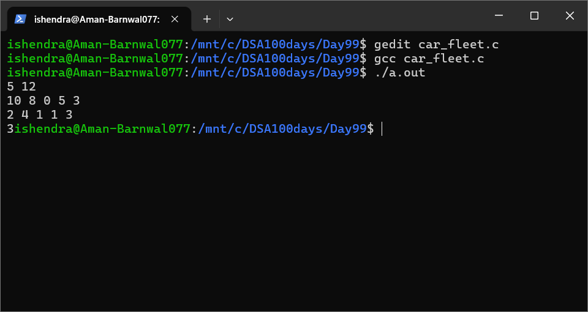

---

### Problem 2: Car Fleet (LeetCode)

**Description**  
Counts number of car fleets reaching the destination under given constraints.

**Concepts Used**
- Sorting
- Greedy Logic
- Floating Point Computation

**Output Screenshot**

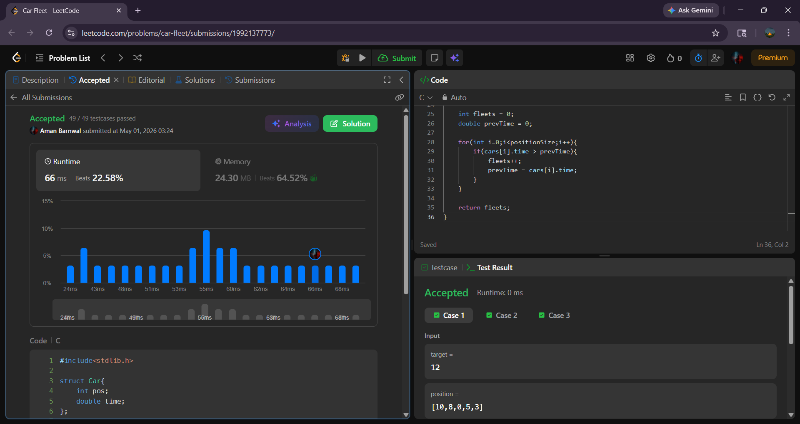

---

## Day 100

### Problem 1: Count Smaller Elements on Right (Terminal)

**Description**  
For each element, counts how many smaller elements appear on its right side.

**Concepts Used**
- Merge Sort Modification
- Divide and Conquer
- Index Tracking

**Approach**
- Store value + original index
- During merge:
  - If left > right → count += remaining elements in right
- Maintain mapping using indices

**Time Complexity**
- O(n log n)

**Source Code**  
[Day100/count_smaller_right.c](Day100/count_smaller_right.c)

**Output Screenshot**

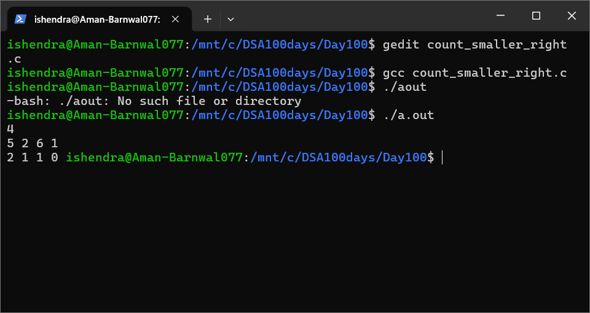

---

### Problem 2: Count of Smaller Numbers After Self (LeetCode)

**Description**  
Returns an array where each element represents count of smaller elements to its right.

**Concepts Used**
- Merge Sort Trick
- Index Mapping
- Efficient Counting

**Output Screenshot**

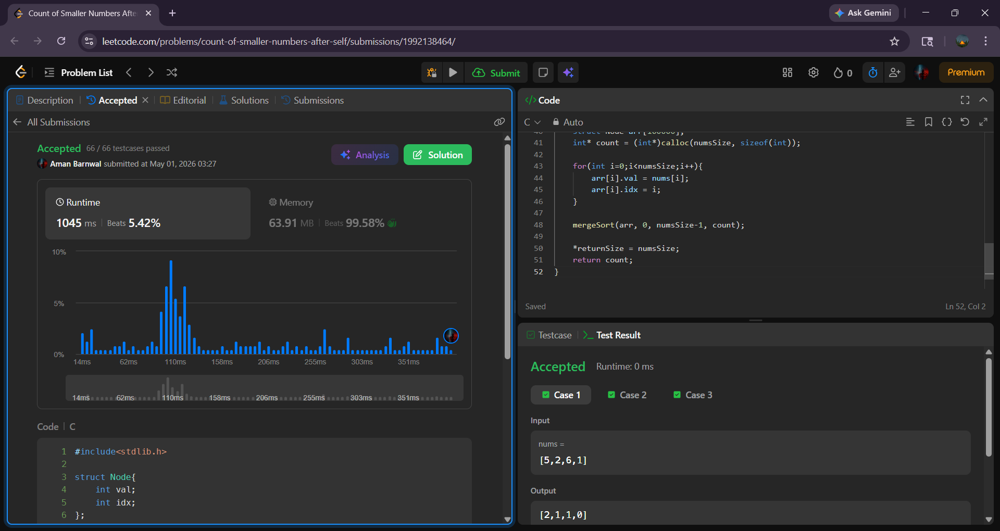

---
