# 100 Days of C Programming and DSA

**Name:** Aman Barnwal  
**SAP ID:** 590028933  
**Batch:** 78  

---

## Introduction

This repository contains the work completed as part of the **100 Days of Code** initiative with a focus on **C Programming** and **Data Structures & Algorithms (DSA)**.  
The objective of this practice is to build strong programming fundamentals, improve logical reasoning, and apply algorithmic concepts through consistent hands-on coding.

Each section below represents the problems solved on a particular day, along with source code references and output screenshots.

---

## Day 01

### Problem 1: Two Sum (LeetCode)

**Description**  
Given an integer array and a target value, identify two distinct indices such that the sum of the elements at those indices equals the target.  
Exactly one valid solution exists for each input.

**Concepts Used**
- Arrays  
- Nested loops  
- Index-based traversal  

**Output Screenshot**

---

### Problem 2: Insert Element at Given Position in Array

**Description**  
A C program to insert an element `x` at a specified **1-based position** in an array of `n` integers.  
All elements following the position are shifted one index to the right.

**Concepts Used**
- Arrays  
- Index manipulation  
- Element shifting  

**Source Code**  
[Day01/insert_element_at_position.c](Day01/insert_element_at_position.c)

**Output Screenshot**

---

## Day 02

### Problem 1: Delete Element at Given Position in Array

**Description**  
This program deletes an element from a given **1-based index** in an array.  
Remaining elements are shifted left to maintain the array structure.

**Concepts Used**
- Arrays  
- Index-based traversal  
- Element shifting  

**Source Code**  
[Day02/delete_element.c](Day02/delete_element.c)

**Output Screenshot**

---

### Problem 2: Best Time to Buy and Sell Stock (LeetCode)

**Description**  
An array representing stock prices on consecutive days is provided.  
The objective is to choose one day to buy and a later day to sell to maximize profit.  
If no profit is possible, the output is `0`.

**Concepts Used**
- Greedy approach  
- Single-pass traversal  

**Time Complexity**  
O(n)

**Output Screenshot**

---

## Day 03

### Problem: Linear Search and Missing Number

**Description**  
This day focuses on basic searching techniques using arrays.  
The tasks include performing linear search to locate a given element and identifying a missing number from a sequence.

**Concepts Used**
- Arrays  
- Linear traversal  
- Conditional statements  

**Source Code**  
[Day03/linear_search.c](Day03/linear_search.c)

**Output Screenshot**

**Platform Submission Screenshot**

---

## Day 04

### Problem 1: Reverse an Array Using Two-Pointer Technique

**Description**  
Given an array of integers, the task is to reverse the array **in-place** using the two-pointer approach.  
Elements from both ends are swapped until the entire array is reversed.

**Concepts Used**
- Two-pointer technique  
- In-place array modification  

**Source Code**  
[Day04/reverse_array.c](Day04/reverse_array.c)

**Output Screenshot**

---

### Problem 2: Remove Element from Array (LeetCode)

**Description**  
Given an integer array `nums` and a value `val`, remove all occurrences of `val` **in-place**.  
The function returns the number of elements not equal to `val`.  
The order of elements may change.

**Concepts Used**
- Arrays  
- Conditional filtering  

**Output Screenshot**

---

## Day 05

### Problem 1: Merge Two Sorted Logs

**Description**  
Two sorted arrays representing arrival times from two different servers are provided.  
The task is to merge both arrays into a single sorted list while preserving chronological order.

**Concepts Used**
- Arrays  
- Two-pointer traversal  
- Merging logic  

**Source Code**  
[Day05/merge_logs.c](Day05/merge_logs.c)

**Output Screenshot**

---

### Problem 2: Merge Two Sorted Arrays (LeetCode)

**Description**  
Two sorted arrays `nums1` and `nums2` are given along with integers `m` and `n`.  
The goal is to merge `nums2` into `nums1` so that the final array remains sorted in non-decreasing order.  
The merged result is stored directly in `nums1`.

**Concepts Used**
- Arrays  
- Two-pointer technique  
- In-place merging  

**Output Screenshot**

---

## Day 06

### Problem 1: Remove Duplicates from Sorted Array

**Description**  
Since the array is already sorted, we traverse it once and compare each element with the previous unique element.  
Only the first occurrence of each value is kept, and duplicates are skipped to produce a list of unique elements.

**Concepts Used**
- Arrays  
- Two-pointer technique  
- In-place modification  

**Source Code**  
[Day06/remove_duplicates.c](Day06/remove_duplicates.c)

**Output Screenshot**

---

### Problem 2: Move Zeroes (LeetCode)

**Description**  
All non-zero elements are shifted to the front of the array while maintaining their relative order.  
Zeroes are automatically moved to the end by overwriting positions during traversal.

**Concepts Used**
- Arrays  
- Two-pointer technique  
- In-place updates  

**Output Screenshot**

---

## Day 07

### Problem 1: Fibonacci Number Using Recursion

**Description**  
A recursive function is used to compute the n-th Fibonacci number by directly applying the recurrence relation fib(n) = fib(n−1) + fib(n−2).  
The base cases fib(0) = 0 and fib(1) = 1 are handled explicitly to terminate recursion.

**Concepts Used**
- Recursion  
- Function calls  
- Mathematical recurrence  

**Source Code**  
[Day07/fibonacci_recursive.c](Day07/fibonacci_recursive.c)

**Output Screenshot**

---

### Problem 2: Fibonacci Number (LeetCode – Problem 509)

**Description**  
The Fibonacci value is calculated based on the definition that each number is the sum of the previous two numbers in the sequence.  
This problem reinforces understanding of recursion and sequence-based computation.

**Concepts Used**
- Recursion  
- Mathematical sequence  

**Output Screenshot**

---

## Day 08

### Problem 1: Fibonacci Number Using Recursion

**Description**  
A recursive function is implemented to compute the n-th Fibonacci number by repeatedly calling the function for smaller values of n.  
The base conditions fib(0) = 0 and fib(1) = 1 ensure correct termination of the recursion.

**Concepts Used**
- Recursion  
- Function calls  
- Mathematical recurrence  

**Source Code**  
[Day08/DSA_Power.c](Day08/DSA_Power.c)

**Output Screenshot**

---

### Problem 2: Fibonacci Number Calculation (LeetCode)

**Description**  
This problem computes the Fibonacci value using the standard definition where each term is the sum of the two preceding terms.  
It reinforces understanding of recursive sequence generation.

**Concepts Used**
- Recursion  
- Mathematical sequences  

**Output Screenshot**

---

## Day 09

### Problem 1: Reverse a String (Mirror Transformation)

**Description**  
The given string is reversed by rearranging its characters so that the first character moves to the last position and so on.  
This transformation produces the mirror image of the original string.

**Concepts Used**
- Strings  
- Index-based traversal  
- Character swapping  

**Source Code**  
[Day09/reverse_string.c](Day09/reverse_string.c)

**Output Screenshot**

---

### Problem 2: Reverse String In-Place (LeetCode)

**Description**  
The input character array is reversed directly by swapping characters from both ends using a two-pointer approach.  
The operation is performed in-place with constant extra memory.

**Concepts Used**
- Two-pointer technique  
- In-place modification  

**Output Screenshot**

---

## Day 10

### Problem 1: Check Whether a String is Palindrome

**Description**  
The string is checked for palindrome property by comparing characters from the beginning and end using two pointers.  
If all corresponding characters match, the string is identified as a palindrome.

**Concepts Used**
- Strings  
- Two-pointer comparison  
- Conditional logic  

**Source Code**  
[Day10/palindrome.c](Day10/palindrome.c)

**Output Screenshot**

---

### Problem 2: Intersection of Two Arrays (LeetCode)

**Description**  
The task is to find common elements between two integer arrays while considering the frequency of each element.  
Each element in the result appears as many times as it occurs in both arrays.

**Concepts Used**
- Arrays  
- Frequency counting  
- Comparison logic  

**Output Screenshot**

---

## Day 11

### Problem 1: Matrix Addition

**Description**  
Two matrices of the same dimensions are read as input, and their corresponding elements are added to form a resultant matrix.  
The result matrix is printed row-wise, where each element represents the sum of elements at the same position in both matrices.

**Concepts Used**
- 2D Arrays  
- Nested loops  
- Matrix traversal  

**Source Code**  
[Day11/matrix_addition.c](Day11/matrix_addition.c)

**Output Screenshot**

---

### Problem 2: Transpose Matrix (LeetCode)

**Description**  
The matrix is transformed by interchanging rows and columns such that element at position (i, j) becomes (j, i).  
A new matrix is constructed to store the transposed values.

**Concepts Used**
- 2D Arrays  
- Matrix indexing  
- Nested iteration  

**Output Screenshot**

---

## Day 12

### Problem 1: Symmetric Matrix Check

**Description**  
The matrix is first verified to ensure it is square.  
It is considered symmetric if every element satisfies the condition matrix[i][j] == matrix[j][i].

**Concepts Used**
- 2D Arrays  
- Nested loops  
- Matrix property validation  

**Source Code**  
[Day12/symmetric_matrix.c](Day12/symmetric_matrix.c)

**Output Screenshot**

---

### Problem 2: Toeplitz Matrix (LeetCode 766)

**Description**  
A matrix is identified as Toeplitz if each diagonal from top-left to bottom-right contains identical values.  
The condition matrix[i][j] == matrix[i-1][j-1] is checked for all valid positions.

**Concepts Used**
- Diagonal traversal  
- 2D arrays  
- Conditional comparison  

**Output Screenshot**

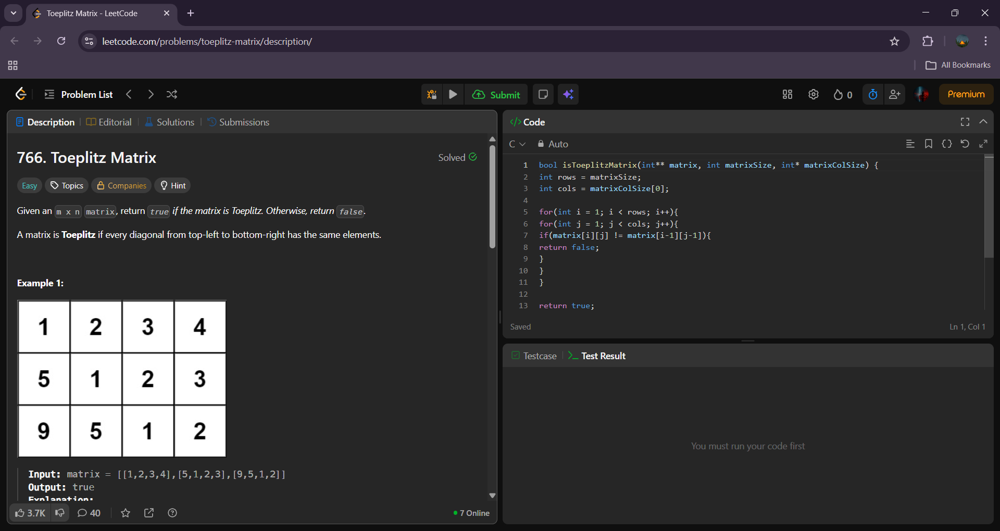

---

## Day 13

### Problem 1: Spiral Matrix Traversal

**Description**  
The matrix is traversed in a clockwise spiral order starting from the outer boundary and gradually moving inward.  
Four boundary variables (top, bottom, left, right) are updated after completing traversal of each layer.

**Concepts Used**
- 2D Arrays  
- Boundary control  
- Spiral traversal logic  
- Nested loops  

**Source Code**  
[Day13/spiral_matrix.c](Day13/spiral_matrix.c)

**Output Screenshot**

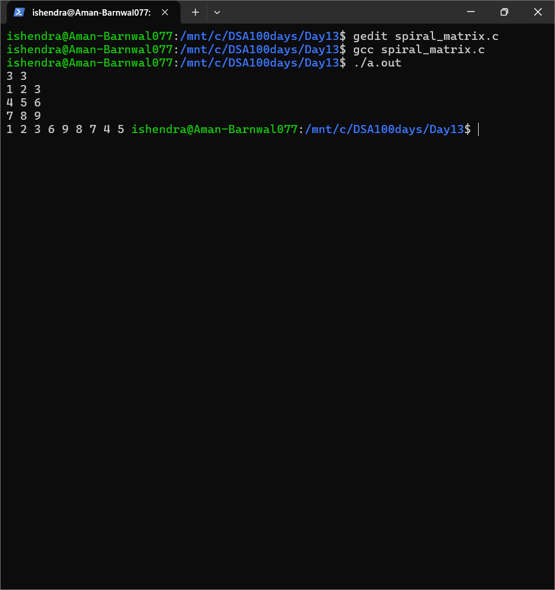

---

### Problem 2: Spiral Matrix (LeetCode)

**Description**  
All elements of the matrix are returned in spiral order using systematic boundary traversal.  
The approach ensures each element is visited exactly once.

**Concepts Used**
- Matrix traversal  
- Dynamic boundary adjustment  
- Order-based extraction  

**Output Screenshot**

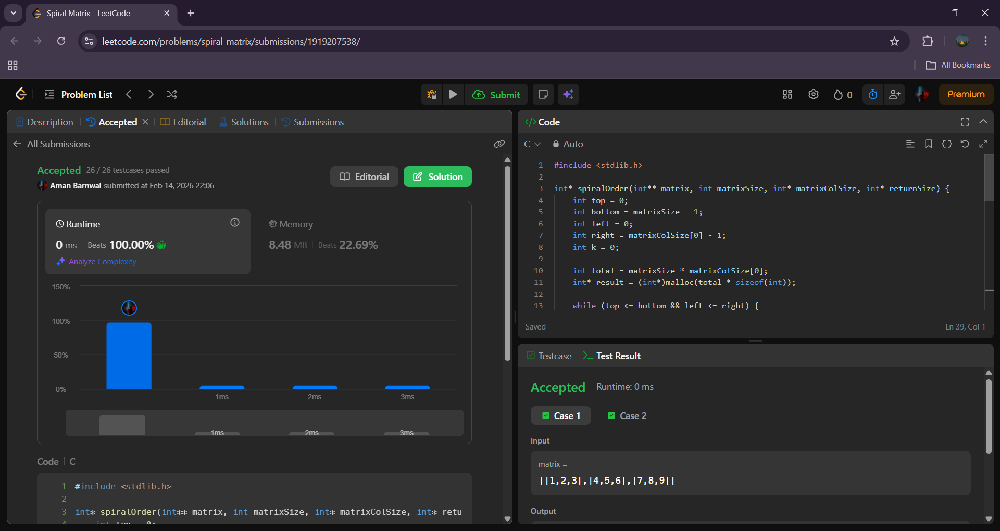

---

## Day 14

### Problem 1: Identity Matrix Check

**Description**  
A square matrix is examined to determine whether it satisfies the identity matrix property.  
All diagonal elements must be 1, and every non-diagonal element must be 0.

**Concepts Used**
- 2D Arrays  
- Diagonal validation  
- Nested loops  
- Conditional checking  

**Source Code**  
[Day14/identity_matrix.c](Day14/identity_matrix.c)

**Output Screenshot**

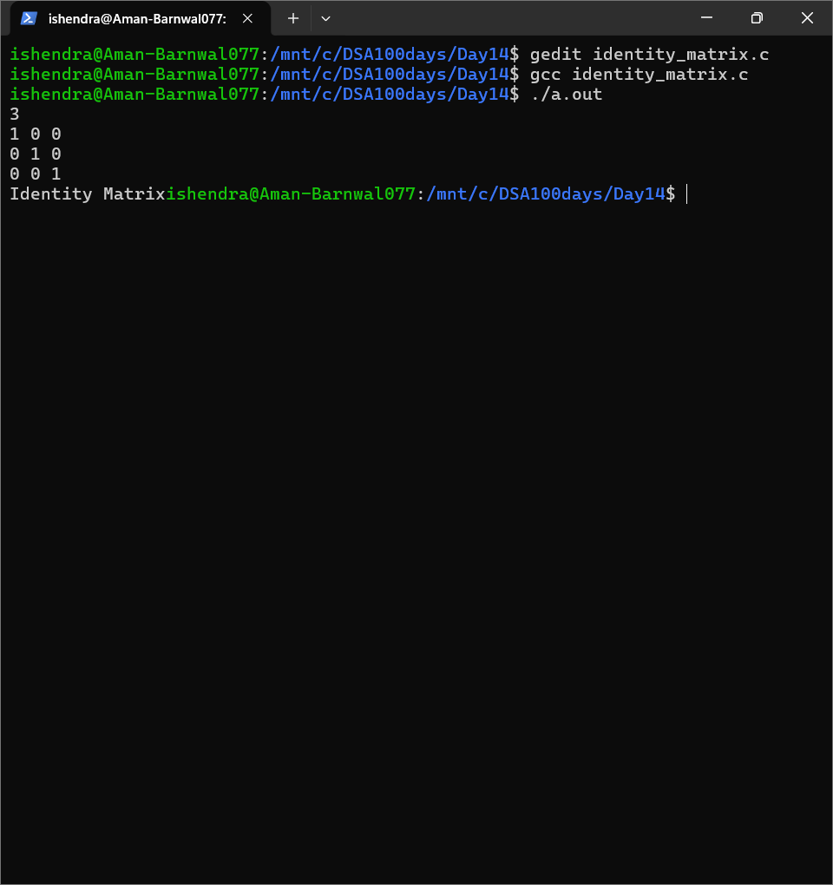

---

### Problem 2: Rotate Image (LeetCode 48)

**Description**  
The matrix is rotated 90 degrees clockwise in-place without using extra space.  
The approach involves first transposing the matrix and then reversing each row.

**Concepts Used**
- Matrix transpose  
- In-place modification  
- 2D array manipulation  

**Output Screenshot**

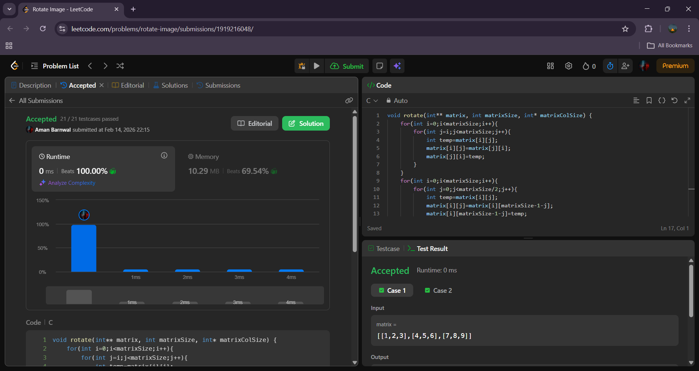

---

## Day 15

### Problem 1: Primary Diagonal Sum

**Description**  
The matrix is traversed to calculate the sum of elements where the row index equals the column index.  
Only elements forming the primary diagonal are included in the final sum.

**Concepts Used**
- 2D Arrays  
- Diagonal traversal  
- Nested loops  

**Source Code**  
[Day15/primary_diagonal_sum.c](Day15/primary_diagonal_sum.c)

**Output Screenshot**

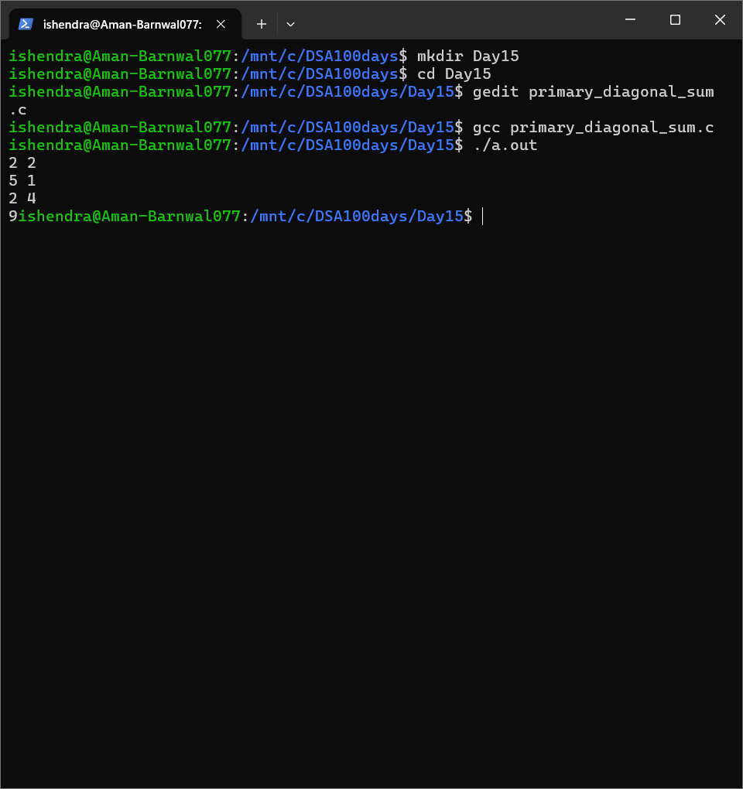

---

### Problem 2: Set Matrix Zeroes (LeetCode 73)

**Description**  
If any element in the matrix is zero, its entire row and column are set to zero.  
The solution is implemented in-place using marker rows and columns to maintain constant extra space.

**Concepts Used**
- In-place matrix modification  
- Row and column marking  
- Nested traversal  

**Output Screenshot**

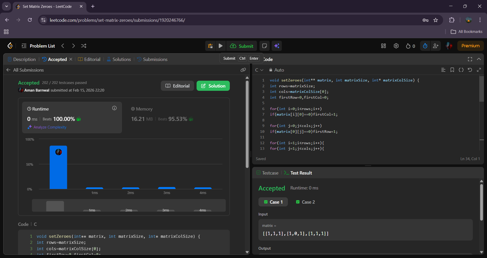

---

## Day 16

### Problem 1: Frequency of Elements in an Array

**Description**  
The program counts how many times each distinct element appears in the given array.  
Each element is printed in the format element:count.

**Concepts Used**
- Arrays  
- Nested loops  
- Frequency counting  

**Source Code**  
[Day16/frequency_count.c](Day16/frequency_count.c)

**Output Screenshot**

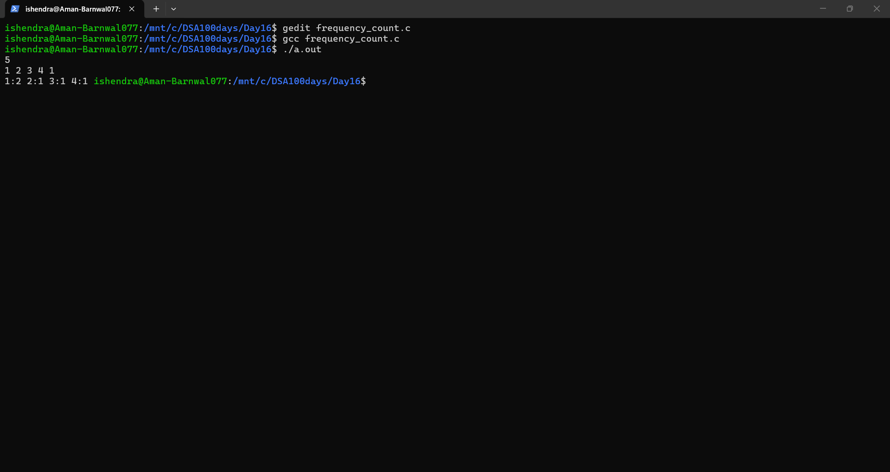

---

### Problem 2: Rotate Array (LeetCode 189)

**Description**  
The array is rotated to the right by k steps using an in-place reversal approach.  
The method reverses the entire array, then reverses segments to achieve the required rotation.

**Concepts Used**
- Array manipulation  
- Reversal technique  
- In-place modification  

**Output Screenshot**

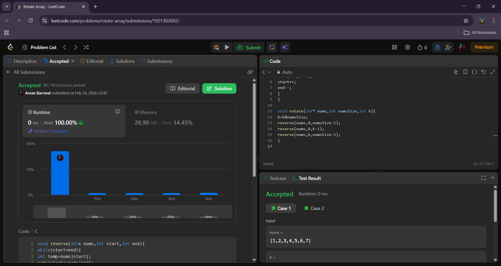

---

## Day 17

### Problem 1: Maximum and Minimum in an Array

**Description**  
The array is traversed once to determine the largest and smallest elements.  
During traversal, the maximum and minimum values are updated dynamically.

**Concepts Used**
- Arrays  
- Linear traversal  
- Conditional comparison  

**Source Code**  
[Day17/max_min_array.c](Day17/max_min_array.c)

**Output Screenshot**

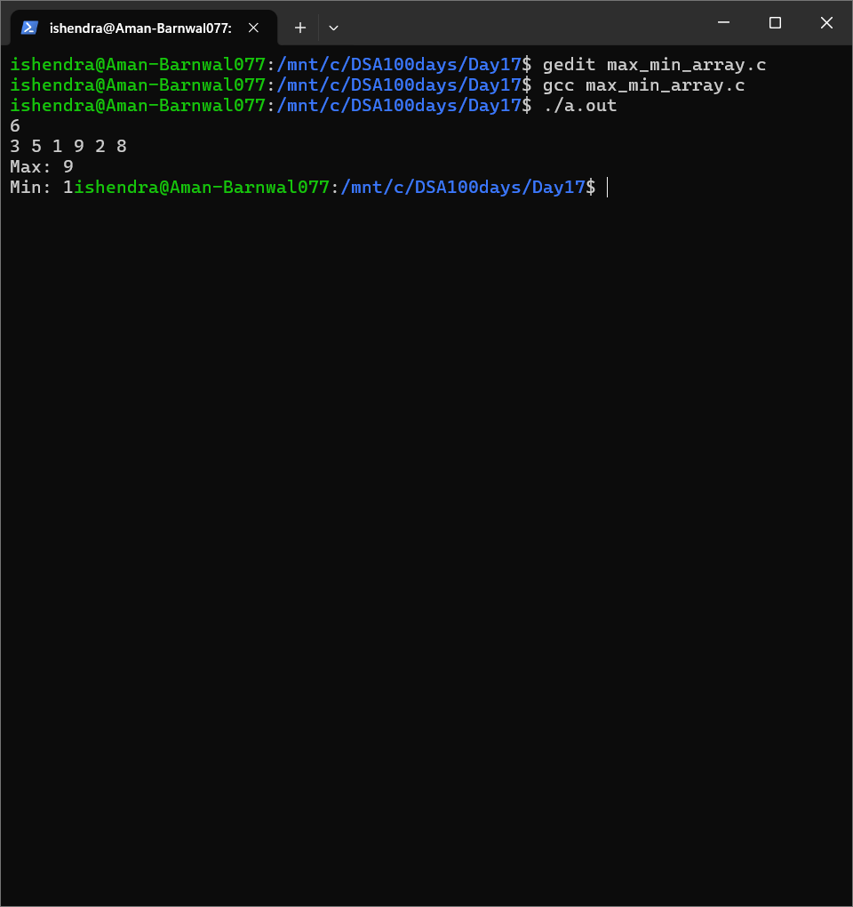

---

### Problem 2: Maximum Subarray (LeetCode 53)

**Description**  
The task is to find a contiguous subarray with the largest possible sum.  
Kadane’s Algorithm is applied to compute the maximum subarray sum in linear time.

**Concepts Used**
- Dynamic programming  
- Kadane’s Algorithm  
- Running sum optimization  

**LeetCode Output Screenshot**

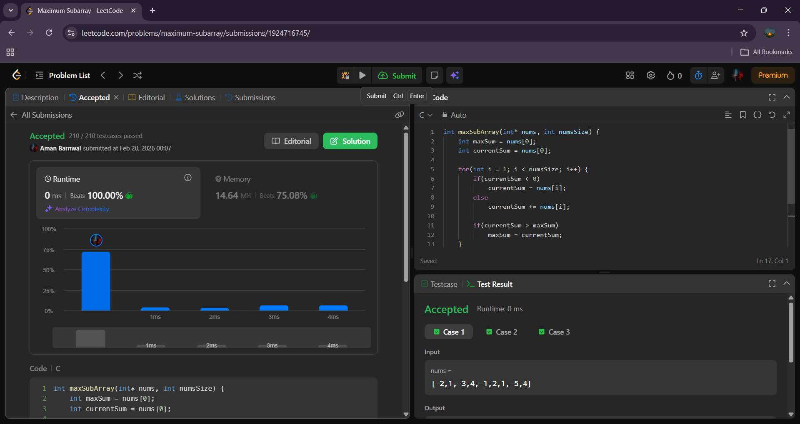

---

## Day 18

### Problem 1: Rotate Array by k Positions

**Description**  
The elements of the array are rotated to the right by k positions using circular indexing.  
Each element is placed at its new index computed using modular arithmetic.

**Concepts Used**
- Arrays  
- Modular arithmetic  
- Index manipulation  

**Source Code**  
[Day18/rotate_array_k.c](Day18/rotate_array_k.c)

**Output Screenshot**

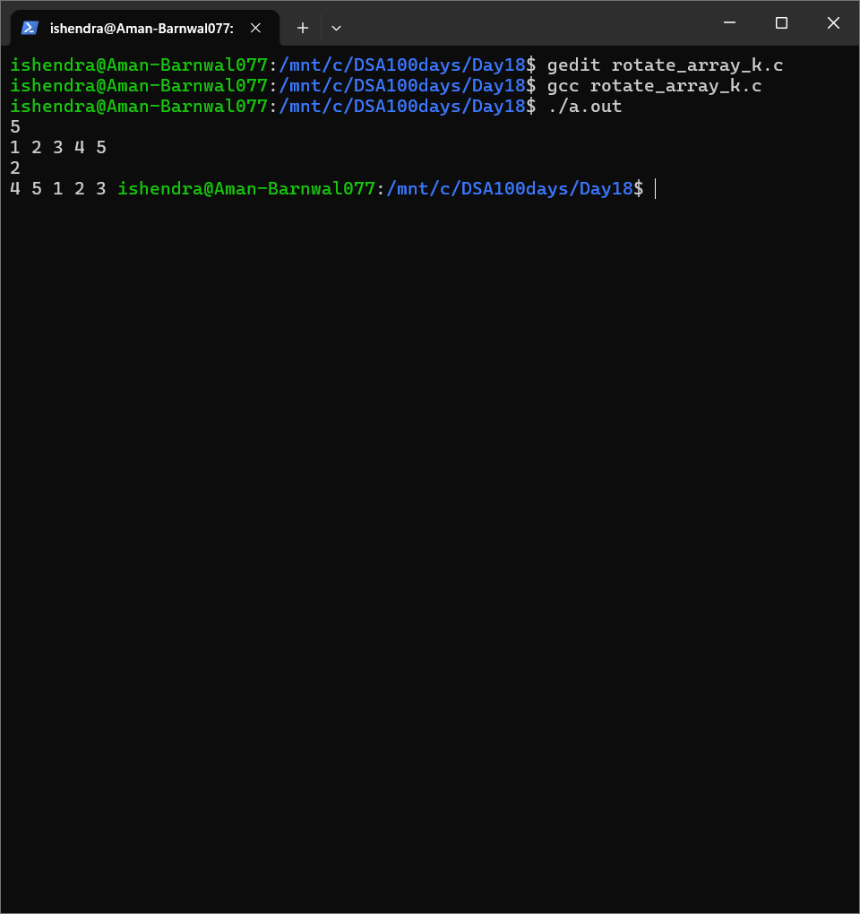

---

### Problem 2: Product of Array Except Self (LeetCode 238)

**Description**  
For every index in the array, the product of all other elements is calculated without using division.  
Prefix and suffix multiplication are used to achieve linear time complexity with constant extra space.

**Concepts Used**
- Prefix products  
- Suffix products  
- In-place computation  

**LeetCode Output Screenshot**

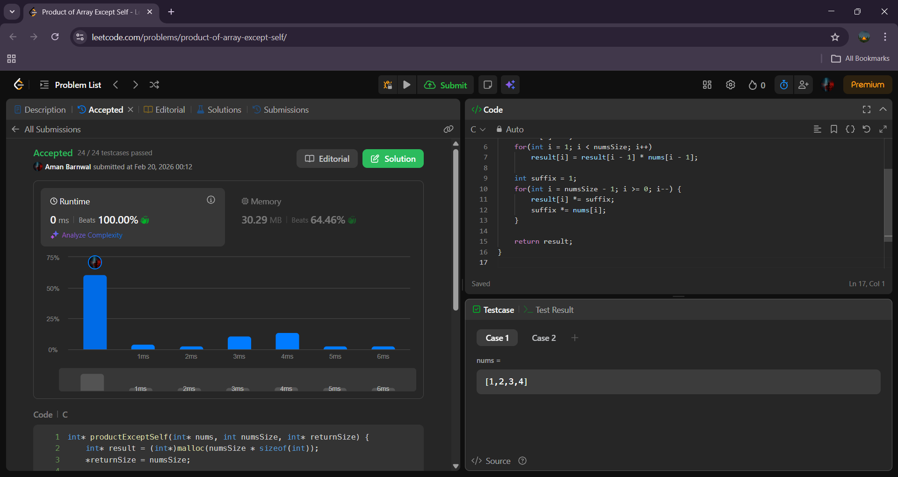

---

## Day 19

### Problem 1: Pair with Sum Closest to Zero

**Description**  
The array is sorted and a two-pointer approach is used to find two elements whose sum is closest to zero.  
The pair with the minimum absolute sum is tracked during traversal.

**Concepts Used**
- Arrays  
- Sorting  
- Two-pointer technique  
- Absolute comparison  

**Source Code**  
[Day19/closest_sum_zero.c](Day19/closest_sum_zero.c)

**Output Screenshot**

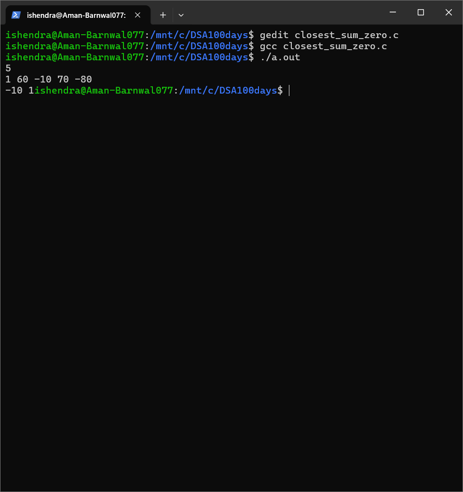

---

### Problem 2: Maximum Sum Circular Subarray (LeetCode 918)

**Description**  
The maximum subarray sum is computed considering both normal and circular cases.  
Kadane’s Algorithm is applied to find the maximum and minimum subarrays, and the final answer is determined accordingly.

**Concepts Used**
- Kadane’s Algorithm  
- Circular array handling  
- Prefix and suffix reasoning  
- O(n) optimization  

**LeetCode Output Screenshot**

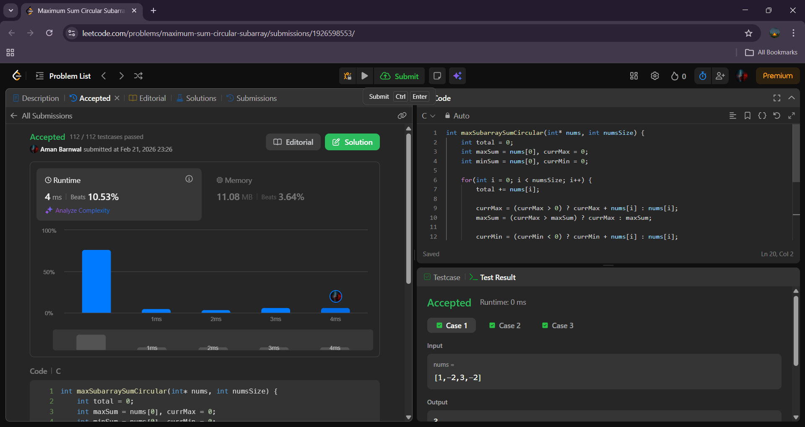

---

## Day 20

### Problem 1: Count Subarrays with Sum Equal to Zero

**Description**  
The program counts all continuous subarrays whose total sum is zero.  
Each possible starting point is checked to determine whether a zero-sum subarray exists.

**Concepts Used**
- Arrays  
- Prefix sum logic  
- Nested traversal  

**Source Code**  
[Day20/zero_sum_subarrays.c](Day20/zero_sum_subarrays.c)

**Output Screenshot**

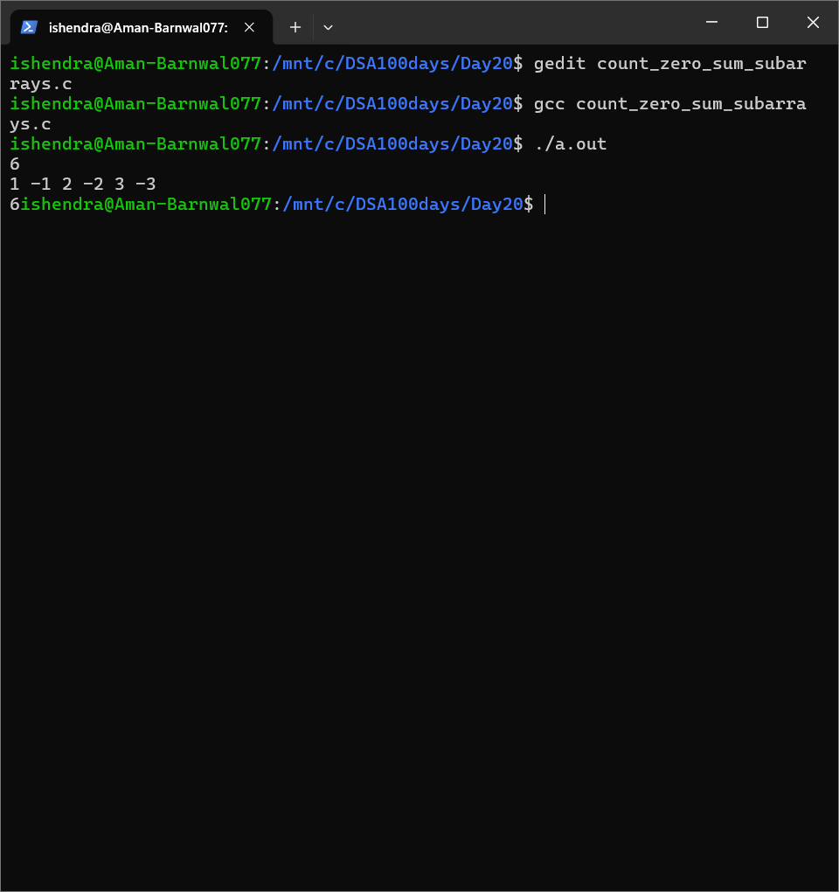

---

## Day 21

### Problem 1: Create and Traverse Singly Linked List

**Description**  
A singly linked list is dynamically created using user input and then traversed to print all elements in order.

**Concepts Used**
- Structures  
- Dynamic memory allocation  
- Pointer traversal  

**Source Code**  
[Day21/singly_linked_list.c](Day21/singly_linked_list.c)

**Output Screenshot**

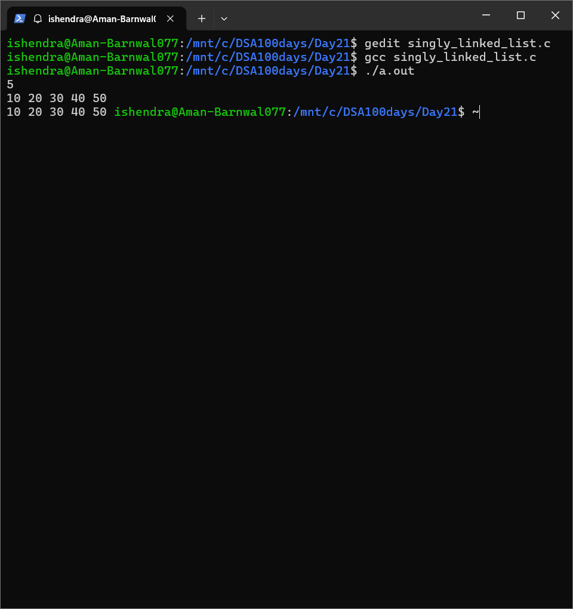

---

### Problem 2: Middle of the Linked List (LeetCode 876)

**Description**  
The middle node of the linked list is found using the fast and slow pointer technique.  
If two middle nodes exist, the second one is returned.

**Concepts Used**
- Fast and slow pointer  
- Linked list traversal  

**LeetCode Output Screenshot**

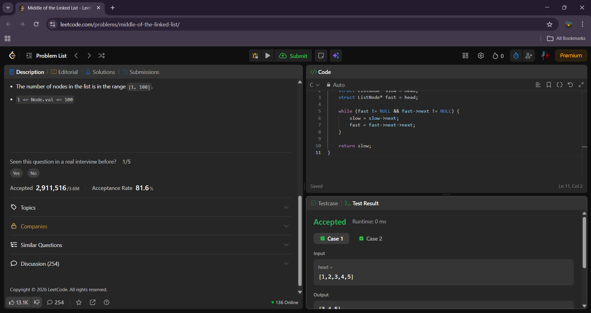

---

## Day 22

### Problem 1: Count Nodes in Linked List

**Description**  
A linked list is created dynamically, and the total number of nodes present in the list is calculated by traversal.

**Concepts Used**
- Linked list traversal  
- Node counting  
- Dynamic memory allocation  

**Source Code**  
[Day22/count_nodes.c](Day22/count_nodes.c)

**Output Screenshot**

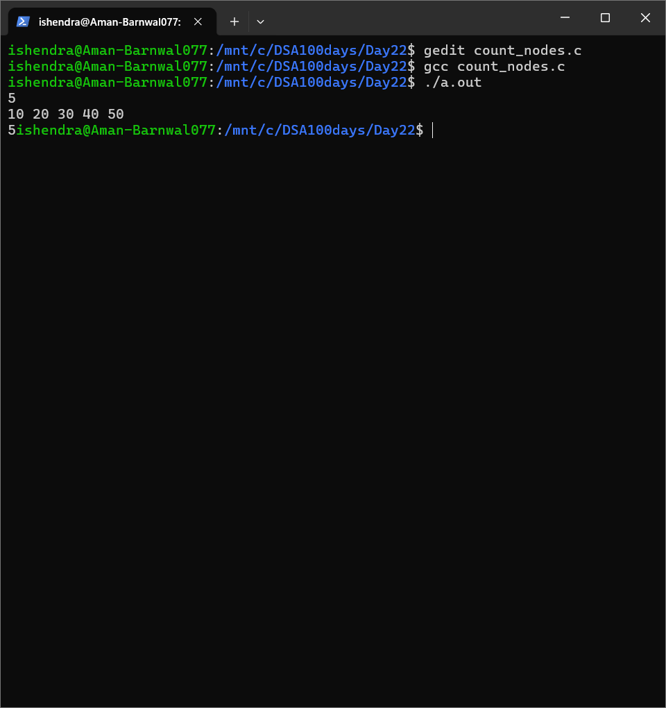

---

### Problem 2: Reverse Linked List (LeetCode 206)

**Description**  
The linked list is reversed by modifying the direction of next pointers for each node.

**Concepts Used**
- Pointer manipulation  
- Iterative reversal  

**LeetCode Output Screenshot**

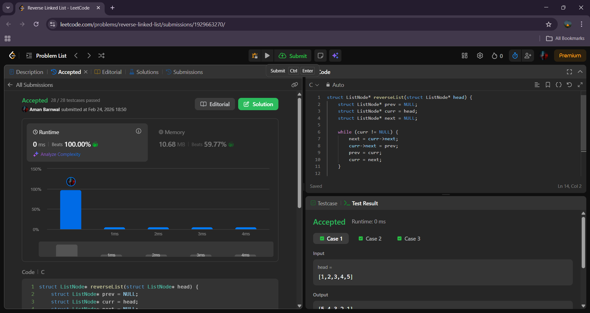

---

## Day 23

### Problem 1: Merge Two Sorted Linked Lists

**Description**  
Two sorted linked lists are merged into a single sorted list by comparing node values and updating pointers accordingly.

**Concepts Used**
- Linked list traversal  
- Pointer comparison  
- Efficient merging  

**Source Code**  
[Day23/merge_sorted_ll.c](Day23/merge_sorted_ll.c)

**Output Screenshot**

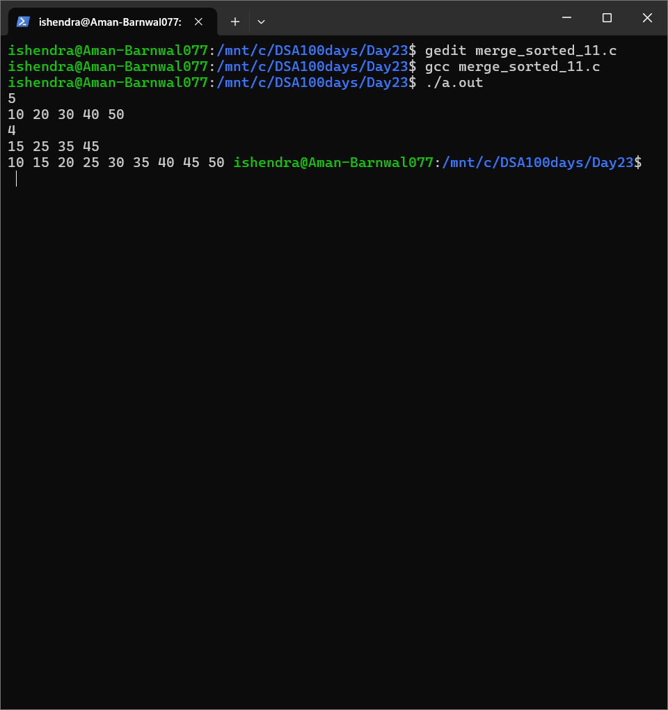

---

### Problem 2: Linked List Cycle (LeetCode 141)

**Description**  
The presence of a cycle in a linked list is detected using Floyd’s cycle detection algorithm.

**Concepts Used**
- Fast and slow pointer  
- Cycle detection  

**LeetCode Output Screenshot**

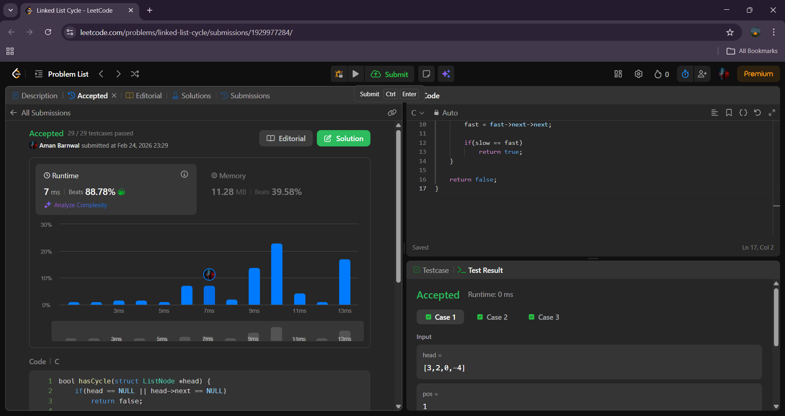

---

## Day 24

### Problem 1: Delete First Occurrence of a Key

**Description**  
The first node containing the specified key is located and removed by updating pointer links.

**Concepts Used**
- Linked list traversal  
- Pointer reassignment  
- Memory deallocation  

**Source Code**  
[Day24/delete_first_occurrence.c](Day24/delete_first_occurrence.c)

**Output Screenshot**

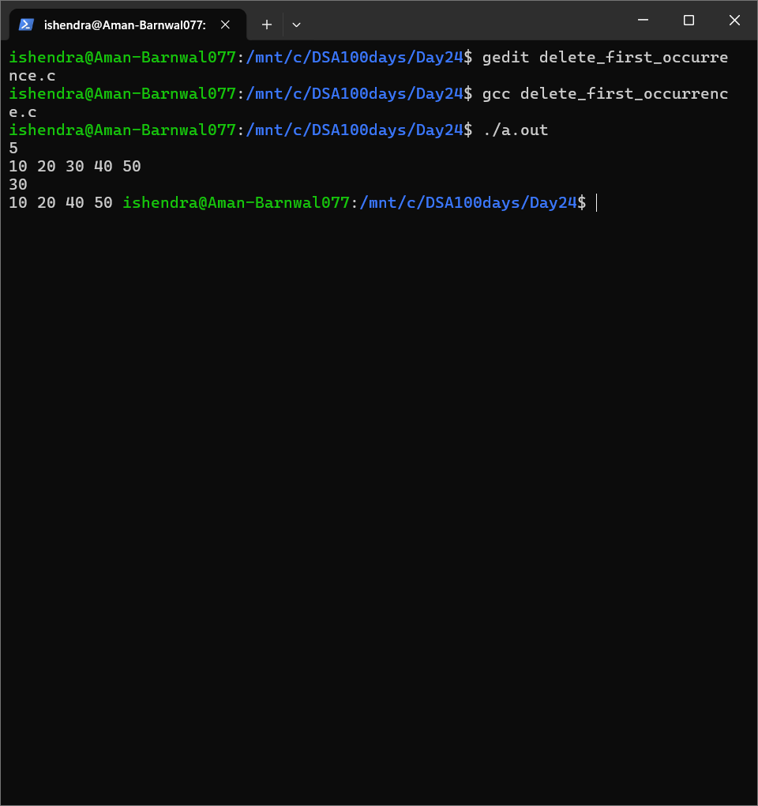

---

### Problem 2: Remove Linked List Elements (LeetCode 203)

**Description**  
All nodes containing a specific value are removed from the linked list using a dummy node approach.

**Concepts Used**
- Dummy node technique  
- Pointer updates  
- Linked list filtering  

**LeetCode Output Screenshot**

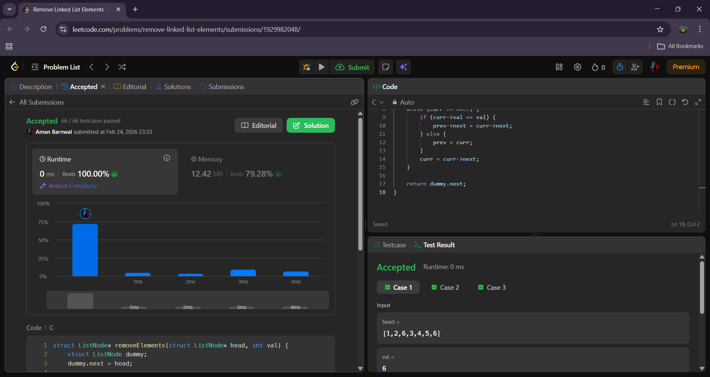
