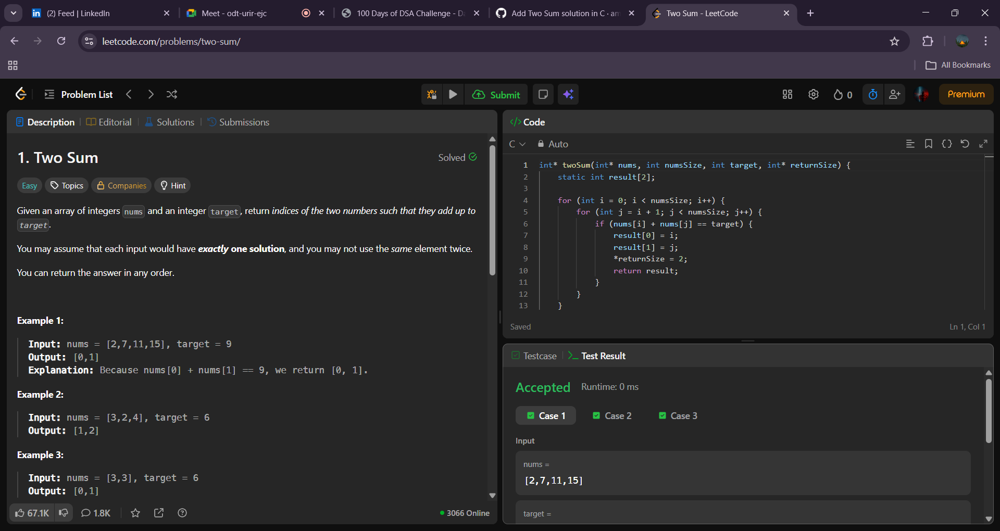
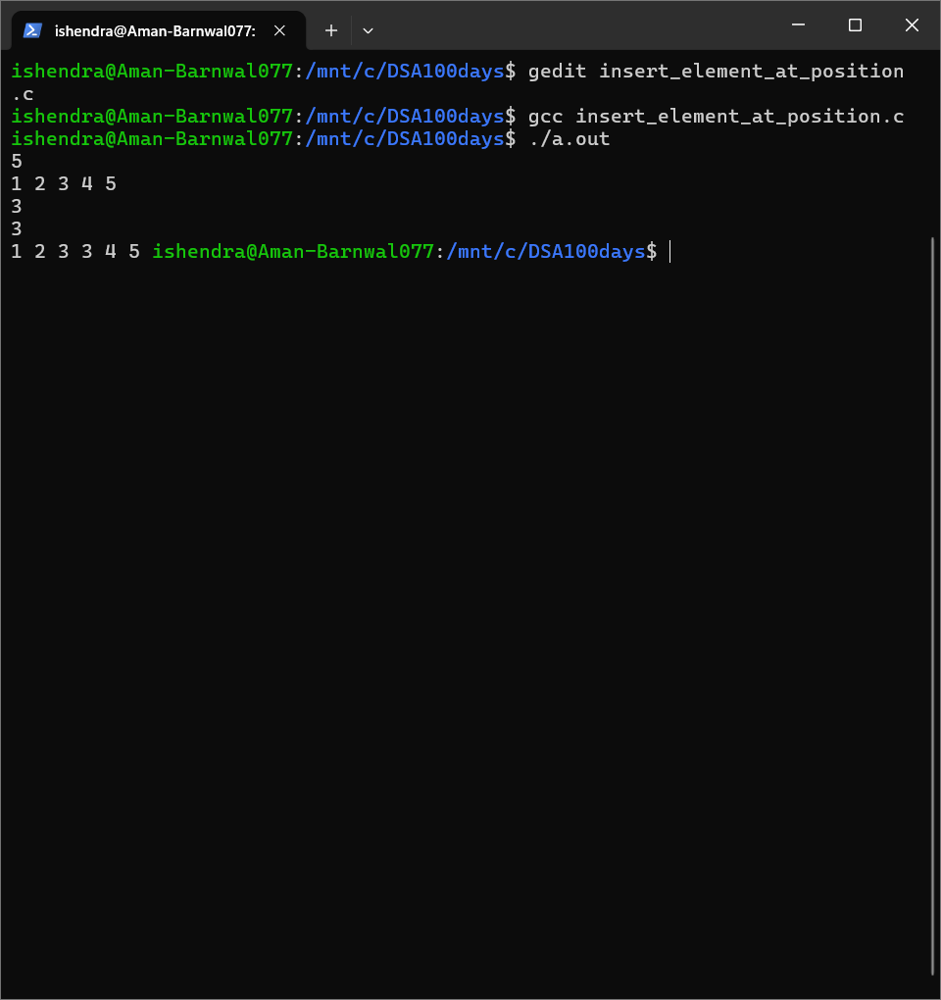

# 100 Days of C Programming and DSA

**Name:** Aman Barnwal  
**SAP ID:** 590028933  
**Batch:** 78  

---

This repository documents my **100 Days of Code** challenge focused on **C Programming and Data Structures & Algorithms (DSA)**.

The objective of this challenge is to build strong fundamentals in C programming, improve logical thinking, and maintain consistency through daily coding practice with proper version control.

---

## Day 01

### Problem 1: Two Sum

**Description**  
Given an array of integers and a target value, return the indices of the two numbers such that they add up to the target.  
Each input has exactly one valid solution, and the same element cannot be used twice.

**Concepts Used**
- Arrays
- Nested loops
- Index-based traversal

**Source Code**  
[Day01/two_sum.c](Day01/two_sum.c)

**Time Complexity**  
O(n²)

**LeetCode Output Screenshot**

---

### Problem 2: Insert Element at Given Position in Array

**Description**  
Write a C program to insert an element `x` at a given 1-based position in an array of `n` integers.  
All elements from that position onward are shifted one place to the right.

**Concepts Used**
- Arrays
- Index manipulation
- Element shifting

**Source Code**  
[Day01/insert_element_at_position.c](Day01/insert_element_at_position.c)

**Program Output Screenshot**

---

